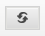
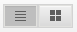
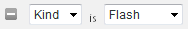

# Sobre banners {#about-banners}

Você pode usar os Banners para gerenciar os anúncios de banner que estão em seu site.

## Uso de banners {#concept_5BBE01FEC6134393B43CC917C8CC64DA}

<!-- 

c_about_banners.xml

 -->

Existem dois métodos que você pode usar para adicionar anúncios de banner ao seu site.

O primeiro método é adicionar banners por meio do Target, Search&amp;Promote. Os banners são trechos de código HTML exibidos no momento em que um cliente pesquisa seu site. Seu banner pode incluir texto ou uma imagem no formato GIF, JPEG ou PNG, ou em uma combinação de ambos. Você pode selecionar de tamanhos predefinidos ou definir suas próprias dimensões personalizadas para se ajustar à sua página. O código HTML usado para exibir o banner também pode especificar itens como o estilo de fonte a ser usado e a borda. Este método de adicionar um banner oferece funcionalidade básica e não requer software adicional.

O segundo método é usar o Adobe Dynamic Media Classic, um serviço de gerenciamento dinâmico de mídia e publicação. Uma conta válida do Adobe Dynamic Media Classic permite gerenciar e fornecer conteúdo de banner diretamente para o Target, Search&amp;Promote, usando o Dynamic Media Classic. Na pesquisa/comercialização do site, você configura o acesso à sua conta do Dynamic Media Classic. Em seguida, abra o navegador de mídia do Dynamic Media Classic e escolha um ativo de mídia dinâmica que deseja servir como seu banner.

>[!NOTE]
>
>Antes de usar ativos de mídia dinâmica como banners na pesquisa/comercialização do site, os ativos são carregados e preparados para publicação no Scene7 Publishing System. Você pode fazer upload de ativos de dentro da pesquisa/comercialização do site e prepará-los automaticamente para publicação pelo Scene7 Publishing System. Ou você pode fazer upload e publicar ativos de dentro do Scene7 Publishing System.

## Integração de banners com o Adobe Scene7 Publishing System {#section_D4D7ADEA6A6348E68EDA138E184FE579}

Você pode usar os tipos de ativos do Dynamic Media Classic como banners na pesquisa/comercialização do site, incluindo imagens, banners dinâmicos e modelos, como modelos de imagem ou modelos Flash.

Os modelos são criados dinamicamente e arquivos de imagem em camadas endereçáveis, como arquivos em camadas em aplicativos de edição de imagens, como o Adobe Photoshop®. Ao contrário de um arquivo de imagem estática, um modelo pode incluir parâmetros. Por meio de parâmetros, é possível personalizar propriedades de imagens variáveis e conteúdo de imagens.

>[!NOTE]
>
>Você também pode criar modelos a partir de designs baseados em layout usando a Publicação de modelo no Scene7 Publishing System e arquivos do Adobe Illustrator e Adobe InDesign.

Consulte Publicação [de](https://help.adobe.com/en_US/scene7/using/WSFBFBAD30-2694-4b18-B7CE-894F9FC5CDDF.html) modelos no Guia do usuário do Dynamic Media Classic (Scene7).

Um modelo pode conter qualquer número de camadas de imagem e camadas de texto. É possível converter um arquivo estático contendo camadas, como um arquivo PSD em camadas, em um modelo ou criar modelos no Dynamic Media Classic. Você pode criar camadas de texto em modelos usando fontes que foram carregadas no Scene7 Publishing System. Depois de adicionar texto a um modelo, é possível formatá-lo alterando sua justificação, fontes, tamanho da fonte e cor.

Usando a tela Parâmetros no Dynamic Media Classic, é possível converter qualquer aspecto de um modelo em um parâmetro endereçável. Ao fazer isso, você pode alterar qual imagem em camadas usar ou qual valor de texto usar no modelo. Os parâmetros são passados com a string de URL, permitindo que você altere qualquer parâmetro para personalizar dinamicamente a imagem de resposta gerada do servidor de imagem.

Você pode aprender mais sobre como usar o Dynamic Media Classic para criar modelos e parametrizar as propriedades nas camadas, para que possa usá-las em banners.

Consulte Noções básicas [do](https://help.adobe.com/en_US/scene7/using/WS60B68844-9054-4099-BF69-3DC998A04D3C.html) modelo no Guia do usuário do Dynamic Media Classic (Scene7).

**Upload e publicação de ativos**

Você deve fazer upload e publicar ativos no Dynamic Media Classic antes de usá-los para banners na pesquisa/comercialização do site. Esse pré-requisito também inclui todos os ativos que um modelo de imagem ou um modelo Flash usa. Use sua conta do Dynamic Media Classic para carregar e publicar ativos digitais. Ou você pode usar a pesquisa/comercialização do site para carregar um ativo digital e, em seguida, fazer com que o Dynamic Media Classic publique-o automaticamente para você com base nas configurações de upload. Se você tentar escolher um ativo que ainda não foi carregado e publicado, você será notificado na interface do usuário e terá a opção de fazer upload dele antes de continuar.

Você pode saber mais sobre como fazer upload e publicar ativos digitais usando o Scene7 Publishing System.

Consulte [Fazer upload e publicar ativos](https://help.adobe.com/en_US/scene7/using/WS3673AD39-098B-4f08-8A24-CA51261B7366.html) no Guia do usuário do Dynamic Media Classic (Scene7).

>[!NOTE]
>
>Para usar a funcionalidade de upload no visualizador de ativos do Dynamic Media Classic, verifique se a conta do Dynamic Media Classic usada tem a função de &quot;Administrador da empresa SPS&quot; já definida.

Consulte Configuração  administrativa no Guia do usuário do Dynamic Media Classic (Scene7).

**Alteração dos parâmetros de modelo do Dynamic Media Classic em um banner usando Regras de negócios**

Se você tiver adicionado um ativo do Dynamic Media Classic como um banner, poderá usá-lo [!DNL Visual Rule Builder] em [!DNL Business Rules] para adicioná-lo a qualquer área de banner do seu site. Por exemplo, você adiciona o banner às páginas de resultados da pesquisa, assim como qualquer outro banner. Você também pode substituir os valores de parâmetro padrão nos modelos do Dynamic Media Classic, personalizando-os para suas necessidades específicas. Esse tipo de funcionalidade permite personalizar modelos do Dynamic Media Classic com diferentes mensagens de marketing e hiperlinks para diferentes pontos de extremidade.

Consulte também [Adicionar uma nova regra](../c-about-rules-menu/c-about-business-rules.md#task_BD3B31ED48BB4B1B8F1DCD3BFA2528E7)comercial.

Consulte também [Edição de uma regra](../c-about-rules-menu/c-about-business-rules.md#task_375CFA75D1D94D9E92A35DE1228E5087)comercial.

## Adicionar um banner {#task_549D02B5F73B4158B105A94E39D937B7}

Você pode usar [!DNL Banners] para gerenciar os anúncios de banner e onde eles são colocados em seu site. Ao adicionar um banner, você está fazendo referência externa à imagem por meio de trechos de código HTML exibidos no momento da pesquisa.

<!-- 

t_adding_a_new_banner.xml

 -->

Se você tiver uma conta válida do Adobe Dynamic Media Classic, poderá adicionar anúncios de banner por meio do Scene7 Publishing System.

Consulte [Adicionar um banner usando o Adobe Dynamic Media Classic](../c-about-design-menu/c-about-banners.md#task_AD1E0C00A9E04B1FA819EB93288786B3).

Consulte [Configuração do acesso à sua conta](../c-about-settings-menu/c-about-account-options-menu.md#task_CEFF88C2033D41D0B2FE86C435EDAC6D)do Adobe Dynamic Media Classic.

**Para adicionar um banner**

1. No menu do produto, clique em **[!UICONTROL Design]** > **[!UICONTROL Banners]**.
1. Na [!DNL Banners] página, na lista **[!UICONTROL Add Banner]** suspensa, selecione **[!UICONTROL HTML code]**.
1. Na caixa de [!DNL Add Banner] diálogo, defina as opções desejadas.

   <table> 
    <thead> 
      <tr> 
      <th colname="col1" class="entry"> 
Opção 
 </th> 
      <th colname="col2" class="entry"> 
Descrição 
 </th> 
      </tr> 
    </thead>
    <tbody> 
      <tr> 
      <td colname="col1"> 
Nome 
 </td> 
      <td colname="col2"> 
Obrigatório. Identifica o nome do banner. O nome é usado para fazer referência ao banner quando você o adiciona ao Construtor de regras visual no Business Rules. O nome não aparece no banner em si. 
 
Consulte <a href="../c-about-rules-menu/c-about-business-rules.md#task_BD3B31ED48BB4B1B8F1DCD3BFA2528E7" type="task" format="dita" scope="local"> Adicionando uma nova regra de negócios.</a> 
 </td> 
      </tr> 
      <tr> 
      <td colname="col1"> 
HTML do banner 
 </td> 
      <td colname="col2"> 
 Permite colar o código HTML associado ao banner. 
 
Qualquer código HTML é aceitável, incluindo o código CSS delimitado por 
        <userinput>
          &lt;style&gt; 
        </userinput> tags ou código JavaScript cercado por 
        <userinput>
          &lt;script&gt; 
        </userinput> específicos. Por exemplo, o seguinte bloco de código é para um banner de texto do tipo Parte superior horizontal: <code> &lt;div&nbsp;style="width:&nbsp;684px;&nbsp;background-image:&nbsp;url('https://www.brough.com/blackb.gif');&nbsp; 
          padding-top:&nbsp;10px;&nbsp;padding-bottom:&nbsp;10px;&nbsp;color:&nbsp;white;&nbsp;font-family:&nbsp;verdana;&nbsp; 
          text-align:&nbsp;center;&nbsp;font-size:&nbsp;20px;"&gt;&nbsp;Sound&nbsp;Study&nbsp;ships&nbsp;free!&nbsp;&lt;/div&gt; </code>No exemplo a seguir, o bloco de código é para uma imagem de apresentação completa: <code> &lt;img&amp;nbsp;src='https://geometrixx.com/images/GEOAds/geometrixx-beauty-home-01.jpg'&amp;nbsp;border="0"&amp;nbsp;/&gt; </code> 
 </td> 
      </tr> 
      <tr> 
      <td colname="col1"> 
Tipo 
 </td> 
      <td colname="col2"> 
Especifica os seguintes tipos de banners: 
        <ul id="ul_6423AEDB9E664049989EB529D63C4A62"> 
          <li id="li_BF6CD60B3ED748D49CFFB9C5D607661C">  [novo tipo]  
Permite que você especifique o tipo de banner desejado, incluindo as dimensões e o nome. 
 </li> 
          <li id="li_1A29AB22AD644E60A12298187B5E898E">  Apresentação completa  
A dimensão definida desse tipo de banner tem 680 pixels de largura e 650 pixels de altura. Como opção, você pode especificar o nome do tipo ou aceitar o nome padrão que é o nome do próprio tipo de banner. 
 </li> 
          <li id="li_2BE06D013CB54DDE851051BFC038BB57">  Parte superior horizontal  
 O banner é posicionado na área superior do site. Esse tipo é útil se você pretende adicionar hiperlinks à esquerda ou à direita do banner. A dimensão definida desse tipo de banner tem 468 pixels de largura e 60 pixels de altura. Como opção, você pode especificar o nome do tipo ou aceitar o nome padrão que é o nome do próprio tipo de banner. 
 </li> 
          <li id="li_EC35AB92234749F08AA8A9BD26D0EA8D">  Parte superior horizontal - Largura total  
Esse tipo é o padrão ao adicionar um novo banner. O banner é posicionado na área superior do site e ocupa a largura total da página. A dimensão definida desse tipo de banner tem 670 pixels de largura e 150 pixels de altura. Como opção, você pode especificar o nome do tipo ou aceitar o nome padrão que é o nome do próprio tipo de banner. 
 </li> 
        </ul> 
 </td> 
      </tr> 
      <tr> 
      <td colname="col1"> 
Tags 
 </td> 
      <td colname="col2"> 
Adiciona tags ou "palavras-chave" que você deseja associar ao banner. Se você usar muitos banners, a adição de tags pode ajudá-lo a refinar sua pesquisa de banner para que você possa localizar rapidamente o banner certo para suas necessidades. Também é possível excluir quaisquer tags adicionadas. 
 </td> 
      </tr> 
    </tbody> 
    </table>

1. Clique em **[!UICONTROL Save]**.
1. (Opcional) Execute um dos procedimentos a seguir:

   * Clique **[!UICONTROL History]** para reverter quaisquer alterações feitas.

      Consulte [Uso da opção](../t-using-the-history-option.md#task_70DD3F87A67242BBBD2CB27156F43002)Histórico.

   * Clique em **[!UICONTROL Live]**.

      Consulte [Visualizar configurações](../c-about-staging.md#task_401A0EBDB5DB4D4CA933CBA7BECDC10F)ativas.

   * Clique em **[!UICONTROL Push Live]**.

      Consulte [Colocar configurações de estágio ao vivo](../c-about-staging.md#task_44306783B4C0408AAA58B471DAF2D9A4).

## Edição de um banner {#task_D4081083BE7B40F5A003D1A2F1435AEA}

Use [!DNL Edit Banner] para alterar coisas como nome do banner, HTML do banner, tipo de banner e quaisquer tags associadas.

<!-- 

t_editing_a_banner.xml

 -->

Se você adicionou um banner usando a pesquisa/comercialização do site, também edita o banner usando o Adobe Dynamic Media Classic.

Consulte também [Editar um banner usando o Adobe Dynamic Media Classic](../c-about-design-menu/c-about-banners.md#task_C3E782477FBF428ABEA220751781ACA9).

**Para editar um banner**

1. No menu do produto, clique em **[!UICONTROL Design]** > **[!UICONTROL Banners]**.
1. Na [!DNL Banners] página, clique em .

   acima de uma miniatura do banner que você deseja editar.
1. Na [!DNL Edit Banner] página, defina as opções desejadas.

   Consulte a tabela de opções em [Adicionar um banner](../c-about-design-menu/c-about-banners.md#task_549D02B5F73B4158B105A94E39D937B7).
1. Quando terminar de editar o banner, clique em **[!UICONTROL Save]**.
1. (Opcional) Execute um dos procedimentos a seguir:

   * Clique **[!UICONTROL History]** para reverter quaisquer alterações feitas.

      Consulte [Uso da opção](../t-using-the-history-option.md#task_70DD3F87A67242BBBD2CB27156F43002)Histórico.

   * Clique em **[!UICONTROL Live]**.

      Consulte [Visualizar configurações](../c-about-staging.md#task_401A0EBDB5DB4D4CA933CBA7BECDC10F)ativas.

   * Clique em **[!UICONTROL Push Live]**.

      Consulte [Colocar configurações de estágio ao vivo](../c-about-staging.md#task_44306783B4C0408AAA58B471DAF2D9A4).

## Adicionar um banner usando o Adobe Dynamic Media Classic {#task_AD1E0C00A9E04B1FA819EB93288786B3}

Você pode usar [!DNL Banners] para gerenciar os anúncios de banner em seu site. Ao adicionar um banner usando o Adobe Dynamic Media Classic, você pode escolher qualquer ativo digital que tenha carregado no Scene7 Publishing System.

<!-- 

t_adding_a_banner_using_adobe_scene7.xml

 -->

Para adicionar um banner usando o Adobe Dynamic Media Classic, verifique se você configurou o acesso à sua conta válida do Dynamic Media Classic.

Consulte [Configuração do acesso à sua conta](../c-about-settings-menu/c-about-account-options-menu.md#task_CEFF88C2033D41D0B2FE86C435EDAC6D)do Adobe Dynamic Media Classic.

**Para adicionar um banner usando o Adobe Dynamic Media Classic**

1. No menu do produto, clique em **[!UICONTROL Design]** > **[!UICONTROL Banners.]**
1. Na [!DNL Banners] página, na lista **[!UICONTROL Add Banner]** suspensa, clique em **[!UICONTROL Adobe Scene7]**.
1. Na caixa de diálogo [!DNL Pick an Asset] , no painel esquerdo, use as opções de navegação na interface do usuário para localizar a pasta que contém o ativo digital que você deseja usar para um banner.

   Com exceção das opções de navegação de ativos, todas as outras opções dependem do ativo digital que você selecionou para adicionar ou editar.

   Use as opções de navegação de ativos para localizar um ativo que você deseja usar para um novo banner na pesquisa/comercialização do site. As opções de navegação se aplicam a todos os tipos de ativos digitais selecionados.

   >[!NOTE]
   >
   >As opções de navegação do ativo não aparecem quando você edita o banner na caixa de [!DNL Change Parameters] diálogo.

   Consulte [Editar um banner usando o Adobe Dynamic Media Classic](../c-about-design-menu/c-about-banners.md#task_C3E782477FBF428ABEA220751781ACA9).

   **Opções de navegação de ativos**

   <table> 
    <thead> 
      <tr> 
      <th colname="col1" class="entry"> 
Opção de navegação 
 </th> 
      <th colname="col2" class="entry"> 
Descrição 
 </th> 
      </tr> 
    </thead>
    <tbody> 
      <tr> 
      <td colname="col1"> 
  
 </td> 
      <td colname="col2"> 
Permite selecionar a conta do Dynamic Media Classic para sua empresa específica na lista suspensa e também navegar pelas pastas de ativos digitais dentro dessa conta. 
 
Quando você seleciona uma pasta, o painel direito da caixa de diálogo  Selecionar um ativo  mostra todos os ativos digitais disponíveis contidos nessa pasta. 
 </td> 
      </tr> 
      <tr> 
      <td colname="col1"> 
  
 </td> 
      <td colname="col2"> 
Permite que você avance ou retroceda pelo histórico de navegação de pastas. 
 </td> 
      </tr> 
      <tr> 
      <td colname="col1"> 
  
 </td> 
      <td colname="col2"> 
Atualiza a lista de ativos digitais exibidos para uma pasta selecionada. 
 
Talvez seja necessário clicar nesse controle se você mover, excluir ou renomear um ativo selecionado usando a lista suspensa  Ações  . 
 </td> 
      </tr> 
      <tr> 
      <td colname="col1"> 
  
 </td> 
      <td colname="col2"> 
Exibe ativos digitais em uma exibição de lista. A lista exibe o ícone ou a imagem em miniatura associada a cada ativo, o nome do arquivo, o tipo de ativo digital, as dimensões (quando aplicável) e a data em que foi editado pela última vez. 
 
A exibição de grade exibe ativos digitais na pasta selecionada como ícones, miniaturas ou ambos. 
 </td> 
      </tr> 
      <tr> 
      <td colname="col1"> 
  
 </td> 
      <td colname="col2"> 
Na exibição de lista, você pode mover, excluir ou renomear um ativo digital selecionado. 
 
Na exibição de grade, você pode mover ou excluir um ou mais ativos digitais selecionados. 
 </td> 
      </tr> 
      <tr> 
      <td colname="col1"> 
  
 </td> 
      <td colname="col2"> 
Abre a caixa de diálogo  Carregar  , na qual é possível carregar um ativo digital selecionado do seu desktop ou de um servidor externo para que você possa usá-lo como um banner. 
 
Depois de fazer upload do ativo, uma tarefa de publicação é agendada automaticamente para você no Scene7 Publishing System. 
 
Consulte a tabela de opções em <a href="../c-about-design-menu/c-about-banners.md#task_AD1E0C00A9E04B1FA819EB93288786B3" type="reference" format="dita" scope="local"> Adicionar um banner usando o Adobe Dynamic Media Classic </a>. 
 
Você pode saber mais sobre como fazer upload e publicar ativos digitais usando o Scene7 Publishing System. 
 
Consulte <a href="https://help.adobe.com/en_US/scene7/using/WS3673AD39-098B-4f08-8A24-CA51261B7366.html" scope="external" format="html"> Fazer upload e publicar ativos </a> no Guia do usuário do sistema de publicação do Scene7. 
 </td> 
      </tr> 
      <tr> 
      <td colname="col1"> 
  
 </td> 
      <td colname="col2"> 
Permite que você pesquise por um ativo digital por palavra-chave ou pesquise por local de arquivo na pasta selecionada e em suas subpastas associadas. 
 
Quando você clica no campo de pesquisa, ele adiciona automaticamente um campo de filtro opcional para você. 
 </td> 
      </tr> 
      <tr> 
      <td colname="col1"> 
  
 </td> 
      <td colname="col2"> 
Adiciona outro filtro de ativo para que você possa refinar ainda mais a lista de ativos digitais exibidos por tipo ou por uma data específica. 
 </td> 
      </tr> 
      <tr> 
      <td colname="col1"> 
  
 </td> 
      <td colname="col2"> 
Refine a lista de ativos digitais exibidos para mostrar somente aqueles de um determinado tipo, como Flash, Imagem, Modelo ou Qualquer. 
 
Clique em  para excluir o filtro da pesquisa. 
 </td> 
      </tr> 
      <tr> 
      <td colname="col1"> 
  
 </td> 
      <td colname="col2"> 
Refine a lista de ativos digitais exibidos para mostrar somente aqueles criados ou editados antes de uma determinada data ou depois de uma determinada data. 
 
Clique em  para excluir o filtro da pesquisa. 
 </td> 
      </tr> 
      <tr> 
      <td colname="col1"> 
  
 </td> 
      <td colname="col2"> 
Permite arrastar o controle deslizante para a esquerda ou direita para reduzir ou ampliar toda a visualização do painel de ativos digitais, respectivamente. 
 </td> 
      </tr> 
    </tbody> 
    </table>

   **Opções de propriedades**

   As opções Propriedades serão exibidas se você escolher um modelo Flash, um modelo de imagem ou uma imagem. Dependendo do ativo digital escolhido, nem todas as opções estão disponíveis.

   <table> 
    <thead> 
      <tr> 
      <th colname="col1" class="entry"> 
Opção Propriedades 
 </th> 
      <th colname="col2" class="entry"> 
Descrição 
 </th> 
      </tr> 
    </thead>
    <tbody> 
      <tr> 
      <td colname="col1"> 
Nome 
 </td> 
      <td colname="col2"> 
O nome descritivo do modelo ou imagem, sem espaços em branco. Você pode optar por incluir a especificação do tamanho da imagem no nome para ajudar os usuários a identificar o ativo. 
 </td> 
      </tr> 
      <tr> 
      <td colname="col1"> 
Formato 
 </td> 
      <td colname="col2"> 
Identifica o formato da imagem ou do modelo de imagem. 
 
É possível escolher entre os seguintes formatos: 
 
        <ul id="ul_9A19421BCC424CF585645049DCB87F10"> 
        <li id="li_A4913D783BD547F9AFA1A259C56EC2B3">jpeg </li> 
        <li id="li_66237D7BE8754FB0B0088CE5A02C0214">png </li> 
        <li id="li_4EDDFD7C8AB04677BEC20EFC9AEBBF1F">png-alfa </li> 
        <li id="li_4FCB03C29AE647ACBAF5105016DF7579">gif </li> 
        <li id="li_B884BD7DFF1845FAA9C58EF09B888A77">gif-alfa </li> 
        </ul> 
Essa opção não se aplica a modelos Flash. 
 </td> 
      </tr> 
      <tr> 
      <td colname="col1"> 
Qualidade 
 </td> 
      <td colname="col2"> 
Controla o nível de compactação de imagens em formato JPEG ou GIF. Essa configuração afeta o tamanho do arquivo e a qualidade da imagem. A escala de qualidade é de 1 a 100. 
 
Quando você arrasta o controle deslizante para a esquerda ou direita, a imagem na janela de visualização é atualizada para refletir a alteração na qualidade. 
 
Essa opção não se aplica a modelos Flash. 
 </td> 
      </tr> 
      <tr> 
      <td colname="col1"> 
Largura 
 </td> 
      <td colname="col2"> 
Especifica a largura do ativo digital, em pixels. Essa dimensão é a largura em que o ativo é visualizado pelos clientes que visitam seu site. 
 
Essa opção não se aplica a modelos Flash. 
 </td> 
      </tr> 
      <tr> 
      <td colname="col1"> 
Altura 
 </td> 
      <td colname="col2"> 
Especifica a altura do ativo digital, em pixels. Essa dimensão é a altura em que o ativo é visto pelos clientes que visitam seu site. 
 
Essa opção não se aplica a modelos Flash. 
 </td> 
      </tr> 
    </tbody> 
    </table>

   **Opções de link do banner**

   As opções de Link do banner são exibidas somente se você escolher uma imagem ou um modelo de imagem para seu banner.

   <table> 
    <thead> 
      <tr> 
      <th colname="col1" class="entry"> 
Opção Link do banner 
 </th> 
      <th colname="col2" class="entry"> 
Descrição 
 </th> 
      </tr> 
    </thead>
    <tbody> 
      <tr> 
      <td colname="col1"> 
URL de link 
 </td> 
      <td colname="col2"> 
Especifica o endereço de URL ao qual você deseja que o banner seja vinculado quando um cliente clicar na imagem. 
 
Se você não quiser que o banner se vincule a nada, deixe o campo URL do link em branco. 
 </td> 
      </tr> 
      <tr> 
      <td colname="col1"> 
Target 
 </td> 
      <td colname="col2"> 
Especifica onde abrir o banner vinculado, como uma nova janela do navegador ou uma nova guia. 
 </td> 
      </tr> 
    </tbody> 
    </table>

   **Opção Modificar links**

   A opção Modificar links aparece somente se você escolher um modelo Flash para o seu banner.

   <table> 
    <thead> 
      <tr> 
      <th colname="col1" class="entry"> 
Opção Modificar links 
 </th> 
      <th colname="col2" class="entry"> 
Descrição 
 </th> 
      </tr> 
    </thead>
    <tbody> 
      <tr> 
      <td colname="col1"> 
  
 </td> 
      <td colname="col2"> 
Permite editar o campo de link URL usado no modelo Flash. 
 </td> 
      </tr> 
    </tbody> 
    </table>

   **Opções de substituição de texto**

   As opções Substituir texto aparecem somente se você escolher um modelo Flash para o banner que tenha camadas de texto editáveis.

   Quaisquer alterações feitas no texto no modelo Flash serão refletidas na janela Visualização.

   >[!NOTE]
   >
   >Se você adicionar um comando de pesquisa e substituição para substituir &quot;vaca&quot; por &quot;maçã&quot; e, em seguida, criar um segundo comando para substituir &quot;maçã&quot; por &quot;laranja&quot;, o segundo comando não terá efeito.

   <table> 
    <thead> 
      <tr> 
      <th colname="col1" class="entry"> 
Opção Substituir texto 
 </th> 
      <th colname="col2" class="entry"> 
Descrição 
 </th> 
      </tr> 
    </thead>
    <tbody> 
      <tr> 
      <td colname="col1"> 
  
 </td> 
      <td colname="col2"> 
Adiciona um campo de pesquisa e substituição. 
 </td> 
      </tr> 
      <tr> 
      <td colname="col1"> 
  
 </td> 
      <td colname="col2"> 
Exclui um campo Pesquisar e substituir e restaura o texto usado anteriormente. 
 </td> 
      </tr> 
      <tr> 
      <td colname="col1"> 
Pesquisa  
 </td> 
      <td colname="col2"> 
Permite inserir um termo de pesquisa para texto não vinculado dentro das camadas do modelo Flash. 
 </td> 
      </tr> 
      <tr> 
      <td colname="col1"> 
Substituir 
 </td> 
      <td colname="col2"> 
Permite que você especifique o texto que deseja inserir no lugar do texto que está procurando. 
 
Quando você pressiona  Enter  nesse campo, a janela de visualização é atualizada com o texto de substituição. 
 </td> 
      </tr> 
    </tbody> 
    </table>

   **Opções de parâmetros**

   As opções de parâmetros são exibidas somente se você escolher um modelo de imagem ou Flash para seu banner. As opções de parâmetro reais variam dependendo de como o modelo foi criado e parametrizado no Scene7 Publishing System. Por exemplo, os campos parametrizados do modelo podem permitir que você altere itens como texto, estilo de fonte, preço, códigos especiais usados para envio gratuito, tamanho da imagem dentro do banner ou até mesmo procure uma imagem diferente para usar.

   >[!NOTE]
   >
   >Esteja ciente de que quaisquer alterações feitas nos parâmetros podem ser substituídas pelas regras de negócios. Os parâmetros só servem como padrões quando não são criadas regras de negócios que alterariam os parâmetros.

   Consulte [Adicionar uma nova regra](../c-about-rules-menu/c-about-business-rules.md#task_BD3B31ED48BB4B1B8F1DCD3BFA2528E7)comercial.

   See [Editing a business rule](../c-about-rules-menu/c-about-business-rules.md#task_375CFA75D1D94D9E92A35DE1228E5087).

   **Alternar opções de visibilidade da camada**

   A opção Alternar visibilidade da camada se aplica somente se você escolher um modelo Flash para seu banner.

   <table> 
    <thead> 
      <tr> 
      <th colname="col1" class="entry"> 
Opção Alternar visibilidade da camada 
 </th> 
      <th colname="col2" class="entry"> 
Descrição 
 </th> 
      </tr> 
    </thead>
    <tbody> 
      <tr> 
      <td colname="col1"> 
  
 </td> 
      <td colname="col2"> 
Permite ativar ou desativar a visibilidade das várias camadas que compõem o arquivo de modelo Flash. 
 
Sempre que você ativa ou desativa a visibilidade de uma camada, a janela de visualização é atualizada para atualizar a exibição. 
 </td> 
      </tr> 
    </tbody> 
    </table>

   (Opcional) Se o ativo digital que você deseja usar para um banner não estiver disponível na pasta selecionada, talvez seja necessário carregá-lo. Clique **[!UICONTROL Upload]** e selecione o arquivo e as opções desejadas. O arquivo é carregado na pasta selecionada.

   >[!NOTE]
   >
   >Se você quiser usar a funcionalidade de upload no visualizador de ativos do Scene7, certifique-se de que a conta do Scene7 usada tenha a função de &quot;Administrador da empresa SPS&quot; já definida.

   Consulte Configuração  administrativa no Guia do usuário do sistema de publicação do Scene7.

   **Opções básicas**

   <table> 
    <thead> 
      <tr> 
      <th colname="col1" class="entry"> 
Opção 
 </th> 
      <th colname="col2" class="entry"> 
Descrição 
 </th> 
      </tr> 
    </thead>
    <tbody> 
      <tr> 
      <td colname="col1"> 
Navegar 
 </td> 
      <td colname="col2"> 
 Permite navegar até o arquivo que você deseja carregar, publicar e selecionar para uso como um banner. 
 </td> 
      </tr> 
      <tr> 
      <td colname="col1"> 
 Substituir 
 </td> 
      <td colname="col2"> 
Os arquivos carregados substituem os arquivos existentes pelo mesmo nome de arquivo, dentro da pasta selecionada. 
 </td> 
      </tr> 
      <tr> 
      <td colname="col1"> 
Preferência de email 
 </td> 
      <td colname="col2"> 
 Permite que você escolha qual notificação por email você recebe para o upload ou pode optar por não ser notificado para nada relacionado ao trabalho de upload. 
 </td> 
      </tr> 
    </tbody> 
    </table>

   **Opções avançadas**

   Ao carregar arquivos de imagem PostScript (EPS) ou Illustrator (AI), você pode formatá-los de várias maneiras. Você pode rasterizar os arquivos, convertê-los em FXG para Publicação de modelo, manter o plano de fundo transparente, escolher uma resolução e escolher um espaço de cor.

   PSD (arquivos de documento do Photoshop) são usados com mais frequência no Dynamic Media Classic para criar modelos. Ao carregar um arquivo PSD, você pode criar um modelo do Dynamic Media Classic automaticamente a partir do arquivo (selecione a **[!UICONTROL Create Template]** opção).

   O Scene7 Publishing System cria várias imagens de um arquivo PSD com camadas se você usar o arquivo para criar um modelo; cria uma imagem para cada camada.

   <table> 
    <thead> 
      <tr> 
      <th colname="col1" class="entry"> 
Nome do grupo de opções 
 </th> 
      <th colname="col02" class="entry"> 
Opção 
 </th> 
      <th colname="col2" class="entry"> 
Descrição 
 </th> 
      </tr> 
    </thead>
    <tbody> 
      <tr> 
      <td colname="col1"> 
Opções de perfil de cor 
 </td> 
      <td colname="col02"> 
Perfil de cor 
 </td> 
      <td colname="col2"> 
 Permite escolher entre as seguintes opções: 
 
        <ul id="ul_6927BC08CA2647EDB2C85DAD2B82AE31"> 
        <li id="li_CA3F44FF9C0F4CE987DCB0AF9303C2E4">  Converter em SRGB  
Converte em SRGB (Padrão Vermelho Verde Azul). SRGB é o espaço de cores recomendado para exibir imagens em páginas da Web. 
 </li> 
        <li id="li_FCCEE6B14CCD4246ADA152932010ABF1">  Manter espaço de cor original  
Mantém o espaço de cor original. 
 </li> 
        </ul> </td> 
      </tr> 
      <tr> 
      <td colname="col1"> 
Opções de edição de imagens 
 </td> 
      <td colname="col02"> 
Criar máscara a partir do caminho de recorte 
 </td> 
      <td colname="col2"> 
Crie uma máscara para a imagem com base em suas informações de caminho de recorte. Essa opção se aplica a imagens criadas com aplicativos de edição de imagens nas quais um caminho de recorte foi criado. 
 </td> 
      </tr> 
      <tr> 
      <td colname="col1"> 
Opções de PostScript 
 
Opções do Illustrator 
 </td> 
      <td colname="col02"> 
Processando 
 </td> 
      <td colname="col2"> 
  A opção Rasterizar  converte gráficos vetoriais no arquivo para o formato de bitmap. 
 </td> 
      </tr> 
      <tr> 
      <td colname="col1"> 
 Opções de Postscript 
 
Opções do Illustrator 
 </td> 
      <td colname="col02"> 
 Resolução 
 </td> 
      <td colname="col2"> 
 Determina a configuração de resolução. Essa configuração determina quantos pixels são exibidos por polegada no arquivo. O padrão é 150. 
 </td> 
      </tr> 
      <tr> 
      <td colname="col1"> 
 Opções de PostScript 
 
Opções do Illustrator 
 </td> 
      <td colname="col02"> 
 Espaço da cor 
 </td> 
      <td colname="col2"> 
Permite escolher um espaço de cor para o arquivo do Illustrator. O espaço de cores RGB é preferível para visualização online. 
 
É possível escolher entre as seguintes opções de espaço de cor: 
 
        <ul id="ul_0E83E2762A574480B243F963A7FB2ACD"> 
        <li id="li_B9FEC7D220D04CCABACD30839051DAE4">  Detectar automaticamente  
 Mantém o espaço de cores do arquivo PDF. 
 </li> 
        <li id="li_ED0EB3B12BCF41C7AFC435447010B6FF">  Forçar como RGB  
 Converte para o espaço de cores RGB. 
 </li> 
        <li id="li_3FB5DD8887C540BC97148A4D63B38F72">  Forçar como CMYK  
 Converte para o espaço de cores CMYK. 
 </li> 
        <li id="li_6C018D3A4B254880AD41896E9F4AF3D9">  Forçar como escala de cinza  
 Converte para o espaço de cor Escala de cinza. 
 </li> 
        </ul> </td> 
      </tr> 
      <tr> 
      <td colname="col1"> 
 Opções de PostScript 
 
Opções do Illustrator 
 </td> 
      <td colname="col02"> 
 Manter fundo transparente 
 </td> 
      <td colname="col2"> 
Mantém a transparência em segundo plano do arquivo. 
 </td> 
      </tr> 
      <tr> 
      <td colname="col1"> 
Opções do Photoshop 
 </td> 
      <td colname="col02"> 
 Manter camadas 
 </td> 
      <td colname="col2"> 
Limpa as camadas no PSD, se houver, em ativos individuais. As camadas de ativo permanecem associadas ao PSD. 
 </td> 
      </tr> 
      <tr> 
      <td colname="col1"> 
 Opções do Photoshop 
 </td> 
      <td colname="col02"> 
Criar modelo 
 </td> 
      <td colname="col2"> 
 Cria um modelo a partir das camadas no arquivo PSD. 
 </td> 
      </tr> 
      <tr> 
      <td colname="col1"> 
 Opções do Photoshop 
 </td> 
      <td colname="col02"> 
 Extrair texto 
 </td> 
      <td colname="col2"> 
 Extrai o texto para que os clientes possam pesquisar por palavras-chave em um banner. 
 </td> 
      </tr> 
      <tr> 
      <td colname="col1"> 
Opções do Photoshop 
 </td> 
      <td colname="col02"> 
 Estender camadas 
 </td> 
      <td colname="col2"> 
Estende o tamanho das camadas de imagem recortadas até o tamanho da camada de plano de fundo. 
 </td> 
      </tr> 
      <tr> 
      <td colname="col1"> 
Opções do Photoshop 
 </td> 
      <td colname="col02"> 
 Nomenclatura de camada 
 </td> 
      <td colname="col2"> 
As camadas no arquivo PSD são carregadas como imagens separadas. Você pode selecionar entre as seguintes opções para decidir como deseja nomear essas imagens no Scene7 Publishing System: 
 
        <ul id="ul_C2A25177A07740CA90B32C638304D39F"> 
        <li id="li_477D5BFF7238454BBF0E04B22DE378F7">  Usar o nome da camada do arquivo PSD  
Nomeia as imagens após seus nomes de camada no arquivo PSD. Por exemplo, uma camada chamada  Tag de preço  no arquivo PSD original se torna uma imagem chamada  Tag de preço . No entanto, se os nomes de camada no arquivo PSD forem nomes de camada padrão do Photoshop (Plano de fundo, Camada 1, Camada 2 e assim por diante), as imagens serão nomeadas após seus números de camada no arquivo PSD, não seus nomes de camada padrão. 
 </li> 
        <li id="li_EB4173B884FC41328CFBDE27DA6D43AA">  Usar o nome do arquivo PSD e o número do anexo  
Nomeia as imagens após seus números de camada no arquivo PSD, ignorando os nomes das camadas originais. As imagens são nomeadas com o nome de arquivo do Photoshop e um número de camada anexado. Por exemplo, a segunda camada de um arquivo chamado  Spring Ad.psd  é chamada  Spring Ad_2  mesmo se ela tiver um nome não padrão no Photoshop. 
 </li> 
        <li id="li_10B2D2DE2FD24BD08DB56D1D95ABA53D">  Usar nome de arquivo PSD e nome ou número da camada  
Nomeia as imagens após o arquivo PSD seguido do nome da camada ou do número da camada. O número da camada será usado se os nomes de camada no arquivo PSD forem nomes de camada padrão do Photoshop. Por exemplo, uma camada chamada  Tag de preço  em um arquivo PSD chamado  SpringAd  é chamada  Spring Ad_Price Tag . Uma camada com o nome padrão  Camada 2  é chamada  Spring Ad_2 . 
 </li> 
        <li id="li_5E57AC0719D4484B9C9BD14DB42B4455">  Criar pasta com base no nome de arquivo PSD  
Cria uma pasta para as imagens de camada usando o nome de arquivo do PSD. 
 </li> 
        </ul> </td> 
      </tr> 
      <tr> 
      <td colname="col1"> 
Opções do Photoshop 
 </td> 
      <td colname="col02"> 
Âncora 
 </td> 
      <td colname="col2"> 
Especifique como as imagens são ancoradas em modelos gerados a partir da composição em camadas produzida a partir do arquivo PSD. 
 
Por padrão, a âncora é o centro. Uma âncora central permite que as imagens de substituição preencham melhor o mesmo espaço, independentemente da proporção da imagem de substituição. Imagens com um aspecto diferente que substituem essa imagem, ao referenciar o modelo e usar substituição de parâmetro, ocupam efetivamente o mesmo espaço. Altere para uma configuração diferente se o aplicativo exigir as imagens de substituição para preencher o espaço alocado no modelo. 
 </td> 
      </tr> 
      <tr> 
      <td colname="col1"> 
Opções de PDF 
 </td> 
      <td colname="col02"> 
Processando 
 </td> 
      <td colname="col2"> 
  A opção Rasterizar  irrompe as páginas no arquivo PDF e converte gráficos vetoriais em imagens de bitmap. 
        <!--Choose this option to create an eCatalog. (This option is thedefault.)--> 
 </td> 
      </tr> 
      <tr> 
      <td colname="col1"> 
Opções de PDF 
 </td> 
      <td colname="col02"> 
 Resolução 
 </td> 
      <td colname="col2"> 
Determina a configuração de resolução. Essa configuração determina quantos pixels são exibidos por polegada no arquivo PDF. O padrão é 150. 
 </td> 
      </tr> 
      <tr> 
      <td colname="col1"> 
Opções de PDF 
 </td> 
      <td colname="col02"> 
 Espaço da cor 
 </td> 
      <td colname="col2"> 
Permite escolher um espaço de cor para o arquivo PDF. A maioria dos arquivos PDF tem imagens coloridas RGB e CMYK. O espaço de cores RGB é preferível para visualização online. 
 
É possível escolher entre as seguintes opções de espaço de cor: 
 
        <ul id="ul_44A8C39DEB21473F9375E3962F14D3C6"> 
        <li id="li_1046FA0017934C5EB7C0100F8F78507D">  Detectar automaticamente  
 Mantém o espaço de cores do arquivo PDF. 
 </li> 
        <li id="li_561CCF705EDD451993D2DA2EB33F05F7">  Forçar como RGB  
 Converte para o espaço de cores RGB. 
 </li> 
        <li id="li_D9E8CF61C40140979484EDEF7DAD2C44">  Forçar como CMYK  
 Converte para o espaço de cores CMYK. 
 </li> 
        <li id="li_F3606B45C0F84BA594263EA12243F67A">  Forçar como escala de cinza  
 Converte para o espaço de cor Escala de cinza. 
 </li> 
        </ul> </td> 
      </tr> 
      <tr> 
      <td colname="col1"> 
Opções de PDF 
 </td> 
      <td colname="col02"> 
Gerar automaticamente o eCatalog de várias páginas em PDF 
 </td> 
      <td colname="col2"> 
 Cria automaticamente um eCatalog a partir do arquivo PDF. O eCatalog recebe o nome do arquivo PDF que você carregou. 
 </td> 
      </tr> 
      <tr> 
      <td colname="col1"> 
 Opções de PDF 
 </td> 
      <td colname="col02"> 
Extrair palavras-chave 
 </td> 
      <td colname="col2"> 
Extrai palavras do arquivo PDF para que o arquivo seja pesquisável por palavras-chave. 
 </td> 
      </tr> 
    </tbody> 
    </table>

1. No painel direito, clique na imagem, modelo ou arquivo Flash desejado.

   A janela [!DNL Pick An Asset] pop-up é exibida.
1. (Opcional) Na janela [!DNL Pick An Asset] pop-up, na lista [!DNL Actions] suspensa, execute um dos procedimentos a seguir:

   * Clique em **[!UICONTROL Move]**. Na caixa de diálogo [!DNL Select a folder to move to] , selecione a pasta na qual deseja mover o ativo digital. Clique em **[!UICONTROL Move]**.

      Você também pode selecionar vários ativos digitais que deseja mover para outra pasta.

   * Clique em **[!UICONTROL Delete]**. Na caixa de [!DNL Delete Selected Assets] diálogo, clique em **[!UICONTROL Delete]**.

      Você também pode selecionar vários ativos digitais que deseja excluir da pasta.

   * Clique em **[!UICONTROL Rename]**. Na caixa de diálogo [!DNL Enter a new name for] , no campo de texto, digite um novo nome para o ativo digital. Clique em **[!UICONTROL Rename]**.

1. (Opcional) Dependendo do ativo digital selecionado, no painel esquerdo da janela pop-up, defina as opções desejadas. [!DNL Pick an Asset]
1. Clique no ativo para selecioná-lo para uso como um banner.
1. (Opcional) Execute um dos procedimentos a seguir:

   * Clique **[!UICONTROL History]** para reverter quaisquer alterações feitas.

      Consulte [Uso da opção](../t-using-the-history-option.md#task_70DD3F87A67242BBBD2CB27156F43002)Histórico.

   * Clique em **[!UICONTROL Live]**.

      Consulte [Visualizar configurações](../c-about-staging.md#task_401A0EBDB5DB4D4CA933CBA7BECDC10F)ativas.

   * Clique em **[!UICONTROL Push Live]**.

      Consulte [Colocar configurações de estágio ao vivo](../c-about-staging.md#task_44306783B4C0408AAA58B471DAF2D9A4).

## Editar um banner usando o Adobe Dynamic Media Classic {#task_C3E782477FBF428ABEA220751781ACA9}

Use [!DNL Edit Banner] para alterar as propriedades e os parâmetros de um banner que você adicionou usando o Adobe Dynamic Media Classic.

<!-- 

t_editing_a_banner_using_adobe_scene7.xml

 -->

Se você adicionou um banner adicionando código HTML, edite-o usando a pesquisa/comercialização do site.

Consulte também [Edição de banner](../c-about-design-menu/c-about-banners.md#task_D4081083BE7B40F5A003D1A2F1435AEA).

**Para editar um banner usando o Adobe Dynamic Media Classic**

1. No menu do produto, clique em **[!UICONTROL Design]** > **[!UICONTROL Banners]**.
1. Na [!DNL Banners] página, clique  acima de uma miniatura do banner que tem um ícone S7 no canto inferior esquerdo da janela do banner.
1. Na [!DNL Change Parameter] página, defina as opções desejadas.
1. Quando terminar de editar o banner, clique em **[!UICONTROL Save]**.
1. (Opcional) Execute um dos procedimentos a seguir:

   * Clique **[!UICONTROL History]** para reverter quaisquer alterações feitas.

      Consulte [Uso da opção](../t-using-the-history-option.md#task_70DD3F87A67242BBBD2CB27156F43002)Histórico.

   * Clique em **[!UICONTROL Live]**.

      Consulte [Visualizar configurações](../c-about-staging.md#task_401A0EBDB5DB4D4CA933CBA7BECDC10F)ativas.

   * Clique em **[!UICONTROL Push Live]**.

      Consulte [Colocar configurações de estágio ao vivo](../c-about-staging.md#task_44306783B4C0408AAA58B471DAF2D9A4).

## Excluindo banners {#task_32F3BADC481E4E8984B2AA04B96052EB}

Você pode excluir banners preparados que não são mais necessários ou que desejam usar um de cada vez ou como um grupo.

<!-- 

t_deleting_banners.xml

 -->

**Para excluir banners**

1. No menu do produto, clique em **[!UICONTROL Design]** > **[!UICONTROL Banners]**.
1. (Opcional) Execute um ou mais dos procedimentos a seguir:

   * Na [!DNL Banners] página, selecione o tipo de banner que deseja localizar na lista **[!UICONTROL Find banner of type]** suspensa. Se desejar, especifique um nome de tag no campo de **[!UICONTROL with tag]** texto ou um nome de tipo de banner no campo de **[!UICONTROL with name]** texto. Clique em **[!UICONTROL Find.]**

   * Na lista **[!UICONTROL Sort]** suspensa, selecione como deseja solicitar a lista de banners.
   * Na lista **[!UICONTROL Show]** suspensa, selecione o número de banners que deseja carregar na página atual que está sendo exibida.

1. Faça uma das seguintes opções:

   * No canto superior esquerdo de qualquer caixa de banner, clique na caixa de seleção de cada banner que deseja excluir.
   * Na barra superior da [!DNL Banners] página, marque **[!UICONTROL Select all]** para selecionar cada banner carregado na página exibida no momento.

1. Na lista **[!UICONTROL Bulk Actions]** suspensa, clique em **[!UICONTROL Delete]**.
1. Na caixa de [!DNL Confirmation Action] diálogo, clique em **[!UICONTROL OK]**.
1. (Opcional) Execute um dos procedimentos a seguir:

   * Clique **[!UICONTROL History]** para reverter quaisquer alterações feitas.

      Consulte [Uso da opção](../t-using-the-history-option.md#task_70DD3F87A67242BBBD2CB27156F43002)Histórico.

   * Clique em **[!UICONTROL Live]**.

      Consulte [Visualizar configurações](../c-about-staging.md#task_401A0EBDB5DB4D4CA933CBA7BECDC10F)ativas.

   * Clique em **[!UICONTROL Push Live]**.

      Consulte [Colocar configurações de estágio ao vivo](../c-about-staging.md#task_44306783B4C0408AAA58B471DAF2D9A4).

## Visualizar banners {#task_6AB1F81A984A4DC2ACACD1FE030545E2}

Você pode navegar pelos banners que você adicionou à [!DNL Banners] página para exibir o tamanho completo deles. Nenhum CSS no modelo que afete o banner é exibido.

<!-- 

t_previewing_banners.xml

 -->

**Para visualizar banners**

1. No menu do produto, clique em **[!UICONTROL Design]** > **[!UICONTROL Banners]**.
1. (Opcional) Execute um ou mais dos procedimentos a seguir:

   * Na [!DNL Banners] página, selecione o tipo de banner que deseja localizar na lista **[!UICONTROL Find banner of type]** suspensa. Se desejar, especifique um nome de tag no campo de **[!UICONTROL with tag]** texto ou um nome de tipo de banner no campo de **[!UICONTROL with name]** texto. Clique em **[!UICONTROL Find.]**

   * Na lista **[!UICONTROL Sort]** suspensa, selecione como deseja solicitar a lista de banners.
   * Na lista **[!UICONTROL Show]** suspensa, selecione o número de banners que deseja carregar na página atual que está sendo exibida.

1. Na [!DNL Banners] página, clique em uma miniatura do banner para exibir seu tamanho completo.
1. Faça uma das seguintes opções:

   * Na caixa de diálogo de visualização do banner, clique na seta para a esquerda ou para a direita para navegar e exibir os banners de tamanho inteiro adicionados.
   * Clique no botão Fechar para fechar a caixa de diálogo de visualização do banner e voltar para a [!DNL Banners] página.

## Publicar banners ao vivo {#task_161F4FEC8362474296A566E64BF05B97}

Você pode enviar um ou mais banners selecionados ao vivo para seu site.

<!-- 

t_pushing_banners_live.xml

 -->

Ou, se preferir, você pode colocar ao vivo todas as alterações em qualquer banner, usando a **[!UICONTROL Push Live]** opção próxima à parte inferior da [!DNL Banners] página.

Consulte [Colocar configurações de estágio ao vivo](../c-about-staging.md#task_44306783B4C0408AAA58B471DAF2D9A4).

**Para enviar banners ao vivo**

1. No menu do produto, clique em **[!UICONTROL Design]** > **[!UICONTROL Banners]**.
1. (Opcional) Execute um ou mais dos procedimentos a seguir:

   * Na [!DNL Banners] página, selecione o tipo de banner que deseja localizar na lista **[!UICONTROL Find banner of type]** suspensa. Se desejar, especifique um nome de tag no campo de **[!UICONTROL with tag]** texto ou um nome de tipo de banner no campo de **[!UICONTROL with name]** texto. Clique em **[!UICONTROL Find]**.

   * Na lista **[!UICONTROL Sort]** suspensa, selecione como deseja solicitar a lista de banners.
   * Na lista **[!UICONTROL Show]** suspensa, selecione o número de banners que deseja carregar na página atual que está sendo exibida.

1. Faça uma das seguintes opções:

   * No canto superior esquerdo de qualquer caixa de banner, clique na caixa de seleção de cada banner que deseja excluir.
   * Na barra superior da [!DNL Banner] página, marque **[!UICONTROL Select all]** para selecionar cada banner carregado na página exibida no momento.

1. Na lista **[!UICONTROL Bulk Actions]** suspensa, clique em **[!UICONTROL Push live]**.
1. Na caixa de [!DNL Confirmation Action] diálogo, clique em **[!UICONTROL OK]**.
1. (Opcional) Na [!DNL Banners] página, clique **[!UICONTROL History]** para reverter as alterações feitas.

   Consulte [Uso da opção](../t-using-the-history-option.md#task_70DD3F87A67242BBBD2CB27156F43002)Histórico.
