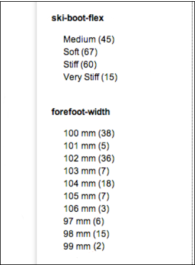
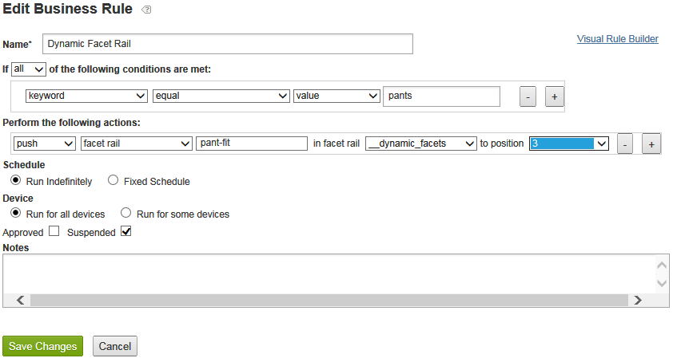

# Sobre aspectos dinâmicos{#about-dynamic-facets}

Use Aspectos dinâmicos para criar novas seleções de intervalo automaticamente no momento da pesquisa. Como opção, você pode associar cada campo de aspecto dinâmico a até um nome de tabela na sua conta de Search &amp; Promote de Adobe. Você aplica essas relações de tabela em tempo de pesquisa para quaisquer campos de aspecto dinâmico envolvidos na pesquisa.

## Usando aspectos dinâmicos {#concept_E65A70C9C2E04804BF24FBE1B3CAD899}

>[!NOTE]
>
>Este recurso não está ativado em [!DNL Adobe Search&Promote], por padrão. Entre em contato com o suporte técnico para ativar o recurso para uso.

Sem o uso de Aspectos dinâmicos, era necessário unir atributos relacionados em &quot;slots&quot; e exibir apenas os slots homogêneos para uma determinada pesquisa. Ou seja, eles poderiam conter apenas os valores de um atributo lógico, como &quot;tamanho do sapato&quot; ou &quot;tamanho do anel&quot;. Este método proporcionou um desempenho adequado em tempo de pesquisa com um grande conjunto de atributos exclusivos.

No entanto, quando o Dynamic Faceting é usado, ele não coloca um limite no número de aspectos que a pesquisa principal pode rastrear com eficiência. Você pode definir centenas de aspectos dinâmicos, dos quais a pesquisa principal pode retornar as &quot;principais `N` facetas dinâmicas&quot; para uma determinada pesquisa, em que `N` é normalmente um valor mais modesto de 10-20 ou menos. Esse método elimina a necessidade de alocar os atributos - agora você pode criar uma faceta dinâmica exclusiva para atributos em seu site.

## Que facetas você deveria fazer dinâmicas? {#section_254EE034BCAD4250A5D09FBF6158C4A5}

As facetas que são escassamente preenchidas em seu site e que aparecem somente para um subconjunto de pesquisas são bons candidatos para tornar dinâmicas. Por exemplo, uma faceta chamada &quot;largura da frente&quot; só pode ser preenchida quando se procura sapatos ou botas. Enquanto outra faceta chamada &quot;Estilo numérico da face&quot;, com possíveis valores de &quot;Romano&quot; e &quot;Árabe&quot;, só pode aparecer ao procurar relógios ou relógios.

Se sua conta tiver um grande número dessas facetas, isso aprimora o desempenho da pesquisa para usar facetas dinâmicas em vez de sempre selecionar o conjunto completo de possíveis aspectos para cada pesquisa. Aspectos genéricos, como &quot;SKU&quot; ou &quot;marca&quot;, que normalmente são apropriados para exibição com os resultados de cada pesquisa, normalmente não são apropriados como aspectos dinâmicos.

## Relação entre aspectos e campos de tag meta {#section_2869E5FCDA8B431A87BC6E5573F2B0A0}

As facetas são criadas sobre os campos da meta tag. Um campo de tag meta é um recurso de camada de pesquisa principal de baixo nível de [!DNL Adobe Search&Promote]. As facetas, por outro lado, são parte da camada de apresentação de Search &amp; Promote de Adobe GS (Pesquisa guiada) de alto nível. No entanto, os próprios campos de meta tag do Facebook não conhecem nada sobre aspectos. Ao configurar aspectos dinâmicos, você primeiro adiciona aspectos e, em seguida, adiciona campos de tag meta com a opção Aspecto dinâmico selecionada para definir a faceta identificada como dinâmica.

>[!NOTE]
>
>Não há nenhuma configuração de &quot;Aspecto dinâmico&quot; em **[!UICONTROL Design > Navigation > Facets]**. O que torna uma faceta &quot;dinâmica&quot; é que seu &quot;campo de tag meta&quot; subjacente é dinâmico, conforme definido em **[!UICONTROL Settings > Metadata > Definitions]**.

## Exemplos de aspectos dinâmicos em ação {#section_BC699A05E2E742EF94D41679163ACE84}

Exemplo de aspectos dinâmicos que são exibidos após uma pesquisa por &quot;inicializações&quot;:



Outro exemplo de aspectos dinâmicos que são exibidos após uma pesquisa por &quot;relógios&quot;:


Consulte também

* [Parâmetros CGI de pesquisa de backend](../c-appendices/c-cgiparameters.md#reference_582E85C3886740C98FE88CA9DF7918E8)
* [Tags de modelo de apresentação](../c-appendices/c-templates.md#reference_F1BBF616BCEC4AD7B2548ECD3CA74C64)
* [Tags de modelo de transporte](../c-appendices/c-templates.md#reference_227D199F5A7248049BE1D405C0584751)

## Configurar aspectos dinâmicos {#task_D17F484130E448258100BAC1EEC53F39}

Configuração de Aspectos Dinâmicos no Search&amp;Promotoe.

<!-- 

t_configuring_dynamic_facets.xml

 -->

>[!NOTE]
>
>Por padrão, esse recurso não está ativado no Search &amp; Promote de Adobe. Entre em contato com o suporte técnico para ativar o recurso para uso.

Antes que os efeitos de seus aspectos dinâmicos sejam visíveis para os clientes, você deve recriar o índice do site.

Consulte também

* [Parâmetros CGI de pesquisa de backend](../c-appendices/c-cgiparameters.md#reference_582E85C3886740C98FE88CA9DF7918E8)
* [Tags de modelo de apresentação](../c-appendices/c-templates.md#reference_F1BBF616BCEC4AD7B2548ECD3CA74C64)
* [Tags de modelo de transporte](../c-appendices/c-templates.md#reference_227D199F5A7248049BE1D405C0584751)

**Para configurar aspectos dinâmicos**

1. Verifique se você já adicionou aspectos.

   Consulte [Adicionar uma nova faceta](../c-about-design-menu/c-about-facets.md#task_FC07BFFA62CA4B718D6CBF4F2855C89B).
1. Depois que seus aspectos forem adicionados, verifique se você adicionou os aspectos aos novos campos de meta tag definidos pelo usuário.

   Consulte [Adicionar um novo campo de tag meta](../c-about-settings-menu/c-about-metadata-menu.md#task_6DF188C0FC7F4831A4444CA9AFA615E5).
1. No menu do produto, clique em **[!UICONTROL Settings]** > **[!UICONTROL Metadata]** > **[!UICONTROL Definitions.]**
1. Na página [!DNL Definitions], na tabela [!DNL User-defined fields], na coluna [!DNL Actions], clique no ícone de lápis (Editar) na linha do nome do campo da tag meta associada à faceta que você deseja tornar dinâmica.
1. Na página [!DNL Edit Field], marque **[!UICONTROL Dynamic Facet]**.

   Consulte a tabela de opções em [Adicionar um novo campo de tag meta](../c-about-settings-menu/c-about-metadata-menu.md#task_6DF188C0FC7F4831A4444CA9AFA615E5).
1. Clique em **[!UICONTROL Save Changes]**.
1. Clique em **regenerar o índice do site preparado** na caixa azul para recriar rapidamente o índice do site preparado.

   Consulte também [Regenerar o índice de um site ao vivo ou preparado](../c-about-index-menu/c-about-regenerate-index.md#task_B28DE40C0E9A475ABCBCBC4FF993AACD).
1. Determine o número de aspectos dinâmicos a serem selecionados para uma determinada pesquisa. Para realizar essa tarefa, execute um dos procedimentos a seguir:

   * Crie uma regra de limpeza de query com quaisquer condições desejadas, que execute a ação `set`, `backend parameter`, `sp_sfvl_df_count` para o valor `X`, em que `X` é o número desejado de aspectos dinâmicos a serem solicitados no momento da pesquisa, e clique em **[!UICONTROL Add]**.

   

   Consulte [Adicionar uma regra de limpeza de query](../c-about-rules-menu/c-about-query-cleaning-rules.md#task_47F43988D3D9485F8AE1DFDA7E00BF54).

   Consulte também [Parâmetros CGI de pesquisa de backend](../c-appendices/c-cgiparameters.md#reference_582E85C3886740C98FE88CA9DF7918E8), linha 40 na tabela para obter mais explicações de `sp_sfvl_df_count`.

   * Adicione uma pesquisa e defina o parâmetro &quot;custom&quot; `sp_sfvl_df_count` para o valor desejado e clique em **[!UICONTROL Add]**.

   

   Consulte [Adicionar uma nova definição de pesquisa](../c-about-settings-menu/c-about-searching-menu.md#task_98D3A168AB5D4F30A1ADB6E0D48AB648).

   Consulte também [Parâmetros CGI de pesquisa de backend](../c-appendices/c-cgiparameters.md#reference_582E85C3886740C98FE88CA9DF7918E8), linha 40 na tabela para obter mais explicações de `sp_sfvl_df_count`.

1. Edite o modelo de transporte apropriado para exibir os aspectos dinâmicos que a pesquisa principal retorna.

   Consulte [Editar uma apresentação ou um modelo de transporte](../c-about-design-menu/c-about-templates.md#task_800E0E2265C34C028C92FEB5A1243EC3).

   Por exemplo, suponha que seu modelo de transporte tenha o nome `guided.tpl`. Nesse caso, no menu do produto, clique em **[!UICONTROL Design > Templates]**. Na página [!DNL Templates], localize `guided.tpl` na tabela. e clique em **[!UICONTROL Edit]** à direita do nome. Na página Edição, adicione o seguinte bloco de código ao final de `</facets>`: Saída JSON:

   ```
   ... 
   }<search-dynamic-facet-fields>, 
           { 
               "name" : "<search-dynamic-facet-field-name>", 
               "dynamic-facet" : 1, 
               "values" : [<search-field-value-list quotes="yes" commas="yes" data="values" sortby="values" encoding="json" />], 
               "counts" : [<search-field-value-list quotes="yes" commas="yes" data="results" sortby="values" />] 
   
           }</search-dynamic-facet-fields> 
   ...
   ```

1. Edite o modelo ou modelos de apresentação apropriados para exibir as facetas dinâmicas.

   Consulte [Editar uma apresentação ou um modelo de transporte](../c-about-design-menu/c-about-templates.md#task_800E0E2265C34C028C92FEB5A1243EC3).

   Por exemplo, suponha que você tenha um modelo chamado `sim.tmpl` que seja usado para produzir conteúdo no Simulador. Para editar esse modelo, no menu do produto, clique em **[!UICONTROL Design > Templates]**. Na página [!DNL Templates], localize `sim.tmpl` na tabela. e clique em **[!UICONTROL Edit]** à direita do nome. Na página Edição, adicione o seguinte dentro da área de exibição da faceta do modelo:

   ```
   <h6>DF RAIL</h6> 
   <guided-facet-rail gsname="__dynamic_facets"> 
               <guided-facet ><!-- behavior=Normal --> 
               <div class="facet-block" id="facet"> 
               <p><b><guided-facet-display-name /></b></p> 
               <ul> 
                   <guided-facet-values> 
                       <guided-if-facet-value-equals-length-threshold> 
               </ul> 
               <ul id="brand" style="display:none"> 
                       </guided-if-facet-value-equals-length-threshold> 
                       <guided-if-facet-value-selected> 
                           <li><guided-facet-value> [<guided-lt>a href="<guided-facet-value-undo-path />"<guided-gt>X</a>]</li> 
                       <guided-else-facet-value-selected> 
                           <li><guided-facet-link><guided-facet-value></guided-facet-link> (<guided-facet-count>) </li> 
                       </guided-if-facet-value-selected> 
                   </guided-facet-values> 
               </ul> 
               <guided-if-facet-long> 
                 <br /><guided-lt />a href="#" onclick="moreless(this,'brand');return false;" <guided-gt /><button style="font-size:10px;">VIEW MORE</button></a> 
               </guided-if-facet-long> 
               </div> 
               </guided-facet> 
   </guided-facet-rail> 
   <h6>/DF RAIL</h6>
   ```

   Você também faria uma modificação semelhante a outros modelos de Apresentação, conforme necessário, como `json.tmpl`.

   Certifique-se de especificar `__dynamic_facets` para `gsname` na tag `guided-facet-rail`. Esta tag é um painel de facetas predefinido reservado para a saída de quaisquer facetas dinâmicas que são retornadas para uma determinada pesquisa.

   Você também pode editar opcionalmente esse painel de facetas especiais por meio de **[!UICONTROL Rules > Business Rules]** e usando **[!UICONTROL Advanced Rule Builder]** como mostrado abaixo.

   

   Consulte também [Adicionar uma nova regra de negócios](../c-about-rules-menu/c-about-business-rules.md#task_BD3B31ED48BB4B1B8F1DCD3BFA2528E7)
