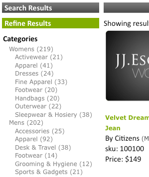

# Sobre os aspectos{#about-facets}

Você pode usar o Facets para personalizar sua camada de apresentação e fornecer aos usuários uma Pesquisa guiada que permite que eles detalhem os resultados da pesquisa.

## Usando aspectos {#concept_FA912B3B41EE493DB2F492D188457FF5}

Por exemplo, suponha que um visitante para um site que vende ferramentas execute uma pesquisa por chaves. A empresa pode usar duas facetas: uma para especificar todas as marcas de chave que foram encontradas e a segunda para especificar todos os tamanhos de chave. O cliente pode clicar em qualquer marca ou tamanho dentro da faceta apropriada para restringir os resultados e encontrar rapidamente a chave inglesa correta de que precisa.

É possível basear uma faceta em qualquer definição de metadados existente. Se um aspecto for definido como um tipo de Data nos metadados, ele será exibido como uma faceta de intervalo de datas.

A tabela na página [!DNL Staged Facets] mostra uma visão geral das configurações que compõem cada aspecto adicionado. Você pode adicionar novas facetas e editar ou excluir aspectos existentes. É possível reverter quaisquer alterações feitas nas facetas usando **[!UICONTROL History]** próximo ao canto superior direito da página.

As configurações de facetas são preparadas por padrão para permitir que você teste as alterações antes de colocá-las em funcionamento.

Consulte [Sobre o armazenamento temporário](../c-about-staging.md#concept_08B8F3CA1F4241108F14BA7FC7806CA7).

Você pode usar **[!UICONTROL View Live Settings]** para comparar suas configurações preparadas com a configuração ativa atual. Use **[!UICONTROL View Staged Settings]** para retornar à área de preparo. Para um item que é preparado, a versão em tempo real das configurações é somente leitura. Portanto, você a manipula por meio da ativação das configurações preparadas. Depois que você estiver satisfeito com as alterações feitas na faceta de preparo, clique em **[!UICONTROL Push Live]** para colocá-las online.

## Aspectos de intervalo de datas {#section_FEFFF6B5B6534456913189FEF559BA58}

Os aspectos definidos como Data do tipo nos metadados são tratados de forma diferente dos outros aspectos. Em vez de serem tratados como um conjunto de valores, eles são tratados como um intervalo de datas, com uma data de start, uma data de término ou ambos.

Um aspecto de intervalo de datas tem um valor da data do start, seguido por &quot;BTW&quot; (para &quot;entre&quot;), seguido da data final. As datas estão nos dois formatos a seguir:

mm-dd-aaaa

mm/dd/aaaa

São necessários anos de quatro dígitos. Deve haver pelo menos uma das datas de start ou de término, mas ambas não são obrigatórias. Por exemplo, &quot;12/1/2007BTW1/4/2009&quot; significa todas as datas entre 1º de dezembro de 2007 e 4 de janeiro de 2009. Entretanto, &quot;1-1-2005BTW&quot; significa todas as datas desde 1º de janeiro de 2005.

Você pode usar a tag do modelo de apresentação `<guided-facet-value/>` para obter um valor da faceta do intervalo de datas, como uma faceta normal. Atualmente, o JavaScript é necessário para permitir que os usuários digitem intervalos de datas para pesquisa. Por exemplo, você pode obter a entrada de dois campos de entrada para as datas de start e término. Em seguida, você pode validar a entrada e anexar o valor da nova faceta (criado a partir dos dois campos de entrada) e o nome da faceta ao URL existente.

Consulte [Tags de modelo de apresentação](../c-appendices/c-templates.md#reference_F1BBF616BCEC4AD7B2548ECD3CA74C64).

A amostra de código a seguir é um exemplo de como apresentar um intervalo de datas em uma página. Mostra o intervalo de datas existente se estiver selecionado; caso contrário, apresenta um formulário de entrada simples. Quando o formulário é submetido, ele executa uma validação simples. Em seguida, envia o navegador para um novo URL que inclui dois novos parâmetros:

* `q#` - Representa o intervalo de datas selecionado montado nos dois campos de entrada.
* `x#` - Nomeia a faceta. Neste exemplo, a faceta de intervalo de datas é chamada de &quot;modificado&quot;.

As partes `replace(/%2F/ig, '~2F')` no código são necessárias porque o Apache não permite `%2F` em caminhos de URL por motivos de segurança e, ao usar URLs SEO, o query está no caminho de URL. Portanto, `/` é codificado como `~2F` em vez de `%2F`, pois normalmente estaria em um URL.

```
<div class="date_range"> 
 <p>Date Range</p> 
 <guided-if-facet-selected gsname="modified"> 
  <guided-facet-values gsname="modified"> 
   <script> 
   var modified_daterange= '<guided-facet-value />'.split(/BTW/) ; 
   if (modified_daterange[0]=='') modified_daterange[0]= '--/--/----' ; 
   if (modified_daterange[1]=='') modified_daterange[1]= '--/--/----' ; 
   document.write('From: ' + modified_daterange[0]) ; 
   document.write('<br>To: ' + modified_daterange[1]) ; 
   </script> 
  </guided-facet-values> 
 
 <guided-else-facet-selected> 
  <form action="#"> 
   From: <input name="dateFrom" size=10> 
   <br>To: <input name="dateTo" size=10> 
   <br><input type="button" value="Go" onclick="goClick(this.form)"> 
  </form> 
  <script> 
  function goClick(f) { 
   if (f.dateFrom.value=='' && f.dateTo.value=='') { 
    alert('You must enter either a From: date or a To: date.') ; 
    return ; 
   } 
   if ( f.dateFrom.value!='' && !f.dateFrom.value.match(/^\d+[\/\-]\d+[\/\-]\d\d\d\d$/) ) { 
    alert('From: date must be in "mm/dd/yyyy" or "mm-dd-yyyy" format.') ; 
    return ; 
   } 
   if ( f.dateTo.value!='' && !f.dateTo.value.match(/^\d+[\/\-]\d+[\/\-]\d\d\d\d$/) ) { 
    alert('To: date must be in "mm/dd/yyyy" or "mm-dd-yyyy" format.') ; 
    return ; 
   } 
   // Note that "/" is encoded as "~2F" instead of "%2F" to avoid Apache 404 error. 
   var new_url= '<guided-current-path />&<guided-query-param-name gsname="q#" offset="0" />=' 
    + encodeURIComponent(f.dateFrom.value).replace(/%2F/ig, '~2F') + 'BTW' 
    + encodeURIComponent(f.dateTo  .value).replace(/%2F/ig, '~2F') 
    + '&<guided-query-param-name gsname="x#" offset="0" />=modified' ; 
   location.href= new_url ; 
  } 
  </script> 
 </guided-if-facet-selected> 
</div>
```

## Sobre aspectos aninhados {#section_6BC77F38DE9F43D5B6911F8CECB15DFC}

As facetas aninhadas são facetas que exibem vários níveis de categorias, como a seguir:



As categorias Mulheres e Masculino estão na faceta superior ou principal. As subcategorias, como Acessórios e Calçado, estão na faceta inferior ou secundária.

A profundidade de aspecto aninhado atual suportada é de dois, mas pode estar em qualquer lugar ao longo da lista de detalhamento.

Estes são os comportamentos de vários tipos de facetas aninhadas:

<table> 
 <thead> 
  <tr> 
   <th colname="col1" class="entry"> <p>Comportamento do tipo de aspecto aninhado </p> </th> 
   <th colname="col2" class="entry"> <p>Comportamento </p> </th> 
  </tr> 
 </thead>
 <tbody> 
  <tr> 
   <td colname="col1"> <p>Normal </p> </td> 
   <td colname="col2"> <p>O comportamento de uma faceta aninhada normal é que ela diminui se outras facetas estreitam a pesquisa. </p> <p>Se a faceta aninhada for selecionada, ela se encolherá em direção à sua seleção. Se uma faceta pai for selecionada, somente esse pai será exibido com todas as facetas filhas restantes. Se uma faceta secundária for selecionada, a faceta mostrará somente a faceta pai selecionada e a faceta filho selecionada. </p> </td> 
  </tr> 
  <tr> 
   <td colname="col1"> <p>Aderente </p> </td> 
   <td colname="col2"> <p>O comportamento de uma faceta aninhada pegajosa é tentar manter a faceta aberta o máximo possível com base no estado de outras facetas ou critérios de pesquisa. Se a faceta filho estiver selecionada, ela conta em direção à profundidade adesiva. </p> </td> 
  </tr> 
  <tr> 
   <td colname="col1"> <p>Seleção múltipla </p> </td> 
   <td colname="col2"> <p>O comportamento de uma faceta multisseleção é manter a faceta aberta. Quaisquer novas seleções tentam eliminar todas as outras seleções de facetas, a menos que a faceta seja "pai" da faceta aninhada da categoria. Nesse caso, "pai" refere-se às facetas categorias, não categorias de nível superior de uma faceta aninhada. </p> </td> 
  </tr> 
  <tr> 
   <td colname="col1"> <p>Seleção múltipla de categoria </p> </td> 
   <td colname="col2"> <p>Tipo de aspecto aninhado de seleção múltipla semelhante com as seguintes exceções: </p> 
    <ul id="ul_D5AB6AF3169A483E8F3FC6D2A2EA3A28"> 
     <li id="li_9308156EF2FF43CE9DFB933F13786C58">Quaisquer outras facetas escolhidas anteriormente serão desmarcadas se essa faceta for selecionada pela primeira vez. </li> 
     <li id="li_DD96D6802A9C479283212A0FD68C6F85">Outras facetas anteriormente escolhidas também são desmarcadas se o cliente detalha diretamente para a faceta filho sem clicar na faceta pai ou se um irmão de uma outra faceta pai for escolhido. </li> 
     <li id="li_8BF58F10969B4743986D5D0E0086AD6C">Eles podem ter pais no sentido de que facetas categorias têm pais. Não confunda esse comportamento com relações pai-filho encontradas com todas as facetas aninhadas. </li> 
    </ul> </td> 
  </tr> 
 </tbody> 
</table>

Consulte também [Sobre o Facet Rail](../c-about-design-menu/c-about-facet-rails.md#concept_1FDC8BCDFFC84A0889DA670F63D5F6DB).

## Adicionar uma nova faceta {#task_FC07BFFA62CA4B718D6CBF4F2855C89B}

Você pode adicionar aspectos para personalizar sua camada de apresentação e fornecer aos clientes uma Pesquisa guiada que permite que eles detalhem os resultados da pesquisa.

<!-- 

t_adding_a_new_facet.xml

 -->

A tabela de facetas na página [!DNL Facets] mostra um trecho das configurações que compõem uma única faceta. Você pode adicionar novas facetas e editar ou excluir aspectos existentes. Qualquer alteração feita nas facetas pode ser revertida usando o recurso Histórico.

>[!NOTE]
>
>Certifique-se de fazer referência à faceta em seu modelo de apresentação para que esteja visível no site.

Consulte também [Sobre o Facet Rail](../c-about-design-menu/c-about-facet-rails.md#concept_1FDC8BCDFFC84A0889DA670F63D5F6DB).

**Para adicionar uma nova faceta**

1. Antes de adicionar uma nova faceta, verifique se você já fez o seguinte antes de prosseguir para a próxima etapa:

   * Alguns campos de tag meta já estão definidos.

      Consulte [Adicionar um novo campo de tag meta](../c-about-settings-menu/c-about-metadata-menu.md#task_6DF188C0FC7F4831A4444CA9AFA615E5).
   * Injete os metadados no índice.
Consulte [Adicionar definições de injeção de campo](../c-about-settings-menu/c-about-metadata-menu.md#task_E86566FA1FF74CF68115C0ADA05172AE).

1. No menu do produto, clique em **[!UICONTROL Design]** > **[!UICONTROL Navigation]** > **[!UICONTROL Facets.]**
1. Na página [!DNL Facets], clique em **[!UICONTROL Add New Facet]**.
1. Na página [!DNL Add Facet], defina as opções desejadas.

   Essas configurações afetam o comportamento e a apresentação padrão de uma faceta. É possível substituir algumas dessas configurações por meio das configurações do modelo de apresentação.

   Se um aspecto for definido como um tipo de Data nos metadados, ele será exibido como um intervalo de datas.

   Consulte [Aspectos de intervalo de datas](../c-about-design-menu/c-about-facets.md#section_FEFFF6B5B6534456913189FEF559BA58).

   Dependendo das opções de aspecto selecionadas, nem todas as opções estão disponíveis.

   <!-- 
   r_add_facet_options.xml
   -->

   <table> 
    <thead> 
      <tr> 
      <th colname="col1" class="entry"> <p>Opção </p> </th> 
      <th colname="col2" class="entry"> <p>Descrição </p> </th> 
      </tr> 
    </thead>
    <tbody> 
      <tr> 
      <td colname="col1"> <p>Nome da face </p> </td> 
      <td colname="col2"> <p>Identifica o nome de uma determinada faceta. </p> <p> <p>Observação:  Você só pode ter uma faceta com base em metadados existentes definidos pelo usuário. Se não houver aspectos disponíveis na lista suspensa, primeiro defina alguns metadados. </p> </p> <p>Consulte <a href="../c-about-settings-menu/c-about-metadata-menu.md#task_6DF188C0FC7F4831A4444CA9AFA615E5" type="task" format="dita" scope="local"> Adicionando um novo campo de tag meta </a>. </p> <p>Para criar uma faceta com base em uma tabela de campo, use o nome de faceta personalizado e especifique o nome da tabela de campo. </p> </td> 
      </tr> 
      <tr> 
      <td colname="col1"> <p>Rótulo de exibição </p> </td> 
      <td colname="col2"> <p>Define o rótulo de uma faceta que pode ser usado em uma trilha de navegação, em vez de um nome de campo de metadados (com a tag <span class="codeph"> &lt;guided-breadcrumb-label&gt; </span>) ou um valor independente (com a tag <span class="codeph"> &lt;guided-facet-display-name&gt; </span>). </p> </td> 
      </tr> 
      <tr> 
      <td colname="col1"> <p>Comportamento </p> </td> 
      <td colname="col2"> <p>Define um de três comportamentos de faceta. </p> <p> 
      <ul id="ul_67C19E1C16224B9990F04A0D05BD3D05"> 
      <li id="li_6B232C11A61840B68CA59E1F593405A0"> <span class="uicontrol"> Normal </span> <p>Quando um cliente clica em uma faceta cujo comportamento está definido como <span class="uicontrol"> Normal </span>, ele detalha os resultados da pesquisa desse item. A partir daí, o cliente pode refinar e restringir ainda mais o número de resultados da pesquisa. </p> </li> 
      <li id="li_7D7C43A7F7AB4B84A9B0FEF34627605A"> <span class="uicontrol"> Categoria </span> <p>As facetas de categoria atuam como elementos de navegação. Essas facetas são facetas de nível superior que os clientes normalmente analisam antes de revelar facetas com opções de atributo. As facetas de categoria não se restringem quando outras facetas são selecionadas e permanecem abertas. Clicar em um valor diferente em uma faceta categoria cancela a seleção de todas as outras facetas na página, exceto os pais daquela faceta categoria. </p> </li> 
      <li id="li_01255993D71F40DBA8870AA3FEA7D304"> <span class="uicontrol"> Seleção múltipla de categoria  </span> <p>as facetas são facetas categorias que suportam a seleção de vários itens da faceta em que os itens são "OUed" juntos. </p> </li> 
      </ul> 
      <ul id="ul_683F6D3FC8524E65AF303453ADDB6001"> 
        <li id="li_81F504D1D1294666BBBC5EA43B34B712"> <span class="uicontrol"> Aderente </span> <p>Quando um cliente clica em uma faceta cujo comportamento está definido como <span class="uicontrol"> Aderente </span>, a faceta com a opção selecionada permanece aberta durante a busca detalhada. Essa opção é útil quando você deseja permitir que um cliente altere uma opção anterior. </p> </li> 
      </ul> 
      <ul id="ul_8E871D63B09445268C600C8ABC20F6A4"> 
        <li id="li_F88AC5528B0C4751BC4CFE7FA9525857"> <span class="uicontrol"> Seleção múltipla  </span> <p>Permite a seleção de vários itens de uma faceta, onde os itens dentro da faceta são "OUed" juntos. Essa opção é útil para uma faceta que pode mostrar um atributo menor, como cores, e você deseja permitir que o cliente possa criar um query que permita "mostrar sapatos no meu tamanho que sejam vermelhos ou pretos". </p> </li> 
      </ul> </p> </td> 
      </tr> 
      <tr> 
      <td colname="col1"> <p>Mostrar sempre </p> </td> 
      <td colname="col2"> <p>Para uma faceta normal ou aderente, define a faceta para permanecer visível ao cliente o tempo todo. </p> <p>Esta opção só está disponível se você selecionou <span class="uicontrol"> Normal </span>, <span class="uicontrol"> Categoria </span> ou <span class="uicontrol"> Aderente </span> na lista suspensa <span class="uicontrol"> Comportamento </span>. </p> </td> 
      </tr> 
      <tr> 
      <td colname="col1"> <p>Pais da faceta </p> </td> 
      <td colname="col2"> <p>Essa opção só estará disponível se você tiver selecionado <span class="uicontrol"> Categoria </span> ou <span class="uicontrol"> Seleção múltipla de Categoria </span> na lista suspensa <span class="uicontrol"> Comportamento </span>. </p> <p>Indica quais são os pais da faceta categoria. Os itens selecionados nas facetas pai do categoria são usados para restringir as opções disponíveis na faceta de categoria atual. As facetas pai não são desmarcadas quando um cliente interage com a faceta categoria. É possível especificar vários pais delimitados por vírgulas. </p> </td> 
      </tr> 
      <tr> 
      <td colname="col1"> <p>Profundidade aderente </p> </td> 
      <td colname="col2"> <p>Essa opção só estará disponível se você tiver selecionado <span class="uicontrol"> Aderente </span> na lista suspensa <span class="uicontrol"> Comportamento </span>. </p> <p>Define o número de opções a serem mantidas abertas durante a busca detalhada. </p> </td> 
      </tr> 
      <tr> 
      <td colname="col1"> <p>Limite de comprimento </p> </td> 
      <td colname="col2"> <p>Define o comprimento vertical (1-9999) da faceta definida em número de itens. </p> <p>Se o modelo de apresentação estiver configurado adequadamente, você poderá usar essa configuração para fornecer um "Mostrar mais..." ou determine quando jogar a faceta em uma div com rolagem e assim por diante. </p> </td> 
      </tr> 
      <tr> 
      <td colname="col1"> <p>Limite de comprimento da truncagem </p> </td> 
      <td colname="col2"> <p>Trunca o número de itens em uma faceta após um determinado limite. </p> <p>Algumas implementações têm facetas com milhares de itens nelas. Pode ser caro enviar todos os dados pela rede. Você pode usar essa configuração para aparar a faceta para um nível gerenciável. A faceta será truncada após a classificação. </p> </td> 
      </tr> 
      <tr> 
      <td colname="col1"> <p>Largura máxima do valor </p> </td> 
      <td colname="col2"> <p>Especifica um limite para o comprimento da string de valor de faceta (1-999). </p> <p>Essa opção é útil quando você deseja colocar uma faceta em um layout de largura fixa e impedir que as strings se vinculem. Por padrão, a string é definida como 3 caracteres menores que o limite para que uma reticulação possa ser adicionada. </p> </td> 
      </tr> 
      <tr> 
      <td colname="col1"> <p>Extensão de valor </p> </td> 
      <td colname="col2"> <p>Especifica a string que você deseja usar para indicar que o valor de uma faceta está truncado. Por padrão, a string "..." é usada. </p> </td> 
      </tr> 
      <tr> 
      <td colname="col1"> <p>Delimitador </p> </td> 
      <td colname="col2"> <p>Especifica o delimitador a ser usado para qualquer lista de valor separado delimitado que se aplique à faceta. </p> <p>O delimitador usado é o mesmo definido nos metadados nos quais a faceta se baseia. O delimitador padrão é uma vírgula. No entanto, você pode usar qualquer valor compatível com XML. </p> </td> 
      </tr> 
      <tr> 
      <td colname="col1"> <p>Classificar </p> </td> 
      <td colname="col2"> <p>Especifica como você deseja que as facetas sejam classificadas em seu site. Você pode ter facetas ordenadas pelo seguinte. Se desejado, você pode combinar até cinco tipos. </p> 
      <ul id="ul_12987F4DC7B34C63ABC906B59688A174"> 
      <li id="li_3206C96013DF431D90119F594D93D85D"> <span class="uicontrol"> alfa  </span> <p>Classifica os valores em ordem alfabética (0-9, A-Z), incluindo caracteres de pontuação. </p> </li> 
      <li id="li_304E4A518FBE48D18D9E9EA7339A3481"> <span class="uicontrol"> alfa (somente alfanumérico)  </span> <p>Classifica os valores em ordem alfabética (0-9, A-Z), ignorando os caracteres de pontuação. </p> </li> 
      <li id="li_CADB888CC514455F9CA379C8EEE490AA"> <span class="uicontrol"> alfa (não diferencia maiúsculas de minúsculas)  </span> <p>Classifica os valores em ordem alfabética (0-9, A-Z), ignorando as letras maiúsculas e minúsculas dos caracteres alfabéticos e incluindo os caracteres de pontuação. </p> </li> 
      <li id="li_F61122E79AB5413792DA31F8AB1414BD"> <span class="uicontrol"> alfa (não diferencia maiúsculas de minúsculas, somente alfanumérico)  </span> <p>Classifica os valores em ordem alfabética (0-9, A-Z), ignorando as letras maiúsculas e minúsculas dos caracteres alfabéticos e ignorando os caracteres de pontuação. </p> </li> 
      <li id="li_F50CC298ABF046D0A39D5AE5B1261823"> <span class="uicontrol"> count  </span> <p>Classifica por número de resultados que correspondem a cada valor de aspecto de maior a menor. </p> </li> 
      <li id="li_32B6AF39E9534762B39B15181DC5AD01"> <span class="uicontrol"> numérico  </span> <p>Classifica os valores numericamente. Ao classificar os números, essa opção é superior a uma classificação Alfa, pois se você usar uma classificação Alfa, 10 será exibido antes de 2. </p> </li> 
      <li id="li_CF8E76A7B1184E0C8DCC11B53E31A1DC"> <span class="uicontrol"> split </span> <p>Quebra a lista em duas listas separadas por limite de contagem. Os valores de aspecto acima do limite são movidos para o topo. Os valores de facetas com contagens abaixo do limite são movidos para a parte inferior. Um limite de divisão é necessário quando você deseja forçar os valores de um determinado intervalo a estarem sempre na parte superior. </p> </li> 
      <li id="li_4AB8276577384B1099CBA895898205AD"> <span class="uicontrol"> quebra  </span> <p>Força certos valores para a parte superior ou inferior da lista. Por exemplo, você pode sempre querer que o termo "Outro" apareça na parte inferior da lista. Os valores superiores ou inferiores são necessários ao usar uma classificação de quebra para identificar os valores explícitos que devem estar na parte superior ou inferior da classificação. </p> </li> 
      <li id="li_227E96CFED2044FCA2F10B6913B03CFB"> <span class="uicontrol"> pedido  </span> <p>Os valores de aspecto devem estar sempre em uma ordem fixa (uma lista de valor separada por delimitadores definida na opção <span class="uicontrol"> Order </span> descrita abaixo). </p> </li> 
      </ul> </td> 
      </tr> 
      <tr> 
      <td colname="col1"> <p>Alias da face </p> </td> 
      <td colname="col2"> <p>Para oferecer suporte a URLs de pesquisa existentes que podem estar disponíveis no modo original, você pode usar um alias de faceta para mapear o nome do parâmetro herdado para modificado ou apenas criar uma faceta com um nome diferente. O alias é aplicado somente às solicitações recebidas e não é usado para criar links de facetas. </p> </td> 
      </tr> 
      <tr> 
      <td colname="col1"> <p>Nome do painel de facetas </p> </td> 
      <td colname="col2"> <p>O nome do painel de facetas se você decidir classificar suas facetas alfabeticamente, por contagem ou por um método personalizado. </p> <p>Consulte <a href="../c-about-design-menu/c-about-facet-rails.md#concept_1FDC8BCDFFC84A0889DA670F63D5F6DB" format="dita" scope="local">Sobre o Facet Rail </a>. </p> </td> 
      </tr> 
      <tr> 
      <td colname="col1"> <p>Pedido </p> </td> 
      <td colname="col2"> <p>Essa opção só estará disponível se você tiver selecionado <span class="uicontrol"> Solicitado </span> na lista suspensa <span class="uicontrol"> Classificar </span>. </p> <p>Permite que você defina uma lista de valores delimitada que especifica a ordem a ser usada. </p> </td> 
      </tr> 
      <tr> 
      <td colname="col1"> <p>Anexar extras </p> </td> 
      <td colname="col2"> <p>Essa opção só estará disponível se você tiver selecionado <span class="uicontrol"> Solicitado </span> na lista suspensa <span class="uicontrol"> Classificar </span>. </p> <p>Se os valores não estiverem presentes na lista solicitada, eles serão anexados ao final. </p> </td> 
      </tr> 
      <tr> 
      <td colname="col1"> <p>Mostrar fantasmas </p> </td> 
      <td colname="col2"> <p>Essa opção só estará disponível se você tiver selecionado <span class="uicontrol"> Solicitado </span> na lista suspensa <span class="uicontrol"> Classificar </span>. </p> <p>Se os valores especificados pela lista solicitada estiverem ausentes, essa opção sinalizará cada item ausente na faceta como "fantasma" para que os itens sejam exibidos de forma diferente. </p> </td> 
      </tr> 
      <tr> 
      <td colname="col1"> <p>Aspecto aninhado </p> </td> 
      <td colname="col2"> <p>Uma faceta aninhada exibe suas categorias e categorias de seus filhos. Ele só pode mostrar uma profundidade de duas categorias, mas pode estar em qualquer lugar ao longo da análise. </p> <p>Os dados desta faceta devem seguir uma convenção para descrever os dois níveis de categorias. Por exemplo, um valor de faceta pode ser 'sapatos:botas' onde a categoria pai é 'sapatos' e a categoria filho é 'botas'. O ':' é usado como delimitador para separá-los. </p> <p>Consulte Delimitador aninhado abaixo para obter mais informações sobre como alterar o delimitador. </p> <p>Para gerar os dados nesse formato, você pode usar um script de filtro para combinar duas categorias existentes. Você pode combinar comportamentos Normal, Categoria e Aderente com facetas aninhadas. </p> </td> 
      </tr> 
      <tr> 
      <td colname="col1"> <p>Nome pai aninhado </p> </td> 
      <td colname="col2"> <p>Esta lista suspensa só estará disponível se você tiver selecionado <span class="uicontrol"> Aspecto aninhado </span>. </p> <p>Permite escolher qual campo representa a categoria pai. Esse campo é usado durante o tempo de pesquisa em categorias pai correspondentes. </p> </td> 
      </tr> 
      <tr> 
      <td colname="col1"> <p>Nome filho aninhado </p> </td> 
      <td colname="col2"> <p>Esta lista suspensa só estará disponível se você tiver selecionado <span class="uicontrol"> Aspecto aninhado </span>. </p> <p>Permite escolher qual campo representa a categoria filho. Esse campo é usado durante o tempo de pesquisa em categorias secundárias correspondentes. </p> </td> 
      </tr> 
      <tr> 
      <td colname="col1"> <p>Delimitador de face aninhado </p> </td> 
      <td colname="col2"> <p>Essa opção só estará disponível se você tiver selecionado <span class="uicontrol"> Aspecto aninhado </span>. </p> <p>O caractere inserido aqui é usado para analisar as categorias pai e filho a partir de seus dados. </p> <p>Por exemplo, se ':' for usado como delimitador e o pai for 'sapatos' e o filho for 'botas', ele espera que os dados sejam formatados como 'sapatos:botas'. </p> </td> 
      </tr> 
      <tr> 
      <td colname="col1"> <p>Limite de divisão </p> </td> 
      <td colname="col2"> <p>Essa opção só estará disponível se você tiver selecionado <span class="uicontrol"> Dividir </span> na lista suspensa <span class="uicontrol"> Classificar </span>. </p> <p>Ao usar uma classificação Dividir, o limite de divisão define a contagem na qual dividir a faceta em duas listas separadas. Valores com contagens maiores ou iguais ao limite são mantidos na parte superior, enquanto valores abaixo do limite são movidos para a parte inferior. </p> </td> 
      </tr> 
      <tr> 
      <td colname="col1"> <p>Valores Superiores </p> </td> 
      <td colname="col2"> <p>Essa opção só estará disponível se você tiver selecionado <span class="uicontrol"> Quebrar </span> na lista suspensa <span class="uicontrol"> Classificar </span>. </p> <p>Ao usar uma classificação de Quebra, essa lista de valores delimitados é sempre colocada na parte superior da lista. O uso de expressões regulares é permitido, mas devem estar entre chaves ou chaves, por exemplo: {^Novo.*?},{^Muito Novo.*} </p> </td> 
      </tr> 
      <tr> 
      <td colname="col1"> <p>Valores Inferiores </p> </td> 
      <td colname="col2"> <p>Essa opção só estará disponível se você tiver selecionado <span class="uicontrol"> Quebrar </span> na lista suspensa <span class="uicontrol"> Classificar </span>. </p> <p>Ao usar uma classificação de Quebra, essa lista de valores delimitados é sempre colocada na parte inferior da lista. O uso de expressões regulares é permitido, mas devem estar entre chaves ou chaves, como no exemplo a seguir: {^Antigo.*?},{^Muito antigo.*} </p> </td> 
      </tr> 
    </tbody> 
    </table>

1. Clique em **[!UICONTROL Add]**.
1. (Opcional) Na página [!DNL Facets], execute um dos procedimentos a seguir:

   * Clique em **[!UICONTROL History]** para reverter quaisquer alterações feitas.

      Consulte [Usando a opção Histórico](../t-using-the-history-option.md#task_70DD3F87A67242BBBD2CB27156F43002).

   * Clique em **[!UICONTROL Live]**.

      Consulte [Ver definições ativas](../c-about-staging.md#task_401A0EBDB5DB4D4CA933CBA7BECDC10F).

   * Clique em **[!UICONTROL Push Live]**.

      Consulte [Envio de configurações de estágio ao vivo](../c-about-staging.md#task_44306783B4C0408AAA58B471DAF2D9A4).

## Adicionar uma faceta aninhada {#task_A132FA7EB7494A6B88E443F2C3FABBBA}

Você pode adicionar uma faceta aninhada para exibir vários níveis de categorias.

<!-- 

t_adding_a_nested_facet.xml

 -->

Lembre-se do seguinte ao criar uma faceta aninhada:

* Cada aspecto aninhado requer um campo de tag meta definido pelo usuário.
* As facetas aninhadas são compostas de duas outras facetas, a faceta pai e a faceta filho. Elas podem ser facetas de valor único ou de valor múltiplo. Não é permitida a combinação de aspectos de valor único e de aspectos de valor múltiplo.
* É necessário determinar se essa faceta será usada na tabela de campos de pesquisa. A tabela de campos exige a própria faceta aninhada e seus aspectos de composição.
* Considere o uso do JSON para implementar aspectos aninhados; é mais fácil.

* [Tarefa 1 - Adicionar uma tag meta](../c-about-design-menu/c-about-facets.md#task_6944558325204E749C725DCFEF17EF3D)
* [Tarefa 2 - Adicionar um script de filtragem para gerar dados pré-formatados](../c-about-design-menu/c-about-facets.md#task_2DFED8BCB87B4067A6CE280945D7CAF4)
* [Tarefa 3 - Adicionar uma nova faceta](../c-about-design-menu/c-about-facets.md#task_3C11A4159FC44B9494D48594941AF8CF)
* [Tarefa 4 - Editar pesquisa guiada](../c-about-design-menu/c-about-facets.md#task_E50EFD7BBD0F45729C15759EA4F548D8)
* [Tarefa 5 - Criar o modelo de transporte](../c-about-design-menu/c-about-facets.md#task_C1FEDEF11D2549DEB1A9C09BFBA64381)
* [Tarefa 6 - Criar o modelo de apresentação](../c-about-design-menu/c-about-facets.md#task_4B2ABB37B9CD4F3F8AF8E6874227A995)
* [Tarefa 7 - Editar a navegação estrutural](../c-about-design-menu/c-about-facets.md#task_5E22409528EC4DA284821F82FDCE3438)

>[!NOTE]
>
>Este tópico se refere à faceta aninhada como faceta n1.

## Tarefa 1 - Adicionar uma tag meta {#task_6944558325204E749C725DCFEF17EF3D}

Adicione um novo campo de tag meta dedicado à data de retenção para a faceta aninhada. Pode ser um campo de vários valores ou um campo de valor único.

1. No menu do produto, clique em **[!UICONTROL Settings]** > **[!UICONTROL Metadata]** > **[!UICONTROL Definitions]**.
1. Na página [!DNL Definitions], clique em **[!UICONTROL Add New Field]**.
1. Na página [!DNL Add Field], defina as opções desejadas.

   Consulte [Adicionar um novo campo de tag meta](../c-about-settings-menu/c-about-metadata-menu.md#task_6DF188C0FC7F4831A4444CA9AFA615E5).
1. Clique em **[!UICONTROL Add]**.
1. (Opcional) Reconstrua o índice do site preparado se desejar pré-visualização nos resultados.

   Consulte [Configurar um índice incremental de um site preparado](../c-about-index-menu/c-about-incremental-index.md#task_46A367B0786C4C90BFFA5D3F95FD86C0).

   As tarefas restantes referem-se a esse campo de tag meta como **n1**.

## Tarefa 2 - Adicionar um script de filtragem para gerar dados pré-formatados {#task_2DFED8BCB87B4067A6CE280945D7CAF4}

1. Adicione um script de filtragem para combinar os aspectos originais no seguinte formato: `<parent_value><nested_delimiter><child_value>`.

   Consulte [Adicionar um script de filtragem](../c-about-settings-menu/c-about-filtering-menu.md#task_0AB84FD1133F47F9AA069A79BEA13A22).

   A seguir estão exemplos de valores para o campo de tag meta n1, usando o formato acima

   `Womens:Handbags`

   `Womens:Dresses`

   `Mens:Accessories`

   `Mens:Footwear`
1. Depois de criar ou editar o script de filtragem, teste-o. Se parecer correto, reindexe sua conta, se apropriado. Você pode verificar o índice usando [!DNL Index Overview].

   Os exemplos a seguir pressupõem que você tenha algumas bibliotecas de consultoria padrão incluídas na inicialização do script de filtragem. Lembre-se de que cada conta é diferente, portanto, seu script de filtragem deve refletir os requisitos necessários para sua própria conta.

   **Exemplo de um script de filtragem de vários valores**

   ```
   my $doc; 
   { 
   # Slurp all the data into $doc 
   local $/; 
   undef $/; 
   $doc = <>; 
   } 
    # Create n1 field 
    if ( $doc =~ m{<meta\s+name="t1"\s+content="([^\"]*)"}is ) 
    { 
     my @t1arr = split(/\|/, $1); 
     if (scalar @t1arr > 0) 
     { 
      if ( $doc =~ m{<meta\s+name="t2"\s+content="([^\"]*)"}is ) 
      { 
       my @t2arr = split(/\|/, $1); 
   
       if ( scalar @t2arr > 0 ) 
       { 
        my $max = ((scalar @t1arr) < (scalar @t2arr)) ? (scalar @t1arr) : (scalar @t2arr); 
        for (my $i = 0; $i < $max; $i++) 
        { 
         $t1arr[$i] .= ":" . $t2arr[$i]; 
        } 
       } 
      } 
      my $output = join( '|', @t1arr ); 
      $doc =~ s{</head>}{<meta name="n1" content="$output" />\b</head>}is; 
     } 
    } 
    # END: n1 field
   ```

   **Exemplo de um script de filtragem de valor único**

   ```
   # This is a complete example. 
   # This script is designed for index connector where each record 
   # in the XML file is converted into a fake HTML page filled with 
   # meta data tags.  
   my $doc; 
   { 
   # Slurp all the data 
   local $/; 
   undef $/; 
   $doc = <>; 
   } 
   # All legitimate index connector data has key in its URL. 
   # Process the page if and only if it is coming from index connector and 
   # it is not the first entry point page.  Entry point pages don't have key 
   # in the URL. 
   if ($main::search_url =~ /\?key=/) { 
    my $meta = {}; 
    # Mine and scrape the meta fields from the page 
    my @lines = split(/\n/,$doc); 
    foreach my $line (@lines) 
    { 
     if ($line =~ m{<meta name="(.*?)" content="(.*?)" />}) 
     { 
      $meta->{lc($1)} = $2; 
     } 
    } 
    # Combined t1,t2 and t2,t3, and t3,t4 together. 
    # Assign them respectively to n1, n2, and n3. 
    my ($t1, $t2, $t3, $t4); 
    my %meta2; 
    $t1 = $meta->{'t1'}; 
    $t2 = $meta->{'t2'}; 
    $t3 = $meta->{'t3'}; 
    $t4 = $meta->{'t4'}; 
    if (defined $t1 && $t1) { 
     $meta2{'n1'} = $t1; 
     if (defined $t2 && $t2) { 
      $meta2{'n1'} .= ":" . $t2; 
      $meta2{'n2'} = $t2; 
      if (defined $t3 && $t3) { 
      $meta2{'n2'} .= ":" . $t3; 
       $meta2{'n3'} = $t3; 
       if (defined $t4 && $t4) { 
        $meta2{'n3'} .= ":" . $t4; 
       } 
      } 
     } 
    } 
    foreach my $stuff ( keys %meta2 ) 
    { 
     my $v = $meta2{$stuff}; 
     $doc =~ s{</head>}{<meta name="$stuff" content="$v" />\n</head>}; 
    } 
   } 
   
   # Do some ranking stuff here 
   ws_insert_static_rank_meta_tag(\$doc, "RANK"); 
   
   # Prints the entire page back out. 
   print $doc;
   ```

## Tarefa 3 - Adicionar uma nova faceta {#task_3C11A4159FC44B9494D48594941AF8CF}

1. No menu do produto, clique em **[!UICONTROL Design]** > **[!UICONTROL Navigation]** > **[!UICONTROL Facets]**.
1. Na página [!DNL Facets], clique em **[!UICONTROL Add New Facet]**.
1. Na página [!DNL Add Facet], defina as seguintes opções:

   * Na lista suspensa [!DNL Facet Name], selecione o campo de tag meta definido na Tarefa 1. Se você estiver usando tabelas de campos de pesquisa, selecione **[!UICONTROL custom]** na lista suspensa e insira o nome personalizado da faceta.

   * Marque **[!UICONTROL Nested Facet]** para &quot;ativar&quot; aspectos aninhados.
   * Nas listas suspensas [!DNL Nested Parent Name] e [!DNL Nested Child Name], escolha os campos da meta tag que podem ser usados. Se você estiver usando tabelas de campos de pesquisa, selecione **[!UICONTROL custom]** e insira o nome personalizado da faceta.

   * No campo [!DNL Nested Facet Delimiter], especifique o delimitador que deseja usar, como um &quot;:&quot; (dois pontos). Não confunda isso com o delimitador de vários valores. Ambos os delimitadores devem ser diferentes um do outro.
   * Se você definir o comportamento da faceta **[!UICONTROL Category]**, poderá especificar os pais da faceta (não confunda os pais com os pais da faceta aninhados). Em geral, nunca use o nome de outra faceta aninhada como pai de Categoria. Em vez disso, use as facetas individuais que compõem essa faceta aninhada.
   * Defina quaisquer outras opções de faceta desejadas.

   Consulte [Adicionar uma nova faceta](../c-about-design-menu/c-about-facets.md#task_FC07BFFA62CA4B718D6CBF4F2855C89B).
1. Clique em **[!UICONTROL Add]**.

## Tarefa 4 - Editar pesquisa guiada {#task_E50EFD7BBD0F45729C15759EA4F548D8}

1. No menu do produto, clique em **[!UICONTROL Settings]** > **[!UICONTROL Searching]** > **[!UICONTROL Searches]**.
1. Nas páginas [!DNL Searches], clique em **[!UICONTROL Edit]** no nome do tipo de pesquisa que deseja atualizar.
1. O campo `sp_field_table` precisa de n1, t1 e t2.

   Se tabelas de campos forem usadas, você deverá editar o parâmetro `sp_field_table`. Ou você pode fazer isso em outro lugar usando regras de limpeza de query ou regras de pré-pesquisa.

   Consulte [Adicionar uma regra de limpeza de query](../c-about-rules-menu/c-about-query-cleaning-rules.md#task_47F43988D3D9485F8AE1DFDA7E00BF54).

   Consulte [Adicionar uma nova regra de pré-pesquisa](../c-about-rules-menu/c-about-pre-search-rules.md#task_182B95918462490D8BDA7F16A81CAC11).
1. Clique em **[!UICONTROL Save Changes]**.

## Tarefa 5 - Criar o modelo de transporte {#task_C1FEDEF11D2549DEB1A9C09BFBA64381}

1. No menu do produto, clique em **[!UICONTROL Design]** > **[!UICONTROL Templates]**.
1. Nas páginas [!DNL Templates], clique em **[!UICONTROL Add New Template]**.
1. Na caixa de diálogo [!DNL Add Template], especifique o nome do arquivo de modelo de transporte.
1. Na lista suspensa [!DNL New Template Type], selecione **[!UICONTROL Transport]**.
1. Clique em **[!UICONTROL Add]**.
1. Na página [!DNL Templates], clique no nome do arquivo de modelo de transporte que você acabou de adicionar.
1. Na página [!DNL Template Editor] do modelo de transporte, inclua os dados que vêm do campo n1. Consulte os exemplos a seguir.

   **Exemplo XML de retorno de** dados de aspecto aninhadosO exemplo XML precisa especificar qual caractere é usado como delimitador entre valores de aspecto. Neste caso, é um tubo (|).

   ```
   <facet name="n1"> 
     <values delimiter="|"><search-field-value-list name="n1" quotes="no" separator="|" sortby="values" data="values" /></values> 
     <counts><search-field-value-list name="n1" quotes="no" sortby="values" data="results" /></counts> 
   </facet>
   ```

   **Exemplo JSON de retorno de dados de faceta aninhados**

   ```
   { 
      "name" : "n1", 
      "values" : [ <search-field-value-list name="n1" quotes="yes" sortby="values" data="values" encoding="json"/>], 
      "counts" : [<search-field-value-list name="n1" quotes="no" sortby="values" data="results" />] 
   },
   ```

## Tarefa 6 - Criar o modelo de apresentação {#task_4B2ABB37B9CD4F3F8AF8E6874227A995}

1. No menu do produto, clique em **[!UICONTROL Design]** > **[!UICONTROL Templates]**.
1. Nas páginas [!DNL Templates], clique em **[!UICONTROL Add New Template]**.
1. Na caixa de diálogo [!DNL Add Template], especifique o nome do arquivo de modelo de apresentação.
1. Na lista suspensa [!DNL New Template Type], selecione **[!UICONTROL Presentation]**.
1. Clique em **[!UICONTROL Add]**.
1. Na página [!DNL Templates], clique no nome do arquivo de modelo de apresentação que você acabou de adicionar.
1. Na página [!DNL Template Editor] do modelo de apresentação, adicione uma marcação HTML que se integre à saída esperada.

   Você pode usar as seguintes tags para exibir as tags-filho:

* **Se houver tags filho** `<guided-if-facet-value-has-children><guided-else-facet-value-selected></guided-if-facet-value-has-children>`

* **Tags de Valor Filho** `<guided-facet-value-children></guided-facet-value-children>`

   As tags de Valor-filho não se comportam como tags de valor-aspecto-guiado normais. As tags são wrapper que forçam todas as tags `<guided-facet-value>` abrangentes a serem repetidas pelos valores do faceta filho em vez dos valores do aspecto pai. Da mesma forma, outras tags de aspecto guiado, como as tags de desfazer, seguem a mesma coisa. Eles são melhor usados em tags `<guided-if-facet-value-has-children>`.

   A seguir está um exemplo de um modelo de apresentação com marcação HTML.

   ```
   <guided-facet gsname="n1"> 
   <guided-if-facet-selected> 
    <guided-facet-values> 
    <guided-if-facet-value-selected> 
     <li><span class="selected"><guided-facet-value /></span><guided-facet-value-undo-link gsname="n1">X</guided-facet-value-undo-link></li> 
     <guided-if-facet-value-has-children> 
      <ul> 
      <guided-facet-value-children> 
      <guided-if-facet-value-selected> 
       <li><span class="selected"><guided-facet-value /></span><guided-facet-value-undo-link gsname="n1">X</guided-facet-value-undo-link></li> 
      <guided-else-facet-value-selected> 
       <li><guided-facet-link title='<guided-facet-value />'><guided-facet-value /> (<guided-facet-count />)</guided-facet-link> </li> 
      </guided-if-facet-value-selected> 
      </guided-facet-value-children> 
      </ul> 
     </guided-if-facet-value-has-children> 
    <guided-else-facet-value-selected> 
     <li><guided-facet-link title='<guided-facet-value />'><guided-facet-value /> (<guided-facet-count />)</guided-facet-link> </li> 
     <guided-if-facet-value-has-children> 
      <ul> 
      <guided-facet-value-children> 
       <li><guided-facet-link title='<guided-facet-value />'><guided-facet-value /> (<guided-facet-count />)</guided-facet-link> </li> 
      </guided-facet-value-children> 
      </ul> 
     </guided-if-facet-value-has-children> 
    </guided-if-facet-value-selected> 
    </guided-facet-values> 
   <guided-else-facet-selected>  
    <guided-facet-values> 
    <guided-if-facet-value-selected> 
     <li><span class="selected"><guided-facet-value /></span><guided-facet-value-undo-link gsname="n1">X</guided-facet-value-undo-link></li> 
     <guided-if-facet-value-has-children> 
      <ul> 
      <guided-facet-value-children> 
       <li><guided-facet-link title='<guided-facet-value />'><guided-facet-value /> (<guided-facet-count />)</guided-facet-link> </li> 
      </guided-facet-value-children> 
      </ul> 
     </guided-if-facet-value-has-children> 
    <guided-else-facet-value-selected> 
     <li><guided-facet-link title='<guided-facet-value />'><guided-facet-value /> (<guided-facet-count />)</guided-facet-link> </li> 
     <guided-if-facet-value-has-children> 
      <ul> 
      <guided-facet-value-children> 
       <li><guided-facet-link title='<guided-facet-value />'><guided-facet-value /> (<guided-facet-count />)</guided-facet-link> </li> 
      </guided-facet-value-children> 
      </ul> 
     </guided-if-facet-value-has-children> 
    </guided-if-facet-value-selected> 
    </guided-facet-values> 
   </guided-if-facet-selected> 
   </guided-facet>
   ```

## Tarefa 7 - Editar a navegação estrutural {#task_5E22409528EC4DA284821F82FDCE3438}

Se você estiver usando navegações estruturais em sua pesquisa, será necessário definir o comportamento para **Ir para**.

1. No menu do produto, clique em **[!UICONTROL Design]** > **[!UICONTROL Navigation]** > **[!UICONTROL Breadcrumbs]**.
1. Nas páginas [!DNL Breadcrumbs], clique em **[!UICONTROL Edit]** no nome da navegação estrutural cujo comportamento você deseja atualizar.
1. Na página [!DNL Edit Breadcrumb], na lista suspensa [!DNL Behavior], selecione **Ir para**.
1. Clique em **[!UICONTROL Save Changes]**.

## Editar uma faceta {#task_457EDC49983F4F7781873703AF574DA5}

É possível editar as configurações de qualquer faceta adicionada.

<!-- 

t_editing_a_facet.xml

 -->

>[!NOTE]
>
>Certifique-se de fazer referência à faceta no modelo de apresentação para que ela fique visível no site.

**Para editar uma faceta**

1. No menu do produto, clique em **[!UICONTROL Design]** > **[!UICONTROL Navigation]** > **[!UICONTROL Facets.]**
1. Na página [!DNL Facets], clique em **[!UICONTROL Edit]** à direita do nome de uma faceta.
1. Na página [!DNL Edit Facet], defina as opções desejadas.

   Consulte a tabela de opções em [Adicionar uma nova faceta](../c-about-design-menu/c-about-facets.md#task_FC07BFFA62CA4B718D6CBF4F2855C89B).
1. Clique em **[!UICONTROL Save Changes]**.
1. (Opcional) Na página [!DNL Facets],

   * Clique em **[!UICONTROL History]** para reverter quaisquer alterações feitas.

      Consulte [Usando a opção Histórico](../t-using-the-history-option.md#task_70DD3F87A67242BBBD2CB27156F43002).

   * Clique em **[!UICONTROL Live]**.

      Consulte [Ver definições ativas](../c-about-staging.md#task_401A0EBDB5DB4D4CA933CBA7BECDC10F).

   * Clique em **[!UICONTROL Push Live]**.

      Consulte [Envio de configurações de estágio ao vivo](../c-about-staging.md#task_44306783B4C0408AAA58B471DAF2D9A4).

## Excluindo uma faceta {#task_17756FD66BCC49629325B2217F821BDD}

Você pode excluir qualquer aspecto adicionado.

<!-- 

t_deleting_a_facet.xml

 -->

**Para excluir uma faceta**

1. No menu do produto, clique em **[!UICONTROL Design]** > **[!UICONTROL Navigation]** > **[!UICONTROL Facets]**.
1. Na página [!DNL Facets], clique em **[!UICONTROL Delete]** à direita do nome de uma faceta.
1. Na caixa de diálogo [!DNL Confirmation], clique em **[!UICONTROL OK]**.
1. Faça uma das seguintes opções:

   * Clique em **[!UICONTROL History]** para reverter quaisquer alterações feitas.

      Consulte [Usando a opção Histórico](../t-using-the-history-option.md#task_70DD3F87A67242BBBD2CB27156F43002).

   * Clique em **[!UICONTROL Live]**.

      Consulte [Ver definições ativas](../c-about-staging.md#task_401A0EBDB5DB4D4CA933CBA7BECDC10F).

   * Clique em **[!UICONTROL Push Live]**.

      Consulte [Envio de configurações de estágio ao vivo](../c-about-staging.md#task_44306783B4C0408AAA58B471DAF2D9A4).

