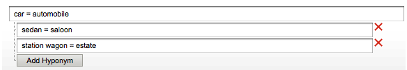

# Sobre dicionários{#about-dictionaries}

Você pode usar Dicionários para gerenciar uma coleção de dicionários e seus sinônimos e hiponímicos associados.

## Uso de dicionários {#concept_B8028B71EC8144669614C64578EDB034}

Sinônimos são palavras que têm o mesmo significado ou significado similar, como calças, jeans, calças e slacks, ou compram, compram, compram, compram e fazem pedido.

Os hipônimos são sinônimos unidirecionais e fornecem uma solução quando os sinônimos são inadequados. Por exemplo, o termo de pesquisa principal de um site de varejo de vestuário é &quot;calças&quot;. No entanto, os jeans não aparecem nos resultados da pesquisa. Nesse caso, você pode usar um hiponímio para associar jeans com calças, mas permitir que uma busca por jeans retorne apenas jeans. Use hífens para fornecer também uma correspondência para produtos descontinuados ou termos competitivos. Essa estratégia garante um impacto mínimo em outros resultados de pesquisa. Por exemplo, se o produto &quot;S2000&quot; for descontinuado e o &quot;S3000&quot; for seu sucessor, use um hiponímio em vez de um sinônimo para garantir que os resultados da pesquisa para &quot;S3000&quot; não incluam nenhum resultado &quot;S2000&quot; vazio.

Sinônimos e hiponímicos ajudam os clientes a encontrar resultados de pesquisa relevantes quando inserem termos de correspondência não exatos que não existem nas páginas da Web. Por exemplo, se a palavra &quot;calças&quot; for usada em todo o site, você pode criar um sinônimo que une &quot;calças&quot; e &quot;calças&quot;. Por sua vez, quando os clientes pesquisam &quot;calças&quot;, os resultados da pesquisa são retornados e estão relacionados a calças.

Sinônimos e hiponímicos são agrupados como Dicionários de domínio. Esses são dicionários especiais criados para um tema ou propósito específico.

A página Menu do dicionário lista todos os dicionários de domínio que sua conta definiu atualmente. Nessa página principal, é possível renomear, editar, excluir ou ativar e desativar dicionários de domínio.

## Noções básicas sobre a notação de sinônimo e de hipônimo {#section_B459CCB850974F4FB16A14E489BBBEC0}

A imagem a seguir é um exemplo de um grupo de termos com relacionamentos de sinônimo e hiponímio.

Seis relacionamentos principais de sinônimo são explicitamente definidos. Cada termo é separado por sinais iguais (=).

* &quot;Carro&quot; é sinônimo de automóvel.
* &quot;Sedan&quot; é um sinônimo de salão.
* &quot;Vagão de estação&quot; é sinônimo de herança.
* &quot;ASP&quot; é um sinônimo de Páginas ativas do servidor e Provedor de serviços de aplicativos.
* &quot;Compra&quot;, &quot;compra&quot; e &quot;aquisição&quot; são sinônimos um do outro.
* &quot;EUA&quot;, &quot;EUA&quot; e &quot;Estados Unidos da América&quot; são sinônimos uns dos outros.

As linhas que contêm uma única palavra são sinônimos simples. As linhas com árvores expansíveis formam relações de hipônio. No exemplo, a segunda árvore define sedan, saloon, vagão de estação e propriedade como hipônimos de carro e automóvel. Por outro lado, carros e automóveis são hipernimas do resto dos termos da árvore.

A terceira árvore define carro e motocicleta como hiponímicos de veículo.

Você pode incluir mais de um acrônimo e/ou expansão de várias palavras em cada sinônimo, como mostrado no exemplo de sinônimo &quot;US&quot; acima. Quando uma palavra ou sigla tem vários significados, crie um sinônimo para cada significado, como no exemplo &quot;ASP&quot; acima. Ao adicionar vários sinônimos, você garante que uma pesquisa por &quot;Provedor de serviços de aplicativos&quot;, por exemplo, não retorne os resultados da pesquisa para &quot;Páginas ativas do servidor&quot;.

Os hiponímios não se expandem com outros hiponímicos. Os hiponímios expandem, no máximo, um nível com seus sinônimos. Por exemplo, uma busca por &quot;veículo&quot; retorna resultados para &quot;carro&quot; e &quot;automóvel&quot;, mas não retorna resultados para &quot;sedan&quot; e &quot;station wagon&quot;.

## Sobre a pesquisa de termos em dicionários {#section_28E7F80CE68D4481BBF4F51EED237C67}

Você pode pesquisar por hiponímicos e sinônimos em todos os dicionários adicionados. Esse recurso é útil para editar ou excluir um termo específico que possa existir em vários dicionários. Cada dicionário com resultados correspondentes é exibido com os conjuntos de palavras correspondentes. Se o query retornar mais de 1000 conjuntos ou árvores, somente os primeiros 1000 serão apresentados.

Consulte [Pesquisando em dicionários](../c-about-linguistics-menu/c-about-dictionaries.md#task_8D2BACC6F9B4487FA82367CBEDEE306F).

Consulte [Editar um dicionário](../c-about-linguistics-menu/c-about-dictionaries.md#task_7B349B2D385048D7A06E754FAB75316A).

## Sobre a configuração de um dicionário como um dicionário de origem {#section_B859E2E957674F558AC6F8D05A0ED190}

O emming, que é a capacidade de pesquisar na raiz de uma palavra que pode ter várias terminações, pode operar em um dos três modos: Dicionários de domínio, Forms do Word alternativo padrão e Nenhum.

Consulte [Sobre palavras e idioma](../c-about-linguistics-menu/c-about-words-and-language.md#concept_CEB4B9576F3C4E2EB87B352EEC738D79).

As informações a seguir pressupõem que sua conta tenha **[!UICONTROL Alternative Word Forms]** definido como **[!UICONTROL Domain Dictionaries]**, para que você possa configurar dicionários de domínio específicos como a fonte dos conjuntos.

Você pode transformar qualquer dicionário de domínio em um &quot;dicionário de origem&quot;. Seus sinônimos e hiponímicos continuam a se expandir conforme esperado, mas com efeitos colaterais adicionais. Com qualquer termo em comum encontrado em outro dicionário, ou mesmo em si, ele mescla seu grupo de palavras com esses sinônimos ou hiponímicos. Você pode pensar nisso como um outro nível de expansão de palavras.

Sem lematização, os sinônimos e os hiponímios devem ser detalhados e completos, listando cada palavra relevante como membro.

Este é um exemplo de sinônimos e sem lematização:

* Sinônimos: corrida = corrida
* Uma consulta de &quot;corrida&quot; gera documentos com as palavras &quot;corrida&quot; e &quot;corrida&quot;.
* Um query de &quot;execução&quot; gera os mesmos documentos de &quot;corrida&quot;.
* Páginas da Web sem &quot;corrida&quot; e &quot;execução&quot;, mas com outras formas de palavra, como &quot;execução&quot; e &quot;execução&quot;, estão ausentes do resultado da consulta.

Neste exemplo, uma palavra de consulta não se expande a menos que seja um membro de um sinônimo ou de um hífen específico.

Este é um exemplo de sinônimos e resultados:

* Sinônimos: corrida = corrida
* Entrada de sinônimo de um dicionário de origem: run = run = run = run
* Uma consulta para &quot;corrida&quot; ou &quot;corrida&quot; retorna todas as páginas da Web com as palavras &quot;execução&quot;, &quot;execução&quot;, &quot;execução&quot; e &quot;corrida&quot;.
* Uma consulta para &quot;execuções&quot; e &quot;execução&quot; retorna os mesmos resultados ou resultados semelhantes.

Neste exemplo, um sinônimo de um dicionário de origem tem a capacidade de mesclar seu grupo de palavras equivalentes com qualquer outro sinônimo ou hiponímio em qualquer outro dicionário que tenha pelo menos um termo em comum.

Designar muitos dicionários com muitas palavras pode ter ramificações de desempenho. Você deve designar dicionários de domínio como dicionários de origem com moderação. A emulação também pode criar expansões de palavras inesperadas durante o tempo de pesquisa e complicar o processo de depuração e rastreamento de expansões de palavras.

Consulte [Configurar um dicionário como um dicionário de lematização](../c-about-linguistics-menu/c-about-dictionaries.md#task_541E8453A12F4A8E89CF6F595469F074).

## Adicionar um novo dicionário {#task_F31AC6723E894C4F91D12AB2A4CEE9FB}

Você pode adicionar um novo dicionário de sinônimos e hiponímicos para ajudar seus clientes a encontrar resultados de pesquisa relevantes. Esse recurso é particularmente útil quando os clientes inserem termos de correspondência não exatos, que podem não existir em suas páginas da Web.

Consulte também [Adicionar uma nova regra de negócios](../c-about-rules-menu/c-about-business-rules.md#task_BD3B31ED48BB4B1B8F1DCD3BFA2528E7).

**Para adicionar um novo dicionário**

1. No menu do produto, clique em **[!UICONTROL Linguistics]** > **[!UICONTROL Dictionaries]**.
1. Na página **[!UICONTROL Dictionary Menu]**, clique em **[!UICONTROL Add New Dictionary]**.
1. Na página **[!UICONTROL Dictionary]**, no campo **[!UICONTROL Name]**, digite o nome do novo dicionário.
1. Clique em **[!UICONTROL Add Synonyms]**.
1. Na caixa de diálogo **[!UICONTROL Add Terms]**, siga um destes procedimentos:

   * Para adicionar sinônimos, insira dois ou mais termos no campo de texto principal, separando cada palavra ou frase com um sinal de igual (=). Por exemplo, calças = calças.
   * Para adicionar hiponímios, insira um termo de hipernima no campo de texto principal. Clique em **[!UICONTROL Add Hyponym]** e insira um hífen que se relacione ao hipernim inserido. Por exemplo, &quot;sedan&quot;, &quot;saloon&quot;, &quot;station wagon&quot; e &quot;propergol&quot; podem ser hiponímicos de &quot;carro&quot; e &quot;automóvel&quot; (ambos os hipernemas), como mostrado abaixo.

      

      As entradas de Hyponym também podem formar sinônimos, como &quot;sedan&quot; e &quot;saloon&quot;.

1. Clique em **[!UICONTROL Save]**.
1. Faça uma das seguintes opções:

   * Repita as etapas de 4 a 6 para adicionar mais sinônimos e hiponímios.
   * Continue para a próxima etapa.

1. Para visualizar os resultados de suas alterações, clique em **[!UICONTROL regenerate your staged site index]** para recriar o índice do site preparado.

   Consulte [Executar um índice completo de um site ativo ou temporário...](../c-about-index-menu/c-about-full-index.md#task_F7FE04D8A1654A7787FCCA31B45EB42D).

   Consulte [Executar um índice incremental de um site ativo ou temporário...](../c-about-index-menu/c-about-incremental-index.md#task_9BFB6157F3884B2FAECB7E0E9CA318CB).
1. (Opcional) No menu do produto, clique em **[!UICONTROL Linguistics]** > **[!UICONTROL Dictionaries]** e siga um destes procedimentos:

   * Clique em **[!UICONTROL History]** para reverter as alterações feitas.

      Consulte [Usando a opção Histórico](../t-using-the-history-option.md#task_70DD3F87A67242BBBD2CB27156F43002).

   * Clique em **[!UICONTROL Live]**.

      Consulte [Exibição das configurações ativas](../c-about-staging.md#task_401A0EBDB5DB4D4CA933CBA7BECDC10F).

   * Clique em **[!UICONTROL Push Live]**.

      Consulte [Envio das configurações do estágio ao vivo](../c-about-staging.md#task_44306783B4C0408AAA58B471DAF2D9A4).

## Ativar ou desativar um dicionário {#task_EC282EA0846942F6913918EA8218220B}

As relações de cada palavra são geradas no momento em que você indexa seu site. Antes da próxima operação de indexação, você pode ativar ou desativar qualquer dicionário adicionado.

**Para ativar ou desativar um dicionário**

1. No menu do produto, clique em **[!UICONTROL Linguistics]** > **[!UICONTROL Dictionaries]**.
1. Na página **[!UICONTROL Dictionary Menu]**, na coluna **[!UICONTROL Enabled]** da tabela, execute um dos seguintes procedimentos:

   * Marque a caixa de um dicionário que deseja ativar e indexou.
   * Desmarque a caixa de um dicionário que deseja desativar e que não indexou.

1. Clique em **[!UICONTROL Save Changes]**.
1. Para visualizar os resultados de suas alterações, clique em **[!UICONTROL regenerate your staged site index]** para recriar o índice do site preparado.

   Consulte [Executar um índice completo de um site ativo ou temporário...](../c-about-index-menu/c-about-full-index.md#task_F7FE04D8A1654A7787FCCA31B45EB42D).

   Consulte [Executar um índice incremental de um site ativo ou temporário...](../c-about-index-menu/c-about-incremental-index.md#task_9BFB6157F3884B2FAECB7E0E9CA318CB).
1. (Opcional) No menu do produto, clique em **[!UICONTROL Linguistics]** > **[!UICONTROL Dictionaries]** e siga um destes procedimentos:

   * Clique em **[!UICONTROL History]** para reverter as alterações feitas.

      Consulte [Usando a opção Histórico](../t-using-the-history-option.md#task_70DD3F87A67242BBBD2CB27156F43002).

   * Clique em **[!UICONTROL Live]**.

      Consulte [Exibição das configurações ativas](../c-about-staging.md#task_401A0EBDB5DB4D4CA933CBA7BECDC10F).

   * Clique em **[!UICONTROL Push Live]**.

      Consulte [Envio das configurações do estágio ao vivo](../c-about-staging.md#task_44306783B4C0408AAA58B471DAF2D9A4).

## Editar um dicionário {#task_7B349B2D385048D7A06E754FAB75316A}

É possível editar ou excluir grupos de sinônimos e de hiponímios que compõem um dicionário específico.

<!-- 

t_editing_a_dictionary.xml

 -->

Você também pode usar **[!UICONTROL Find]** para localizar sinônimos e hiponímios específicos que deseja editar ou excluir em todos os seus dicionários.

**Para editar um dicionário**

1. No menu do produto, clique em **[!UICONTROL Linguistics]** > **[!UICONTROL Dictionaries]**.
1. Faça uma das seguintes opções:

   * Na página [!DNL Dictionary Menu] , na tabela, clique no nome hipervinculado de um único dicionário cujos termos você deseja editar ou excluir.
   * Na página [!DNL Dictionary Menu], no campo de texto **[!UICONTROL Find]**, digite um termo que deseja localizar em todos os dicionários e clique em **[!UICONTROL Find]**.

      Na página [!DNL Find in Dictionaries], use as listas suspensas que acompanham para definir as opções de refinamento desejadas.

      <table> 
      <thead> 
        <tr> 
        <th colname="col1" class="entry"> 
Opção 
 </th> 
        <th colname="col2" class="entry"> 
Descrição 
 </th> 
        </tr> 
      </thead>
      <tbody> 
        <tr> 
        <td colname="col1"> 
Localizar 
 </td> 
        <td colname="col2"> 
Permite que você insira o termo que deseja pesquisar em todos os dicionários. 
 </td> 
        </tr> 
        <tr> 
        <td colname="col1"> 
Lista suspensa Corresponder 
 </td> 
        <td colname="col2"> 
Permite selecionar entre os quatro tipos de correspondência a seguir: 
        <ul id="ul_D656F159677946938050115F610EEF4B"> 
        <li id="li_2D6B302E021A4CE7A47F028812633EDC">  Correspondência exata   
O query deve ter uma correspondência exata com um hífen ou sinônimo. 
 </li> 
        <li id="li_30AD5976E43041E98190F4757E821092">  Contém texto   
A consulta só precisa de uma correspondência de subsequência de caracteres; uma correspondência dentro de um hiponímio ou sinônimo. 
 </li> 
        <li id="li_9BF911EFB54345BB82679BDE51DDF8AF">  Começa com  
A consulta só é correspondida em relação ao início de cada hífen e sinônimo. 
 </li> 
        <li id="li_CB791C7F5B5A4496B329ED505E7D97BC">  Correspondência de palavra   
A consulta é comparada a cada palavra de um sinônimo ou de um hífen, mas a palavra deve corresponder exatamente. 
 </li> 
        </ul> 
 </td> 
        </tr> 
        <tr> 
        <td colname="col1"> 
Lista suspensa Dicionário ativado/desativado 
 </td> 
        <td colname="col2"> 
Permite selecionar entre as seguintes opções: 
        <ul id="ul_EBBD3F3A2D854952A35CBDDBECB40958"> 
        <li id="li_7F5654C284BE485EAC9B000A663C6C60">  Dicionários ativados e desativados   
Procure o termo especificado em dicionários ativados e desativados. 
 </li> 
        <li id="li_4A83EECF38044287A923EC0AAF639079">  Somente Dicionários Ativados   
Pesquisar apenas dicionários ativados é útil para depurar o índice atual. 
 </li> 
        </ul> 
 
Consulte <a href="../c-about-linguistics-menu/c-about-dictionaries.md#task_EC282EA0846942F6913918EA8218220B" type="task" format="dita" scope="local"> Ativando ou desativando um dicionário </a>. 
 </td> 
        </tr> 
        <tr> 
        <td colname="col1"> 
Lista suspensa Preparado/Em tempo real 
 </td> 
        <td colname="col2"> 
Permite selecionar entre as seguintes opções: 
        <ul id="ul_BD0733A30E6B470E942B21F499A4373B"> 
        <li id="li_F9A8C39C22EA4FBF86536F5924ED973C">  Dicionários preparados/ao vivo   
Pesquisa o termo especificado em dicionários preparados e ativos. No entanto, ele só pesquisa a versão preparada do dicionário se ele existir. Se a versão preparada não existir, ela pesquisará a versão ao vivo do dicionário. 
 </li> 
        <li id="li_DB0944DB18564269AA10676BDFDB0460">  Dicionários em tempo real   
Pesquise o termo especificado somente nos dicionários ativos. 
 </li> 
        </ul> 
 </td> 
        </tr> 
      </tbody> 
      </table>

1. Na tabela, execute um dos seguintes procedimentos:

   * Clique em  que está associado ao termo que você deseja atualizar. Na caixa de diálogo **[!UICONTROL Edit Terms]**, altere os termos desejados. Quando terminar, clique em **[!UICONTROL Save]**.

   * Clique em  que está associado ao termo que você deseja remover. Na caixa de diálogo **[!UICONTROL Delete Terms]**, clique em **[!UICONTROL Delete]**. Certifique-se de excluir o termo correto; não há caixa de diálogo de confirmação de exclusão.

1. Para visualizar os resultados de suas alterações, clique em **[!UICONTROL regenerate your staged site index]** para recriar o índice do site preparado.

   Consulte [Executar um índice completo de um site ativo ou temporário...](../c-about-index-menu/c-about-full-index.md#task_F7FE04D8A1654A7787FCCA31B45EB42D).

   Consulte [Executar um índice incremental de um site ativo ou temporário...](../c-about-index-menu/c-about-incremental-index.md#task_9BFB6157F3884B2FAECB7E0E9CA318CB).
1. (Opcional) No menu do produto, clique em **[!UICONTROL Linguistics]** > **[!UICONTROL Dictionaries]** e siga um destes procedimentos:

   * Clique em **[!UICONTROL History]** para reverter as alterações feitas.

      Consulte [Usando a opção Histórico](../t-using-the-history-option.md#task_70DD3F87A67242BBBD2CB27156F43002).

   * Clique em **[!UICONTROL Live]**.

      Consulte [Exibição das configurações ativas](../c-about-staging.md#task_401A0EBDB5DB4D4CA933CBA7BECDC10F).

   * Clique em **[!UICONTROL Push Live]**.

      Consulte [Envio das configurações do estágio ao vivo](../c-about-staging.md#task_44306783B4C0408AAA58B471DAF2D9A4).

## Renomear um dicionário {#task_7F1F372B337B4853BFA2A60AD267B092}

Você pode alterar o nome de um dicionário adicionado.

<!-- 

t_renaming_a_dictionary.xml

 -->

Se você definir a opção **[!UICONTROL Alternate Word Forms]** como **[!UICONTROL Domain Dictionaries]** em **[!UICONTROL Words & Language]**, a opção **[!UICONTROL Configure]** será usada em vez de **[!UICONTROL Rename]**.

Consulte [Sobre palavras e idioma](../c-about-linguistics-menu/c-about-words-and-language.md#concept_CEB4B9576F3C4E2EB87B352EEC738D79).

**Como renomear um dicionário**

1. No menu do produto, clique em **[!UICONTROL Linguistics]** > **[!UICONTROL Dictionaries]**.
1. Na página **[!UICONTROL Dictionary Menu]**, na coluna **[!UICONTROL Actions]** da tabela, execute um dos seguintes procedimentos:

   * Clique em **[!UICONTROL Rename]** para o dicionário associado cujo nome você deseja alterar.

      Na caixa de diálogo **[!UICONTROL Rename Dictionary]**. no campo **[!UICONTROL Name]** , digite o novo nome do dicionário.

      Clique em **[!UICONTROL Rename File]**.

   * Clique em **[!UICONTROL Configure]** para o dicionário associado cujo nome você deseja alterar.

      Na caixa de diálogo **[!UICONTROL Configure Dictionary]**. no campo **[!UICONTROL Name]** , digite o novo nome do dicionário.

      Clique em **[!UICONTROL Save Configuration]**.

1. (Opcional) Siga um destes procedimentos:

   * Clique em **[!UICONTROL History]** para reverter as alterações feitas.

      Consulte [Usando a opção Histórico](../t-using-the-history-option.md#task_70DD3F87A67242BBBD2CB27156F43002).

   * Clique em **[!UICONTROL Live]**.

      Consulte [Exibição das configurações ativas](../c-about-staging.md#task_401A0EBDB5DB4D4CA933CBA7BECDC10F).

   * Clique em **[!UICONTROL Push Live]**.

      Consulte [Envio das configurações do estágio ao vivo](../c-about-staging.md#task_44306783B4C0408AAA58B471DAF2D9A4).

## Configurar um dicionário como um dicionário de resultados {#task_541E8453A12F4A8E89CF6F595469F074}

Você pode definir um dicionário para o modo de derivação avançado para aproveitar as vantagens das palavras que surgem em pesquisas.

<!-- 

t_configuring_a_dictionary_as_a_stemming_dictionary.xml

 -->

Esse modo retorna páginas da Web que correspondem às variantes do que seus clientes estão pesquisando.

Consulte [Sobre dicionários](../c-about-linguistics-menu/c-about-dictionaries.md#concept_B8028B71EC8144669614C64578EDB034).

Consulte [Sobre palavras e idioma](../c-about-linguistics-menu/c-about-words-and-language.md#concept_CEB4B9576F3C4E2EB87B352EEC738D79).

**Para configurar um dicionário como um dicionário de derivados**

1. No menu do produto, clique em **[!UICONTROL Linguistics]** > **[!UICONTROL Words & Language]**.
1. Na página [!DNL Words & Languages], na lista suspensa **[!UICONTROL Alternate Words Forms]**, selecione **[!UICONTROL Domain Dictionaries]**.

   Qualquer dicionário de domínio definido como um dicionário de origem (consulte a etapa 7 abaixo) é usado como uma fonte de formulários de palavras alternativas.

1. Clique em **[!UICONTROL Save Changes]**.
1. No menu do produto, clique em **[!UICONTROL Linguistics]** > **[!UICONTROL Dictionaries]**.
1. Na página [!DNL Dictionaries Menu] , na coluna **[!UICONTROL Actions]** da tabela, clique em **[!UICONTROL Configure]** para obter um dicionário associado que você deseja definir como um dicionário de origem.
1. Na caixa de diálogo **[!UICONTROL Configure Dictionary]**, na lista suspensa **[!UICONTROL Advanced Stemming Mode]**, selecione **[!UICONTROL Yes]**.
1. Clique em **[!UICONTROL Save Configuration]**.
1. Clique em **[!UICONTROL regenerate your staged site index]** para recriar o índice de site preparado.

   Consulte [Executar um índice completo de um site ativo ou temporário...](../c-about-index-menu/c-about-full-index.md#task_F7FE04D8A1654A7787FCCA31B45EB42D).

   Consulte [Executar um índice incremental de um site ativo ou temporário...](../c-about-index-menu/c-about-incremental-index.md#task_9BFB6157F3884B2FAECB7E0E9CA318CB).
1. (Opcional) No menu do produto, clique em **[!UICONTROL Linguistics]** > **[!UICONTROL Dictionaries]** e siga um destes procedimentos:

   * Clique em **[!UICONTROL History]** para reverter as alterações feitas.

      Consulte [Usando a opção Histórico](../t-using-the-history-option.md#task_70DD3F87A67242BBBD2CB27156F43002).

   * Clique em **[!UICONTROL Live]**.

      Consulte [Exibição das configurações ativas](../c-about-staging.md#task_401A0EBDB5DB4D4CA933CBA7BECDC10F).

   * Clique em **[!UICONTROL Push Live]**.

      Consulte [Envio das configurações do estágio ao vivo](../c-about-staging.md#task_44306783B4C0408AAA58B471DAF2D9A4).

## Pesquisar em dicionários {#task_8D2BACC6F9B4487FA82367CBEDEE306F}

Você pode pesquisar por hiponímicos e sinônimos em todos os dicionários adicionados à pesquisa/comercialização do site.

<!-- 

t_searching_across_dictionaries.xml

 -->

Esse recurso é útil para editar ou excluir um termo específico que possa existir em vários dicionários. Cada dicionário com resultados correspondentes é exibido com os conjuntos de palavras correspondentes. Se o query retornar mais de 1000 conjuntos ou árvores, somente os primeiros 1000 serão apresentados.

Consulte [Editar um dicionário](../c-about-linguistics-menu/c-about-dictionaries.md#task_7B349B2D385048D7A06E754FAB75316A).

**Para pesquisar em dicionários**

1. No menu do produto, clique em **[!UICONTROL Linguistics]** > **[!UICONTROL Dictionaries]**.
1. Na página [!DNL Dictionary Menu], no campo de texto **[!UICONTROL Find]**, digite um termo que deseja localizar em todos os dicionários e clique em **[!UICONTROL Find]**.
1. Na página [!DNL Find in Dictionaries], use as listas suspensas que acompanham para definir as opções de refinamento que desejar.

   Consulte [Editar um dicionário](../c-about-linguistics-menu/c-about-dictionaries.md#task_7B349B2D385048D7A06E754FAB75316A).
1. (Opcional) Use o menu suspenso **[!UICONTROL Show]** para especificar o número máximo de resultados que deseja exibir por página.

## Excluindo um dicionário {#task_DBAAEE624BC14D2590444B0B7869ECCA}

Você pode excluir os dicionários que não são mais necessários ou usados.

<!-- 

t_deleting_a_dictionary.xml

 -->

Se você excluir um dicionário que está ativo, ele será preparado para exclusão. Se você excluir um dicionário que está preparado, ele será excluído imediatamente.

Certifique-se de excluir um dicionário que você sabe que precisa mais; não há nenhum recurso de histórico disponível para reverter a exclusão.

**Para excluir um dicionário**

1. No menu do produto, clique em **[!UICONTROL Linguistics]** > **[!UICONTROL Dictionaries]**.
1. Na página [!DNL Dictionary Menu] , na coluna **[!UICONTROL Actions]** da tabela, clique em **[!UICONTROL Delete]** para obter o dicionário associado que deseja remover.
1. Na caixa de diálogo **[!UICONTROL Delete Dictionary]**. clique em **[!UICONTROL Yes]** para confirmar a exclusão.
1. (Opcional) Se você excluiu um dicionário ao vivo, siga um destes procedimentos:

   * Clique em **[!UICONTROL Live]**.

      Consulte [Exibição das configurações ativas](../c-about-staging.md#task_401A0EBDB5DB4D4CA933CBA7BECDC10F).

   * Clique em **[!UICONTROL Push Live]**.

      Consulte [Envio das configurações do estágio ao vivo](../c-about-staging.md#task_44306783B4C0408AAA58B471DAF2D9A4).

