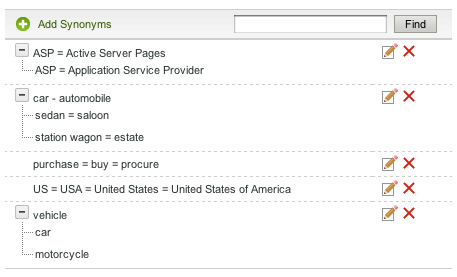

# Sobre dicionários{#about-dictionaries}

Você pode usar os Dicionários para gerenciar uma coleção de dicionários e seus sinônimos e hiponímios associados.

## Uso de dicionários {#concept_B8028B71EC8144669614C64578EDB034}

Sinônimos são palavras que têm o mesmo significado ou um significado semelhante, como calças, jeans, calças e slacks, ou compram, compram, compram e fazem pedidos.

Hiponímios são sinônimos unidirecionais e fornecem uma solução quando sinônimos seriam inapropriados. Por exemplo, o termo de pesquisa principal de um site de varejo em apartamentos é &quot;calças&quot;. No entanto, os jeans não aparecem nos resultados da pesquisa. Nesse caso, você pode usar um hiponmo para associar jeans com calças, mas para permitir uma busca por jeans para devolver apenas jeans. Use hífens para fornecer também uma correspondência para produtos descontinuados ou termos competitivos. Essa estratégia garante um impacto mínimo em outros resultados de pesquisa. Por exemplo, se o produto &quot;S2000&quot; for descontinuado e o &quot;S3000&quot; for seu sucessor, use um hipônimo em vez de um sinônimo para garantir que os resultados da pesquisa para &quot;S3000&quot; não incluam quaisquer resultados &quot;S2000&quot; estranhos.

Sinônimos e hiponímios ajudam os clientes a encontrar resultados de pesquisa relevantes quando inserem termos de correspondência não exatos que não existem nas páginas da Web. Por exemplo, se a palavra &quot;calças&quot; for usada em todo seu site, você pode criar um sinônimo que une &quot;calças&quot; e &quot;calças&quot;. Por sua vez, quando os clientes pesquisam por &quot;calças&quot;, os resultados da pesquisa são retornados relacionados às calças.

Sinônimos e hiponímios são agrupados como Dicionários de domínio. Esses são dicionários especiais que você cria para um tema ou propósito específico.

A página Menu de dicionário lista todos os dicionários de domínio que sua conta definiu atualmente. Nessa página principal, você pode renomear, editar, excluir ou ativar e desativar dicionários de domínio.

## Noções básicas sobre a notação de sinônimo e de hipônimo {#section_B459CCB850974F4FB16A14E489BBBEC0}

A imagem a seguir é um exemplo de um grupo de termos com relacionamentos de sinônimo e hiponímio.

Seis relacionamentos de sinônimos principais estão explicitamente definidos. Cada termo é separado por sinais iguais (=).

* &quot;Carro&quot; é sinônimo de automóvel.
* &quot;Sedan&quot; é um sinônimo de salão.
* &quot;Vagão de estação&quot; é sinônimo de propriedade.
* &quot;ASP&quot; é um sinônimo de Páginas ativas do servidor e Provedor de serviços de aplicativos.
* &quot;Compra&quot;, &quot;compra&quot; e &quot;aquisição&quot; são sinônimos uns dos outros.
* &quot;EUA&quot;, &quot;EUA&quot; e &quot;Estados Unidos da América&quot; são sinônimos uns dos outros.

As linhas que contêm uma única palavra são sinônimos simples. As linhas com árvores expansíveis formam relacionamentos hipônimos. No exemplo, a segunda árvore define sedan, salão, vagão de estação, e propriedade como hiponímios de carro e automóvel. Por outro lado, carros e automóveis são hipernimas do resto dos termos da árvore.

A terceira árvore define carro e motocicleta como hipônimos de veículo.

É possível incluir mais de um acrônimo e/ou expansão de várias palavras em cada sinônimo, como mostra o exemplo do sinônimo &quot;EUA&quot; acima. Quando uma palavra ou acrônimo tem vários significados, crie um sinônimo para cada significado, como no exemplo &quot;ASP&quot; acima. Ao adicionar vários sinônimos, você garante que uma pesquisa por &quot;Provedor de serviços de aplicativos&quot;, por exemplo, não retorne os resultados da pesquisa para &quot;Páginas ativas do servidor&quot;.

Os hiponímios não se expandem com outros hiponímios. Os hiponímios expandem, no máximo, um nível com seus sinônimos. Por exemplo, uma busca por &quot;veículo&quot; retorna resultados para &quot;carro&quot; e &quot;automóvel&quot;, mas não retorna resultados para &quot;sedan&quot; e &quot;station wagon&quot;.

## Sobre a pesquisa de termos em dicionários {#section_28E7F80CE68D4481BBF4F51EED237C67}

Você pode procurar por hiponímios e sinônimos em todos os dicionários que você adiciona. Esse recurso é útil para editar ou excluir um termo específico que possa existir em vários dicionários. Cada dicionário com resultados correspondentes é exibido com seus conjuntos de palavras correspondentes. Se a consulta retornar mais de 1.000 conjuntos ou árvores, somente os primeiros 1.000 serão apresentados.

Consulte [Pesquisar dicionários](../c-about-linguistics-menu/c-about-dictionaries.md#task_8D2BACC6F9B4487FA82367CBEDEE306F).

Consulte [Editar um dicionário](../c-about-linguistics-menu/c-about-dictionaries.md#task_7B349B2D385048D7A06E754FAB75316A).

## Sobre a configuração de um dicionário como um dicionário de origem {#section_B859E2E957674F558AC6F8D05A0ED190}

O emming, que é a capacidade de pesquisar na raiz de uma palavra que pode ter vários finais, pode operar em um dos três modos: Dicionários de domínio, Formulários do Word alternativos padrão e Nenhum.

Consulte [Sobre Palavras e Idioma](../c-about-linguistics-menu/c-about-words-and-language.md#concept_CEB4B9576F3C4E2EB87B352EEC738D79).

As informações a seguir assumem que sua conta foi **[!UICONTROL Alternative Word Forms]** definida como **[!UICONTROL Domain Dictionaries]**, para que você possa configurar dicionários de domínio específicos como sua fonte de sistemas.

Você pode transformar qualquer dicionário de domínio em um &quot;dicionário de origem&quot;. Os seus sinônimos e hipônimos continuam a expandir-se como esperado, mas com efeitos secundários adicionais. Com qualquer termo em comum encontrado em outro dicionário, ou mesmo em si mesmo, ele mescla seu grupo de palavras com esses sinônimos ou hiponismos. Você pode pensar nisso como um outro nível de expansão de palavras.

Sem a derivação, os sinônimos e os hiponímios devem ser detalhados e completos, listando cada palavra relevante como membro.

A seguir está um exemplo de sinônimos e nenhuma origem:

* Sinônimos: corrida = corrida
* Uma consulta para &quot;corrida&quot; produz documentos com as palavras &quot;corrida&quot; e &quot;corrida&quot;.
* Uma consulta para &quot;executar&quot; produz os mesmos documentos que &quot;correr&quot;.
* As páginas da Web sem &quot;corrida&quot; e &quot;em execução&quot;, mas com outras formas de palavras como &quot;execuções&quot; e &quot;executar&quot;, estão ausentes do resultado da consulta.

Neste exemplo, uma palavra de consulta não é expandida a menos que seja membro de um sinônimo ou hiponme específico.

A seguir está um exemplo de sinônimos e origens:

* Sinônimos: corrida = corrida
* Entrada de sinônimo de um dicionário de origem: run = run = run = run
* Uma consulta para &quot;corrida&quot; ou &quot;corrida&quot; retorna todas as páginas da Web com as palavras &quot;corrida&quot;, &quot;corrida&quot;, e &quot;corrida&quot;.
* Uma consulta para &quot;execuções&quot; e &quot;execução&quot; retorna os mesmos resultados, ou semelhantes.

Neste exemplo, um sinônimo de um dicionário de origem tem a capacidade de unir seu grupo de palavras equivalentes a qualquer outro sinônimo ou hiponme em qualquer outro dicionário que tenha pelo menos um termo em comum.

A designação de muitos dicionários com muitas palavras pode ter ramificações de desempenho. Você deve designar dicionários de domínio como dicionários de origem com moderação. A depuração também pode criar expansões de palavras inesperadas durante o tempo de pesquisa e complicar o processo de depuração e rastreamento de expansões de palavras.

Consulte [Configurar um dicionário como um dicionário](../c-about-linguistics-menu/c-about-dictionaries.md#task_541E8453A12F4A8E89CF6F595469F074)de origem.

## Adding a new dictionary {#task_F31AC6723E894C4F91D12AB2A4CEE9FB}

Você pode adicionar um novo dicionário de sinônimos e hiponímios para ajudar seus clientes a encontrar resultados de pesquisa relevantes. Esse recurso é particularmente útil quando os clientes inserem termos de correspondência não exatos que podem não existir em suas páginas da Web.

Consulte também [Adicionar uma nova regra](../c-about-rules-menu/c-about-business-rules.md#task_BD3B31ED48BB4B1B8F1DCD3BFA2528E7)comercial.

**Para adicionar um novo dicionário**

1. No menu do produto, clique em **[!UICONTROL Linguistics]** > **[!UICONTROL Dictionaries]**.
1. Na **[!UICONTROL Dictionary Menu]** página, clique em **[!UICONTROL Add New Dictionary]**.
1. Na **[!UICONTROL Dictionary]** página, no **[!UICONTROL Name]** campo, digite o nome do novo dicionário.
1. Clique em **[!UICONTROL Add Synonyms]**.
1. Na caixa de **[!UICONTROL Add Terms]** diálogo, execute um dos procedimentos a seguir:

   * Para adicionar sinônimos, insira dois ou mais termos no campo de texto principal, separando cada palavra ou frase com um sinal de igual (=). Por exemplo, calças = calças = slacks.
   * Para adicionar hiponímios, insira um termo de hipérnim no campo de texto principal. Clique em **[!UICONTROL Add Hyponym]** e insira um hípônimo relacionado ao hipernimo inserido. Por exemplo, &quot;sedan&quot;, &quot;saloon&quot;, &quot;station wagon&quot; e &quot;estate&quot; podem ser hiponímios de &quot;car&quot; e &quot;automóvel&quot; (ambos os hipernims), como se vê abaixo.

      

      As entradas de Hyponym também podem formar sinônimos como &quot;sedan&quot; e &quot;saloon&quot;.

1. Clique em **[!UICONTROL Save]**.
1. Faça uma das seguintes opções:

   * Repita as etapas de 4 a 6 para adicionar mais sinônimos e hiponímios.
   * Continue para a próxima etapa.

1. Para visualizar os resultados de suas alterações, clique em **[!UICONTROL regenerate your staged site index]** para recriar o índice de site preparado.

   Consulte [Executando um índice completo de um site ao vivo ou preparado...](../c-about-index-menu/c-about-full-index.md#task_F7FE04D8A1654A7787FCCA31B45EB42D).

   Consulte [Executando um índice incremental de um site ao vivo ou preparado...](../c-about-index-menu/c-about-incremental-index.md#task_9BFB6157F3884B2FAECB7E0E9CA318CB).
1. (Opcional) No menu do produto, clique em **[!UICONTROL Linguistics]** > **[!UICONTROL Dictionaries]** e siga um destes procedimentos:

   * Clique **[!UICONTROL History]** para reverter quaisquer alterações feitas.

      Consulte [Uso da opção](../t-using-the-history-option.md#task_70DD3F87A67242BBBD2CB27156F43002)Histórico.

   * Clique em **[!UICONTROL Live]**.

      Consulte [Visualizar configurações](../c-about-staging.md#task_401A0EBDB5DB4D4CA933CBA7BECDC10F)ativas.

   * Clique em **[!UICONTROL Push Live]**.

      Consulte [Colocar configurações de estágio ao vivo](../c-about-staging.md#task_44306783B4C0408AAA58B471DAF2D9A4).

## Ativar ou desativar um dicionário {#task_EC282EA0846942F6913918EA8218220B}

As relações de cada palavra são geradas no momento em que você indexa seu site. Antes da próxima operação de indexação, você pode ativar ou desativar qualquer dicionário adicionado.

**Para ativar ou desativar um dicionário**

1. No menu do produto, clique em **[!UICONTROL Linguistics]** > **[!UICONTROL Dictionaries]**.
1. Na **[!UICONTROL Dictionary Menu]** página, na **[!UICONTROL Enabled]** coluna da tabela, execute um dos procedimentos a seguir:

   * Marque a caixa de um dicionário que você deseja ativar e que foi indexado.
   * Desmarque a caixa de um dicionário que você deseja desligar e que não indexou.

1. Clique em **[!UICONTROL Save Changes]**.
1. Para visualizar os resultados de suas alterações, clique em **[!UICONTROL regenerate your staged site index]** para recriar o índice de site preparado.

   Consulte [Executando um índice completo de um site ao vivo ou preparado...](../c-about-index-menu/c-about-full-index.md#task_F7FE04D8A1654A7787FCCA31B45EB42D).

   Consulte [Executando um índice incremental de um site ao vivo ou preparado...](../c-about-index-menu/c-about-incremental-index.md#task_9BFB6157F3884B2FAECB7E0E9CA318CB).
1. (Opcional) No menu do produto, clique em **[!UICONTROL Linguistics]** > **[!UICONTROL Dictionaries]** e siga um destes procedimentos:

   * Clique **[!UICONTROL History]** para reverter quaisquer alterações feitas.

      Consulte [Uso da opção](../t-using-the-history-option.md#task_70DD3F87A67242BBBD2CB27156F43002)Histórico.

   * Clique em **[!UICONTROL Live]**.

      Consulte [Visualizar configurações](../c-about-staging.md#task_401A0EBDB5DB4D4CA933CBA7BECDC10F)ativas.

   * Clique em **[!UICONTROL Push Live]**.

      Consulte [Colocar configurações de estágio ao vivo](../c-about-staging.md#task_44306783B4C0408AAA58B471DAF2D9A4).

## Editar um dicionário {#task_7B349B2D385048D7A06E754FAB75316A}

Você pode editar ou excluir grupos de sinônimos e hiponímios que compõem um dicionário específico.

<!-- 

t_editing_a_dictionary.xml

 -->

Também é possível usar **[!UICONTROL Find]** para localizar sinônimos e hiponímios específicos que você deseja editar ou excluir em todos os seus dicionários.

**Para editar um dicionário**

1. No menu do produto, clique em **[!UICONTROL Linguistics]** > **[!UICONTROL Dictionaries]**.
1. Faça uma das seguintes opções:

   * Na [!DNL Dictionary Menu] página, na tabela, clique no nome do hiperlink de um único dicionário cujos termos você deseja editar ou excluir.
   * Na [!DNL Dictionary Menu] página, no campo de **[!UICONTROL Find]** texto, digite um termo que deseja localizar em todos os dicionários e clique em **[!UICONTROL Find]**.

      Na [!DNL Find in Dictionaries] página, use as listas suspensas que o acompanham para definir as opções de refinamento desejadas.

      <table> 
      <thead> 
        <tr> 
        <th colname="col1" class="entry"> 
Opção 
 </th> 
        <th colname="col2" class="entry"> 
Descrição 
 </th> 
        </tr> 
      </thead>
      <tbody> 
        <tr> 
        <td colname="col1"> 
Localizar 
 </td> 
        <td colname="col2"> 
Permite que você insira o termo que deseja pesquisar em todos os dicionários. 
 </td> 
        </tr> 
        <tr> 
        <td colname="col1"> 
Lista suspensa Corresponder 
 </td> 
        <td colname="col2"> 
Permite selecionar entre os quatro tipos de correspondência a seguir: 
        <ul id="ul_D656F159677946938050115F610EEF4B"> 
        <li id="li_2D6B302E021A4CE7A47F028812633EDC">  Correspondência exata  
A consulta deve ter uma correspondência exata com um hífen ou sinônimo. 
 </li> 
        <li id="li_30AD5976E43041E98190F4757E821092">  Contém texto  
A consulta só precisa de uma correspondência de subsequência de caracteres; um fósforo dentro de um hipônio ou sinônimo. 
 </li> 
        <li id="li_9BF911EFB54345BB82679BDE51DDF8AF">  Começa com  
A consulta é correspondida somente em relação ao início de cada hífen e sinônimo. 
 </li> 
        <li id="li_CB791C7F5B5A4496B329ED505E7D97BC">  Correspondência de palavras  
A consulta é comparada a cada palavra de um sinônimo ou de um hiponme, mas a palavra deve corresponder exatamente. 
 </li> 
        </ul> 
 </td> 
        </tr> 
        <tr> 
        <td colname="col1"> 
Lista suspensa Dicionário ativado/desativado 
 </td> 
        <td colname="col2"> 
Permite selecionar uma das seguintes opções: 
        <ul id="ul_EBBD3F3A2D854952A35CBDDBECB40958"> 
        <li id="li_7F5654C284BE485EAC9B000A663C6C60">  Dicionários ativados e desativados  
Procure o termo especificado em dicionários habilitados e desabilitados. 
 </li> 
        <li id="li_4A83EECF38044287A923EC0AAF639079">  Somente dicionários ativados  
Pesquisar apenas dicionários ativados é útil para depurar o índice atual. 
 </li> 
        </ul> 
 
Consulte <a href="../c-about-linguistics-menu/c-about-dictionaries.md#task_EC282EA0846942F6913918EA8218220B" type="task" format="dita" scope="local"> Ativando ou desativando um dicionário </a>. 
 </td> 
        </tr> 
        <tr> 
        <td colname="col1"> 
Lista suspensa Preparado/ao vivo 
 </td> 
        <td colname="col2"> 
Permite selecionar uma das seguintes opções: 
        <ul id="ul_BD0733A30E6B470E942B21F499A4373B"> 
        <li id="li_F9A8C39C22EA4FBF86536F5924ED973C">  Dicionários preparados/ao vivo  
Pesquisa o termo especificado em dicionários armazenados e ativos. No entanto, ele só pesquisará a versão de preparo do dicionário se ele existir. Se a versão de preparo não existir, ele pesquisará a versão ativa do dicionário. 
 </li> 
        <li id="li_DB0944DB18564269AA10676BDFDB0460">  Dicionários ao vivo  
Pesquise o termo especificado somente nos dicionários ativos. 
 </li> 
        </ul> 
 </td> 
        </tr> 
      </tbody> 
      </table>

1. Na tabela, execute um dos procedimentos a seguir:

   * Clique  que está associado ao termo que você deseja atualizar. Na caixa de **[!UICONTROL Edit Terms]** diálogo, altere os termos desejados. Quando terminar, clique em **[!UICONTROL Save]**.

   * Clique  que está associado ao termo que você deseja remover. Na caixa de **[!UICONTROL Delete Terms]** diálogo, clique em **[!UICONTROL Delete]**. Certifique-se de excluir o termo correto; não há caixa de diálogo de confirmação de exclusão.

1. Para visualizar os resultados de suas alterações, clique em **[!UICONTROL regenerate your staged site index]** para recriar o índice de site preparado.

   Consulte [Executando um índice completo de um site ao vivo ou preparado...](../c-about-index-menu/c-about-full-index.md#task_F7FE04D8A1654A7787FCCA31B45EB42D).

   Consulte [Executando um índice incremental de um site ao vivo ou preparado...](../c-about-index-menu/c-about-incremental-index.md#task_9BFB6157F3884B2FAECB7E0E9CA318CB).
1. (Opcional) No menu do produto, clique em **[!UICONTROL Linguistics]** > **[!UICONTROL Dictionaries]** e siga um destes procedimentos:

   * Clique **[!UICONTROL History]** para reverter quaisquer alterações feitas.

      Consulte [Uso da opção](../t-using-the-history-option.md#task_70DD3F87A67242BBBD2CB27156F43002)Histórico.

   * Clique em **[!UICONTROL Live]**.

      Consulte [Visualizar configurações](../c-about-staging.md#task_401A0EBDB5DB4D4CA933CBA7BECDC10F)ativas.

   * Clique em **[!UICONTROL Push Live]**.

      Consulte [Colocar configurações de estágio ao vivo](../c-about-staging.md#task_44306783B4C0408AAA58B471DAF2D9A4).

## Renomear um dicionário {#task_7F1F372B337B4853BFA2A60AD267B092}

Você pode alterar o nome de um dicionário que você adicionou.

<!-- 

t_renaming_a_dictionary.xml

 -->

Se você definir a **[!UICONTROL Alternate Word Forms]** opção como **[!UICONTROL Domain Dictionaries]** in **[!UICONTROL Words & Language]**, a opção **[!UICONTROL Configure]** será usada em vez de **[!UICONTROL Rename]**.

Consulte [Sobre Palavras e Idioma](../c-about-linguistics-menu/c-about-words-and-language.md#concept_CEB4B9576F3C4E2EB87B352EEC738D79).

**Para renomear um dicionário**

1. No menu do produto, clique em **[!UICONTROL Linguistics]** > **[!UICONTROL Dictionaries]**.
1. Na **[!UICONTROL Dictionary Menu]** página, na **[!UICONTROL Actions]** coluna da tabela, execute um dos procedimentos a seguir:

   * Clique **[!UICONTROL Rename]** para o dicionário associado cujo nome você deseja alterar.

      Na caixa de **[!UICONTROL Rename Dictionary]** diálogo. no **[!UICONTROL Name]** campo, digite o novo nome do dicionário.

      Clique em **[!UICONTROL Rename File]**.

   * Clique **[!UICONTROL Configure]** para o dicionário associado cujo nome você deseja alterar.

      Na caixa de **[!UICONTROL Configure Dictionary]** diálogo. no **[!UICONTROL Name]** campo, digite o novo nome do dicionário.

      Clique em **[!UICONTROL Save Configuration]**.

1. (Opcional) Execute um dos procedimentos a seguir:

   * Clique **[!UICONTROL History]** para reverter quaisquer alterações feitas.

      Consulte [Uso da opção](../t-using-the-history-option.md#task_70DD3F87A67242BBBD2CB27156F43002)Histórico.

   * Clique em **[!UICONTROL Live]**.

      Consulte [Visualizar configurações](../c-about-staging.md#task_401A0EBDB5DB4D4CA933CBA7BECDC10F)ativas.

   * Clique em **[!UICONTROL Push Live]**.

      Consulte [Colocar configurações de estágio ao vivo](../c-about-staging.md#task_44306783B4C0408AAA58B471DAF2D9A4).

## Configurar um dicionário como um dicionário de origem {#task_541E8453A12F4A8E89CF6F595469F074}

Você pode definir um dicionário como modo de borda avançado para aproveitar as vantagens da borda de palavras nas pesquisas.

<!-- 

t_configuring_a_dictionary_as_a_stemming_dictionary.xml

 -->

Esse modo retorna páginas da Web que correspondem às variantes do que seus clientes estão pesquisando.

Consulte [Sobre dicionários](../c-about-linguistics-menu/c-about-dictionaries.md#concept_B8028B71EC8144669614C64578EDB034).

Consulte [Sobre Palavras e Idioma](../c-about-linguistics-menu/c-about-words-and-language.md#concept_CEB4B9576F3C4E2EB87B352EEC738D79).

**Para configurar um dicionário como um dicionário de origem**

1. No menu do produto, clique em **[!UICONTROL Linguistics]** > **[!UICONTROL Words & Language]**.
1. Na [!DNL Words & Languages] página, na lista **[!UICONTROL Alternate Words Forms]** suspensa, selecione **[!UICONTROL Domain Dictionaries]**.

   Qualquer dicionário de domínio definido como um dicionário de origem (consulte a etapa 7 abaixo) é usado como fonte de formulários de palavras alternativas.

1. Clique em **[!UICONTROL Save Changes]**.
1. No menu do produto, clique em **[!UICONTROL Linguistics]** > **[!UICONTROL Dictionaries]**.
1. Na [!DNL Dictionaries Menu] página, na **[!UICONTROL Actions]** coluna da tabela, clique **[!UICONTROL Configure]** em um dicionário associado que você deseja definir como um dicionário de origem.
1. Na caixa **[!UICONTROL Configure Dictionary]** de diálogo, na lista **[!UICONTROL Advanced Stemming Mode]** suspensa, selecione **[!UICONTROL Yes]**.
1. Clique em **[!UICONTROL Save Configuration]**.
1. Clique em **[!UICONTROL regenerate your staged site index]** para recriar o índice de site preparado.

   Consulte [Executando um índice completo de um site ao vivo ou preparado...](../c-about-index-menu/c-about-full-index.md#task_F7FE04D8A1654A7787FCCA31B45EB42D).

   Consulte [Executando um índice incremental de um site ao vivo ou preparado...](../c-about-index-menu/c-about-incremental-index.md#task_9BFB6157F3884B2FAECB7E0E9CA318CB).
1. (Opcional) No menu do produto, clique em **[!UICONTROL Linguistics]** > **[!UICONTROL Dictionaries]** e siga um destes procedimentos:

   * Clique **[!UICONTROL History]** para reverter quaisquer alterações feitas.

      Consulte [Uso da opção](../t-using-the-history-option.md#task_70DD3F87A67242BBBD2CB27156F43002)Histórico.

   * Clique em **[!UICONTROL Live]**.

      Consulte [Visualizar configurações](../c-about-staging.md#task_401A0EBDB5DB4D4CA933CBA7BECDC10F)ativas.

   * Clique em **[!UICONTROL Push Live]**.

      Consulte [Colocar configurações de estágio ao vivo](../c-about-staging.md#task_44306783B4C0408AAA58B471DAF2D9A4).

## Como pesquisar em dicionários {#task_8D2BACC6F9B4487FA82367CBEDEE306F}

Você pode pesquisar por hiponímios e sinônimos em todos os dicionários adicionados à pesquisa/comercialização do site.

<!-- 

t_searching_across_dictionaries.xml

 -->

Esse recurso é útil para editar ou excluir um termo específico que possa existir em vários dicionários. Cada dicionário com resultados correspondentes é exibido com seus conjuntos de palavras correspondentes. Se a consulta retornar mais de 1.000 conjuntos ou árvores, somente os primeiros 1.000 serão apresentados.

Consulte [Editar um dicionário](../c-about-linguistics-menu/c-about-dictionaries.md#task_7B349B2D385048D7A06E754FAB75316A).

**Para pesquisar em dicionários**

1. No menu do produto, clique em **[!UICONTROL Linguistics]** > **[!UICONTROL Dictionaries]**.
1. Na [!DNL Dictionary Menu] página, no campo de **[!UICONTROL Find]** texto, digite um termo que deseja localizar em todos os dicionários e clique em **[!UICONTROL Find]**.
1. Na [!DNL Find in Dictionaries] página, use as listas suspensas que o acompanham para definir as opções de refinamento desejadas.

   Consulte [Editar um dicionário](../c-about-linguistics-menu/c-about-dictionaries.md#task_7B349B2D385048D7A06E754FAB75316A).
1. (Opcional) Use o menu suspenso **[!UICONTROL Show]** para especificar o número máximo de resultados que deseja exibir por página.

## Excluindo um dicionário {#task_DBAAEE624BC14D2590444B0B7869ECCA}

Você pode excluir dicionários que não são mais necessários ou usados.

<!-- 

t_deleting_a_dictionary.xml

 -->

Se você excluir um dicionário que esteja ativo, ele será preparado para exclusão. Se você excluir um dicionário que está preparado, ele será excluído imediatamente.

Certifique-se de que está a eliminar um dicionário de que já necessita; não há nenhum recurso de histórico disponível para reverter a exclusão.

**Para excluir um dicionário**

1. No menu do produto, clique em **[!UICONTROL Linguistics]** > **[!UICONTROL Dictionaries]**.
1. Na [!DNL Dictionary Menu] página, na **[!UICONTROL Actions]** coluna da tabela, clique **[!UICONTROL Delete]** no dicionário associado que você deseja remover.
1. Na caixa de **[!UICONTROL Delete Dictionary]** diálogo. click **[!UICONTROL Yes]** to confirm the deletion.
1. (Opcional) Se você excluiu um dicionário ao vivo, execute um dos procedimentos a seguir:

   * Clique em **[!UICONTROL Live]**.

      Consulte [Visualizar configurações](../c-about-staging.md#task_401A0EBDB5DB4D4CA933CBA7BECDC10F)ativas.

   * Clique em **[!UICONTROL Push Live]**.

      Consulte [Colocar configurações de estágio ao vivo](../c-about-staging.md#task_44306783B4C0408AAA58B471DAF2D9A4).

