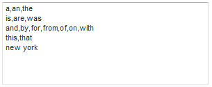

# Sobre palavras excluídas{#about-excluded-words}

Você pode usar Palavras excluídas para especificar frases e palavras comuns usadas com frequência, como &quot;a&quot; e &quot;the&quot;, que você deseja excluir dos resultados de pesquisa.

## Usando palavras excluídas {#concept_9DB67BD2F0DC43AC88741003D9F39812}

Consulte também [Sobre pesquisas](../c-about-settings-menu/c-about-searching-menu.md#concept_207105CF26B1448F8A3D223787C56AB8).

Sem Palavras excluídas, as pesquisas que contêm essas palavras podem identificar vários resultados irrelevantes. Quando você exclui palavras e frases, os resultados da pesquisa são omitidos e correspondem somente aos termos excluídos que você especificou. Se uma consulta de pesquisa contiver uma palavra excluída, somente as palavras não excluídas serão usadas para localizar documentos.

As palavras de pesquisa excluídas não são realçadas nos resultados da pesquisa. No entanto, a pontuação de relevância de cada resultado é influenciada pelas palavras excluídas. Em outras palavras, as palavras excluídas são ignoradas ao localizar documentos, mas ainda são usadas ao classificar os documentos na página de resultados da pesquisa. Antes de os efeitos das configurações de Palavras excluídas (ou alterações nessas configurações) estarem disponíveis para os clientes, certifique-se de gerar novamente o índice do site.

Ao inserir palavras para excluir dos resultados da pesquisa, você pode separar palavras ou frases umas das outras por vírgulas. É possível inserir uma ou mais palavras de exclusão por linha. Veja a seguir um exemplo de palavras excluídas em linhas separadas e divididas por vírgulas.

Usando a lista de exemplos de palavras excluídas acima, se o cliente pesquisar por &quot;os estados unidos da américa&quot;, a palavra &quot;o&quot; e a palavra &quot;de&quot; serão excluídas da pesquisa. Em vez disso, a pesquisa encontra todas as páginas que contêm as palavras &quot;unido&quot;, &quot;estados&quot; e &quot;américa&quot;. As páginas que contêm apenas a palavra &quot;de&quot; ou &quot;o&quot; não são exibidas.

Alguns sites contêm frases específicas na maioria ou em todas as páginas. Por exemplo, um site sobre turismo em Nova York poderia conter as palavras Nova York no título de cada página. Considere adicionar essa frase e outras como ela, à lista de exclusões:

Quando uma frase é excluída, as palavras individuais que a compõem ainda são usadas como termos de pesquisa. Somente quando um visitante pesquisa as palavras exatas, na ordem exata de uma frase excluída, é a frase excluída dos resultados da pesquisa. Utilizando o exemplo acima, se um cliente tiver procurado o &quot;ballet de nova iorque&quot;, são excluídos o termo &quot;the&quot; e a expressão &quot;new york&quot;; somente as páginas que contêm a palavra &quot;ballet&quot; são retornadas como resultado de pesquisa. Por outro lado, a busca por &quot;edifícios novos&quot; ou &quot;duke of york&quot; ainda encontra páginas que contêm a palavra &quot;novo&quot; ou &quot;york&quot;, respectivamente.

## Configurar palavras excluídas {#task_60BF6BB7A66C48479D2BBB32C0F38CDE}

Você pode excluir frases usadas com frequência e palavras comuns de seus resultados de pesquisa.

É possível inserir uma ou mais palavras por linha. Separe cada palavra com vírgulas como no exemplo a seguir:

Você pode optar por mostrar os resultados da pesquisa quando todas as palavras na pesquisa do cliente forem palavras excluídas. Por exemplo, se você excluiu a palavra &quot;o&quot; e um cliente optar por pesquisar apenas por &quot;o&quot;, os resultados da pesquisa mostrarão qualquer página que contenha a palavra &quot;o&quot;. Este resultado é verdadeiro mesmo que a palavra &quot;o&quot; esteja excluída. Se você não marcar essa opção, o cliente não obterá resultados de pesquisa. Essa configuração não terá efeito se a pesquisa contiver pelo menos uma palavra não excluída.

**Para configurar palavras excluídas**

1. No menu do produto, clique em **[!UICONTROL Linguistics]** > **[!UICONTROL Excluded Words]**.
1. Na página [!DNL Excluded Words], no campo de texto **[!UICONTROL Words and Phrases]**, insira as palavras que deseja excluir dos resultados da pesquisa.
1. (Opcional) Clique em **[!UICONTROL Show results when all words in the query are excluded words]**.

   Quando todas as palavras na pesquisa do cliente são palavras excluídas, todas as palavras são usadas em conjunto para realizar a pesquisa.
1. Clique em **[!UICONTROL Save Changes]**.
1. Para visualizar os resultados de suas alterações, clique em **[!UICONTROL regenerate your staged site index]** para recriar o índice do site preparado.

   Consulte [Executar um índice completo de um site ativo ou temporário...](../c-about-index-menu/c-about-full-index.md#task_F7FE04D8A1654A7787FCCA31B45EB42D).

   Consulte [Executar um índice incremental de um site ativo ou temporário...](../c-about-index-menu/c-about-incremental-index.md#task_9BFB6157F3884B2FAECB7E0E9CA318CB).
1. (Opcional) No menu do produto, clique em **[!UICONTROL Linguistics]** > **[!UICONTROL Excluded Words]** e siga um destes procedimentos:

   * Clique em **[!UICONTROL History]** para reverter as alterações feitas.

      Consulte [Usando a opção Histórico](../t-using-the-history-option.md#task_70DD3F87A67242BBBD2CB27156F43002).

   * Clique em **[!UICONTROL Live]**.

      Consulte [Exibição das configurações ativas](../c-about-staging.md#task_401A0EBDB5DB4D4CA933CBA7BECDC10F).

   * Clique em **[!UICONTROL Push Live]**.

      Consulte [Envio das configurações do estágio ao vivo](../c-about-staging.md#task_44306783B4C0408AAA58B471DAF2D9A4).

