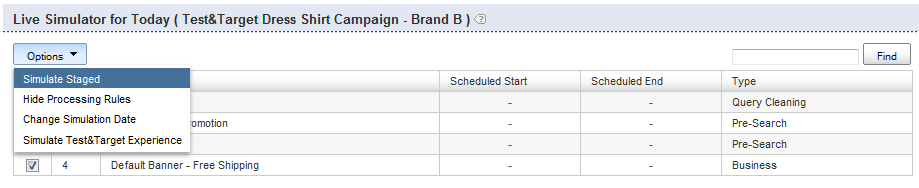

# Sobre regras comerciais{#about-business-rules}

Você pode usar as Regras de negócios para comercializar sua pesquisa.

## Usando regras de negócios {#concept_2A93D76216754D3D8412CDEA00BD26BD}

Por exemplo, você pode configurar quando os banners são exibidos ou quais resultados são exibidos e em que ordem. Você também pode configurar a posição de um item em sua faceta e qual modelo é usado para uma determinada pesquisa. As regras são executadas na ordem em que foram definidas; quanto maior o número do pedido de uma regra, mais tarde ela será executada no processo, superando as regras anteriores. Você pode arrastar e soltar as regras para alterar sua ordem ou pode reorganizá-las inserindo um novo número na caixa de texto Ordem das regras.

Cada regra de negócios é composta de acionadores e ações.

O acionador define quando a regra é executada. Por exemplo, quando o termo do query é &quot;masculino&quot; ou quando os resultados são principalmente chapéus. O acionador consiste em várias condições que devem ser todas, ou qualquer uma delas ser verdadeira para que o acionador geral seja verdadeiro. Você pode especificar a precedência alterando o operador de disparo.

A ação define o que acontece quando a condição de disparo é atendida. Por exemplo, configurar o banner para exibir ou mover um determinado resultado para a posição 1. A tabela de regras mostra informações de resumo sobre a regra. Você pode clicar no nome de uma regra para abri-la e ver informações adicionais.

A tabela de regras mostra uma lista de todas as suas regras de negócios. Por padrão, a tabela mostra as últimas dez regras que foram adicionadas, em ordem decrescente. Você pode clicar nos cabeçalhos de coluna na tabela para classificar as regras em ordem crescente ou decrescente.

As regras de negócios podem ter um dos três estados: Aprovado, Suspenso ou WIP (Trabalho em Andamento)

<table> 
 <thead> 
  <tr> 
   <th colname="col1" class="entry"> 
Estado da regra comercial 
 </th> 
   <th colname="col2" class="entry"> 
Descrição 
 </th> 
  </tr> 
 </thead>
 <tbody> 
  <tr> 
   <td colname="col1"> 
Aprovado 
 </td> 
   <td colname="col2"> 
As regras comerciais aprovadas são executadas em seu ambiente ativo e em seu ambiente preparado. Você aprova uma regra de negócios no Construtor de regras avançado. 
 </td> 
  </tr> 
  <tr> 
   <td colname="col1"> 
Suspenso 
 </td> 
   <td colname="col2"> 
As regras comerciais suspensas nunca são executadas em seu ambiente preparado ou em seu ambiente ativo. 
 </td> 
  </tr> 
  <tr> 
   <td colname="col1"> 
WIP 
 </td> 
   <td colname="col2"> 
WIP (Trabalho em andamento) são regras comerciais que não são aprovadas nem suspensas. Ou seja, você ainda pode estar trabalhando neles ou pode querer testá-los primeiro antes de aprová-los. As regras comerciais em um estado de WIP são executadas somente no ambiente preparado. 
 </td> 
  </tr> 
 </tbody> 
</table>

Você aprova as regras de negócios e as empurra ao vivo para que sejam executadas no seu ambiente. Atualmente, você só pode colocar *todas* as regras online. No entanto, você pode alterar o status de uma regra para ter controle sobre quais regras são executadas e não no seu ambiente ativo.

Por padrão, as regras são executadas sempre que seus acionadores associados são atendidos. Entretanto, você pode, opcionalmente, agendar uma regra para execução para uma data e um intervalo de tempo específicos.

Além disso, por padrão, as regras são executadas sempre que seus acionadores associados são atendidos para todas as lojas. Se você quiser que a regra seja aplicada somente a determinados armazenamentos, poderá usar o painel Armazenamentos para selecionar um ou mais armazenamentos aos quais a regra é aplicada.

## Adicionando uma nova regra de negócios {#task_BD3B31ED48BB4B1B8F1DCD3BFA2528E7}

Você pode usar [!DNL Visual Rule Builder] ou [!DNL Advanced Rule Builder] adicionar regras de negócios que ajustem a experiência de pesquisa do cliente.

**Para adicionar uma nova regra de negócios**

As etapas a seguir pressupõem que você esteja usando o Construtor de regras visual.

1. Faça uma das seguintes opções:

   * No menu do produto, clique em **[!UICONTROL Rules]** > **[!UICONTROL Business Rules]**. Na [!DNL Business Rules] página, clique em **[!UICONTROL Add New Rule]**.

   * No menu do produto, clique em **[!UICONTROL Simulator]**. Na **[!UICONTROL Simulator for Today]** página, clique **[!UICONTROL Add New Rule]** à direita do menu **[!UICONTROL Options]** suspenso.

      Se a **[!UICONTROL Add New Rule]** opção não estiver visível na página, no menu **[!UICONTROL Options]** suspenso, clique em **[!UICONTROL Simulate Staged]**.

      

1. No campo de **[!UICONTROL Name]** texto, digite o novo nome da regra de negócios.

   Não clique **[!UICONTROL Save Rule]** ainda.
1. (Opcional) Se você gerenciar um grande número de regras de negócios, poderá marcar regras de negócios com rótulos específicos. No **[!UICONTROL Tags]** campo, insira um ou mais rótulos de tags, Use uma vírgula, uma Guia ou Enter como delimitador.

   Na [!DNL Business Rules] página, use o **[!UICONTROL Filter by tag]** recurso para filtrar por regras que correspondam a um determinado rótulo. 1. Na [!DNL Business Rule Builder] página, defina os acionadores e as ações que deseja usar.

   **Opções de acionador**

   Acionadores são as condições que devem ser cumpridas para que uma regra de negócios seja executada. Quando uma regra de negócios tem vários acionadores, você pode configurar como os acionadores respondem usando um dos três métodos a seguir:

   * Uma resposta na qual todos os acionadores devem ser verdadeiros (a configuração padrão), como no exemplo a seguir:

      `if a AND b AND c then ...`

   * Uma resposta na qual qualquer um dos acionadores deve ser verdadeiro, como no exemplo a seguir:

      `if a OR b OR c then ...`

   * Uma resposta em que uma combinação personalizada de acionadores é especificada. Ou seja, você combina acionadores individuais ou &quot;condições&quot; com `AND` operadores e `OR` operadores.

      Também é possível alterar a precedência da avaliação adicionando combinações de parênteses esquerdo e direito, como no exemplo a seguir:

      `if (a OR b) AND c then ...`

      >[!NOTE]
      >
      >Se você combinar `AND` operadores com `OR` operadores em um conjunto de regras de negócios Personalizado, certifique-se de especificar parênteses apropriadamente para garantir que os acionadores sejam avaliados na ordem correta.

      Esse recurso específico de personalizar uma combinação de acionadores não está ativado por padrão. Entre em contato com o suporte técnico para ativar este recurso para uso.
   <table> 
      <thead> 
      <tr> 
      <th colname="col1" class="entry"> 
Opção Acionadores 
 </th> 
      <th colname="col2" class="entry"> 
Descrição 
 </th> 
      </tr> 
    </thead>
    <tbody> 
      <tr> 
      <td colname="col1"> 
Correspondências de palavras-chave 
 </td> 
      <td colname="col2"> 
O acionador é verdadeiro quando o termo de pesquisa corresponde a determinada palavra-chave que diferencia maiúsculas de minúsculas. O acionador é verdadeiro para a palavra-chave e para todos os seus sinônimos, conforme definido no dicionário de Linguística. 
 </td> 
      </tr> 
      <tr> 
      <td colname="col1"> 
 Corresponde a Query 
 </td> 
      <td colname="col2"> 
 O acionador é verdadeiro quando todos os parâmetros de pesquisa correspondem. 
 </td> 
      </tr> 
      <tr> 
      <td colname="col1"> 
 O grupo de resultados é dominante 
 </td> 
      <td colname="col2"> 
 O acionador é verdadeiro quando o grupo de resultados definido pela pesquisa em questão domina o conjunto de resultados. 
 
Por padrão, a dominância é definida em 50%. Essa configuração é uma preferência de comercialização que pode ser definida. 
 
 
        <!--See <xref href="t_Configuring_Merchandising_preferences.xml#task_7AC7B9F5D9F44E10AB5BC0B8CB31C37A" type="task" format="dita" scope="local">Configuring Merchandising preferences</xref>. --> 
 
O grupo inteiro deve estar presente no conjunto de resultados para que esse acionador seja verdadeiro. O grupo de resultados é dinâmico. Elas podem ser alteradas após operações de índice, dependendo de quais resultados correspondem aos critérios de pesquisa originais. 
 </td> 
      </tr> 
      <tr> 
      <td colname="col1"> 
O grupo de resultados está presente 
 </td> 
      <td colname="col2"> 
 O acionador é verdadeiro quando o grupo de resultados definido pela pesquisa fornecida está presente no conjunto de resultados. O grupo inteiro deve estar presente no conjunto de resultados para que esse acionador seja atendido (os resultados podem aparecer em qualquer página). O grupo de resultados é dinâmico e pode ser alterado após operações de índice dependendo de quais resultados correspondem aos critérios de pesquisa originais. 
 </td> 
      </tr> 
      <tr> 
      <td colname="col1"> 
 Resultado presente 
 </td> 
      <td colname="col2"> 
 O acionador é verdadeiro quando o resultado individual é encontrado dentro do conjunto de resultados. O resultado pode estar em qualquer lugar do conjunto de resultados, não precisa estar na página que o usuário está visualizando no momento. 
 </td> 
      </tr> 
    </tbody> 
    </table>

   **Opções de ação**

   Quando os acionadores de uma regra de negócios são atendidos, as ações associadas à regra são executadas. Embora o Construtor de regras visual permita criar as seguintes ações, você pode usar o Construtor de regras avançado para criar tipos adicionais de ações.

   As ações Remover item de faceta, Revelar item de faceta, Revelar faceta, Remover face, Empurrar item de faceta na tabela a seguir exigem uma faceta. A interface para escolher uma faceta depende de como sua conta está configurada. Por exemplo, uma conta normal usa uma lista suspensa para escolher aspectos. No entanto, se sua conta tiver facetas deslocadas, uma caixa de texto de preenchimento automático será exibida, onde você poderá digitar o nome de qualquer faceta. O preenchimento automático sugere aspectos em uma lista suspensa à medida que você digita o nome da faceta. As sugestões incluem aspectos definidos no momento. Se sua conta tiver um mapa de slot, também sugerirá aspectos com slot.

   <table> 
    <thead> 
      <tr> 
      <th colname="col1" class="entry"> 
Opção Ações 
 </th> 
      <th colname="col2" class="entry"> 
Descrição 
 </th> 
      </tr> 
    </thead>
    <tbody> 
      <tr> 
      <td colname="col1"> 
Grupo de push 
 </td> 
      <td colname="col2"> 
 Envia o grupo de resultados de pesquisa, conforme definido pelos critérios de pesquisa especificados, para uma posição específica. 
 
Enviar um grupo de resultados de pesquisa não adiciona implicitamente o grupo. 
 </td> 
      </tr> 
      <tr> 
      <td colname="col1"> 
Adicionar grupo 
 </td> 
      <td colname="col2"> 
 Adicione o grupo de resultados de pesquisa conforme definido pelos critérios de pesquisa especificados. 
 </td> 
      </tr> 
      <tr> 
      <td colname="col1"> 
Remover grupo 
 </td> 
      <td colname="col2"> 
 Remova o grupo de resultados de pesquisa definido pelos critérios de pesquisa especificados. 
 </td> 
      </tr> 
      <tr> 
      <td colname="col1"> 
Empurrar único 
 </td> 
      <td colname="col2"> 
 Empurra o resultado da pesquisa individual para a posição selecionada. 
 </td> 
      </tr> 
      <tr> 
      <td colname="col1"> 
Adicionar único 
 </td> 
      <td colname="col2"> 
 Adiciona um resultado de pesquisa individual à posição selecionada. 
 </td> 
      </tr> 
      <tr> 
      <td colname="col1"> 
Remover único 
 </td> 
      <td colname="col2"> 
 Remove um resultado de pesquisa individual do conjunto de resultados de pesquisa. 
 </td> 
      </tr> 
      <tr> 
      <td colname="col1"> 
Remover todos os resultados 
 </td> 
      <td colname="col2"> 
Remove todos os resultados do conjunto de resultados da pesquisa. 
 
 
        <!-- Bug #3331637 The option is meant to be used in conjunction with other rule actions in order to create "canned landing pages" where we want to create a page's content solely by rule actions, and need to completely discard the "natural" results of the search. Given that the other options don't have any kind of "here's how/why you might use this", I don't see much point in breaking that precedent here.--> 
 </td> 
      </tr> 
      <tr> 
      <td colname="col1"> 
Selecionar banner diferente 
 </td> 
      <td colname="col2"> 
 Altera o banner na área selecionada do banner. 
 
Essa opção está disponível quando você clica com o botão direito do mouse em um banner na área de visualização da página da Web. 
 </td> 
      </tr> 
      <tr> 
      <td colname="col1"> 
Adicionar comandos de banner 
 </td> 
      <td colname="col2"> 
Aplica-se somente aos modelos do Adobe Dynamic Media Classic. 
 
Permite alterar os parâmetros padrão usados no modelo de banner. 
 
Consulte a tabela de opções em <a scope="local" href="../c-about-design-menu/c-about-banners.md#task_AD1E0C00A9E04B1FA819EB93288786B3" type="reference" format="dita"> Adicionar um banner usando o Adobe Dynamic Media Classic </a>. 
 
Consulte também <a href="../c-about-design-menu/c-about-banners.md#task_C3E782477FBF428ABEA220751781ACA9" type="task" format="dita" scope="local"> Editar um banner usando o Adobe Dynamic Media Classic </a>. 
 </td> 
      </tr> 
      <tr> 
      <td colname="col1"> 
Remover banner 
 </td> 
      <td colname="col2"> 
 Remove o banner da área selecionada; nenhum banner será exibido, a menos que outra regra que defina um banner substitua essa regra. 
 
Essa opção está disponível quando você clica com o botão direito do mouse em um banner na área de visualização da página da Web. 
 </td> 
      </tr> 
      <tr> 
      <td colname="col1"> 
Item de faceta de push 
 </td> 
      <td colname="col2"> 
 Empurra um item dentro de uma faceta para a posição selecionada. 
 </td> 
      </tr> 
      <tr> 
      <td colname="col1"> 
Remover Zona 
 </td> 
      <td colname="col2"> 
 Remove uma zona da página de resultados da pesquisa. 
 
Consulte também a ação Remover aspecto abaixo. 
 </td> 
      </tr> 
      <tr> 
      <td colname="col1"> 
Zona de revelação 
 </td> 
      <td colname="col2"> 
 Revela uma zona na página de resultados da pesquisa. 
 
Consulte também a ação Revelar faceta abaixo. 
 </td> 
      </tr> 
      <tr> 
      <td colname="col1"> 
Remover item de faceta 
 </td> 
      <td colname="col2"> 
 Remove um item de faceta de uma faceta. 
 </td> 
      </tr> 
      <tr> 
      <td colname="col1"> 
ação de item de revelação de faceta 
 </td> 
      <td colname="col2"> 
 Revela um item de faceta específico. 
 </td> 
      </tr> 
      <tr> 
      <td colname="col1"> 
Aspecto de revelação 
 </td> 
      <td colname="col2"> 
 Revela uma faceta específica. Essa ação é preferida à ação Zona de revelação. 
 </td> 
      </tr> 
      <tr> 
      <td colname="col1"> 
Remover face 
 </td> 
      <td colname="col2"> 
 Remove uma faceta específica. Essa ação é preferida à ação Remover zona. 
 </td> 
      </tr> 
    </tbody> 
    </table>

   Dependendo do painel do construtor de regras que esteja ativo (desdobrado), você também pode fazer o seguinte para definir acionadores e ações.

   * Quando o **[!UICONTROL Triggers]** painel for desdobrado - na área de modelo de apresentação da página do Construtor de regras de negócios, clique com o botão direito do mouse em qualquer resultado de pesquisa ou aspecto de pesquisa e clique em **[!UICONTROL Add "result present" trigger]**.

      No painel Acionadores, clique no &quot;X&quot; à esquerda de um acionador para removê-lo da lista de acionadores.

   * Quando o **[!UICONTROL Actions]** painel for desdobrado - na área de modelo de apresentação da página do Construtor de regras de negócios, clique com o botão direito do mouse em um resultado de pesquisa. Clique **[!UICONTROL Add Result]**, **[!UICONTROL Remove Result]**, **[!UICONTROL Push to bottom]** ou **[!UICONTROL Push to #`<n>`]** (onde `<n>` é um numeral).

1. (Opcional) Em qualquer painel do Construtor de regras de negócios ( [!DNL Triggers], [!DNL Actions]ou [!DNL Schedule]), execute um dos procedimentos a seguir:

   * Na área do modelo de apresentação da área de página do Construtor de regras de negócios, clique com o botão direito do mouse em um banner e clique em **[!UICONTROL Select different banner]**. Na **[!UICONTROL Pick Banner]** página, clique **[!UICONTROL Pick this banner]** abaixo da miniatura do banner para adicioná-la ao modelo de apresentação. Somente os banners que correspondem ao tamanho e à área do banner original no modelo de apresentação estão disponíveis para seleção.

      A ação de adicionar banner é adicionada ao [!DNL Actions] painel.

   * Na área do modelo de apresentação da [!DNL Business Rule Builder] página, clique com o botão direito do mouse em um banner de modelo do Adobe Dynamic Media Classic cujos parâmetros você deseja alterar e clique em **[!UICONTROL Add banner commands]**. Na caixa de [!DNL Change Parameters] diálogo, defina as opções de parâmetro desejadas.

      Consulte a tabela de opções em [Adicionar um banner usando o Adobe Dynamic Media Classic](../c-about-design-menu/c-about-banners.md#task_AD1E0C00A9E04B1FA819EB93288786B3).

      Clique em **[!UICONTROL Save]**.

      As alterações de parâmetro são adicionadas ao [!DNL Actions] painel.

      Consulte também [Editar um banner usando o Adobe Dynamic Media Classic](../c-about-design-menu/c-about-banners.md#task_C3E782477FBF428ABEA220751781ACA9).

   * Na área do modelo de apresentação da página do Construtor de regras de negócios, clique com o botão direito do mouse em um banner que você deseja excluir da página e clique em **[!UICONTROL Remove banner]**. A ação de remoção do banner é adicionada ao painel Ações.

1. (Opcional) No **[!UICONTROL Schedule]** painel, execute um dos procedimentos a seguir:

   * Clique em **[!UICONTROL Run Indefinitely]** para que a regra seja executada sempre que seus acionadores associados forem atendidos. Essa opção é o padrão.
   * Clique em **[!UICONTROL Fixed Schedule]** e especifique a data e a hora do start, a data e a hora de término para a regra ser executada sempre que seu acionador associado for atendido.

1. Clique em **[!UICONTROL Save Rule]**.
1. (Opcional) Na [!DNL Business Rules] página, execute um dos procedimentos a seguir:

   * Clique **[!UICONTROL History]** para reverter quaisquer alterações feitas.

      Consulte [Uso da opção](../t-using-the-history-option.md#task_70DD3F87A67242BBBD2CB27156F43002)Histórico.

   * Clique em **[!UICONTROL Live]**.

      Consulte [Visualizar configurações](../c-about-staging.md#task_401A0EBDB5DB4D4CA933CBA7BECDC10F)ativas.

   * Clique em **[!UICONTROL Push Live]**.

      Consulte [Colocar configurações de estágio ao vivo](../c-about-staging.md#task_44306783B4C0408AAA58B471DAF2D9A4).

## Editar uma regra de negócios {#task_375CFA75D1D94D9E92A35DE1228E5087}

Você pode usar o Construtor de regras visual ou o Construtor de regras avançado para editar regras de negócios que você adicionou.

**Para editar uma nova regra de negócios**

1. No menu do produto, clique em **[!UICONTROL Rules]** > **[!UICONTROL Business Rules]**.
1. Na [!DNL Business Rules] página, execute um dos procedimentos a seguir:

   * Na [!DNL Name] coluna, clique no nome de uma regra de negócios que você deseja alterar.

      A regra de negócios é aberta na interface padrão especificada em **[!UICONTROL Settings]** > **[!UICONTROL My Profile]** > **[!UICONTROL My Preferences]**.

   * Na lista suspensa, ao lado do nome de uma regra de negócios que você deseja editar, clique em **[!UICONTROL Edit in advanced mode]** ou **[!UICONTROL Edit in visual mode]**.

1. No campo de [!DNL Name] texto, digite o novo nome da regra de negócios.

   Não clique **[!UICONTROL Save Rule]** ainda. 1. Na [!DNL Business Rule Builder] página, defina os acionadores e as ações que deseja usar.

   Consulte a tabela de opções em [Adicionar uma nova regra](../c-about-rules-menu/c-about-business-rules.md#task_BD3B31ED48BB4B1B8F1DCD3BFA2528E7)comercial.
1. (Opcional) Em qualquer **[!UICONTROL Business Rule Builder]** painel ( [!DNL Triggers], [!DNL Actions]ou [!DNL Schedule], execute um dos procedimentos a seguir:

   * Na área do modelo de apresentação da [!DNL Business Rule Builder] página, clique com o botão direito do mouse em um banner e clique em **[!UICONTROL Select different banner]**. Na página [!DNL Pick Banner page], clique **[!UICONTROL Pick this banner]** abaixo da miniatura do banner para adicioná-la ao modelo de apresentação. Somente os banners que correspondem ao tamanho e à área do banner original no modelo de apresentação estão disponíveis para seleção.

      A ação de adicionar banner é adicionada ao [!DNL Actions] painel.

   * Na área do modelo de apresentação da [!DNL Business Rule Builder] página, clique com o botão direito do mouse em um banner de modelo do Adobe Dynamic Media Classic cujos parâmetros você deseja alterar e clique em **[!UICONTROL Add banner commands]**. Na caixa de [!DNL Change Parameters] diálogo, defina as opções de parâmetro desejadas.

      Consulte a tabela de opções em [Adicionar um banner usando o Adobe Dynamic Media Classic](../c-about-design-menu/c-about-banners.md#task_AD1E0C00A9E04B1FA819EB93288786B3).

      Clique em **[!UICONTROL Save]**.

      As alterações de parâmetro são adicionadas ao [!DNL Actions] painel.

      Consulte também [Editar um banner usando o Adobe Dynamic Media Classic](../c-about-design-menu/c-about-banners.md#task_C3E782477FBF428ABEA220751781ACA9).

   * Na área do modelo de apresentação da [!DNL Business Rule Builder] página, clique com o botão direito do mouse em um banner que você deseja excluir da página e clique em **[!UICONTROL Remove banner]**. A ação de remoção do banner é adicionada ao [!DNL Actions] painel.

1. (Opcional) No [!DNL Schedule] painel, execute um dos procedimentos a seguir:

   * Clique em **[!UICONTROL Run Indefinitely]** para que a regra seja executada sempre que seus acionadores associados forem atendidos. Essa opção é o padrão.
   * Clique em **[!UICONTROL Fixed Schedule]** e especifique a data e a hora do start, a data e a hora de término para a regra ser executada sempre que seu acionador associado for atendido.

1. Clique em **[!UICONTROL Save Rule]**.

   A [!DNL Business Rule Builder] página é fechada e você é redirecionado para a **[!UICONTROL Business Rule]** página. Suas regras aparecem na tabela. Clique no cabeçalho da **[!UICONTROL Modified]** coluna para classificar as regras por data de edição. 1. (Opcional) Execute um dos procedimentos a seguir:

   * Clique **[!UICONTROL History]** para reverter quaisquer alterações feitas.

      Consulte [Uso da opção](../t-using-the-history-option.md#task_70DD3F87A67242BBBD2CB27156F43002)Histórico.

   * Clique em **[!UICONTROL Live]**.

      Consulte [Visualizar configurações](../c-about-staging.md#task_401A0EBDB5DB4D4CA933CBA7BECDC10F)ativas.

   * Clique em **[!UICONTROL Push Live]**.

      Consulte [Colocar configurações de estágio ao vivo](../c-about-staging.md#task_44306783B4C0408AAA58B471DAF2D9A4).

## Copiando uma regra de negócios {#task_89F1879C71A54EE9B7454439302C03EC}

Você pode copiar uma regra de negócios existente para usar como base para uma nova regra de negócios que deseja criar.

**Para copiar uma regra de negócios**

1. No menu do produto, clique em **[!UICONTROL Rules]** > **[!UICONTROL Business Rules]**.
1. Na **[!UICONTROL Business Rules]** página, na lista suspensa ao lado do nome de uma regra de negócios que você deseja copiar, clique em **[!UICONTROL Copy rule]**.
1. Edite a regra de negócios copiada como de costume.

   See [Editing a business rule](../c-about-rules-menu/c-about-business-rules.md#task_375CFA75D1D94D9E92A35DE1228E5087).

## Aprovação de regras de negócios {#task_BD569D18BF664272B8692294C162E2C1}

Você pode ativar regras de negócios que tenham status WIP (Trabalho em andamento) ou suspenso.

**Para aprovar regras de negócios**

1. No menu do produto, clique em **[!UICONTROL Rule]** > **[!UICONTROL Business Rules]**.
1. Na [!DNL Business Rules] página, usando o cabeçalho da coluna de status na [!DNL Status] coluna da tabela de regras de negócios, classifique as regras que têm um status de **[!UICONTROL WIP]** ou **[!UICONTROL suspended]**.

   Use o cabeçalho da coluna da caixa de seleção no lado esquerdo da tabela para verificar todas as regras que estão sendo exibidas na página ou apenas aquelas que têm um status igual **[!UICONTROL WIP]** ou **[!UICONTROL suspended]**. 1. Na barra de menus próxima à parte superior da página, clique em **[!UICONTROL Approve]**.
1. Na caixa de **[!UICONTROL Confirm Action]** diálogo, clique em **[!UICONTROL OK]**.
1. (Opcional) Execute um dos procedimentos a seguir:

   * Clique **[!UICONTROL History]** para reverter quaisquer alterações feitas.

      Consulte [Uso da opção](../t-using-the-history-option.md#task_70DD3F87A67242BBBD2CB27156F43002)Histórico.

   * Clique em **[!UICONTROL Live]**.

      Consulte [Visualizar configurações](../c-about-staging.md#task_401A0EBDB5DB4D4CA933CBA7BECDC10F)ativas.

   * Clique em **[!UICONTROL Push Live]**.

      Consulte [Colocar configurações de estágio ao vivo](../c-about-staging.md#task_44306783B4C0408AAA58B471DAF2D9A4).

## Suspender regras de negócios {#task_364E1FFB905141C08E306C8F1794A20E}

Você pode suspender regras comerciais que tenham status WIP (Trabalho em andamento) ou aprovado.

Ao suspender uma regra, você indica na interface do usuário que a tornou temporariamente inativa e que está adiando qualquer trabalho nela por mais um tempo. No entanto, você ainda pode editar uma regra suspensa.

**Para suspender as regras de negócios**

1. No menu do produto, clique em **[!UICONTROL Rule]** > **[!UICONTROL Business Rules]**.
1. Na [!DNL Business Rules] página, usando o status na coluna Status da tabela de regras de negócios, na coluna à esquerda da tabela, verifique as regras que têm o status **[!UICONTROL WIP]** ou **[!UICONTROL approved]**.
1. Na barra de menus próxima à parte superior da página, clique em **[!UICONTROL Suspend]**.
1. Na caixa de **[!UICONTROL Confirm Action]** diálogo, clique em **[!UICONTROL OK]**.
1. (Opcional) Execute um dos procedimentos a seguir:

   * Clique **[!UICONTROL History]** para reverter quaisquer alterações feitas.

      Consulte [Uso da opção](../t-using-the-history-option.md#task_70DD3F87A67242BBBD2CB27156F43002)Histórico.

   * Clique em **[!UICONTROL Live]**.

      Consulte [Visualizar configurações](../c-about-staging.md#task_401A0EBDB5DB4D4CA933CBA7BECDC10F)ativas.

   * Clique em **[!UICONTROL Push Live]**.

      Consulte [Colocar configurações de estágio ao vivo](../c-about-staging.md#task_44306783B4C0408AAA58B471DAF2D9A4).

## Retomar regras comerciais {#task_E67D678C765B436EA2A3D6ADD7A49ABA}

Você pode retomar as regras de negócios para reativar uma regra suspensa. Após retomar a regra de negócios, seu status é definido como WIP (Trabalho em andamento).

**Para retomar as regras de negócios**

1. No menu do produto, clique em **[!UICONTROL Rule]** > **[!UICONTROL Business Rules]**.
1. Na [!DNL Business Rules] página, usando o status na coluna Status da tabela de regras de negócios, na coluna à esquerda da tabela, verifique as regras que têm o status de **[!UICONTROL suspended]**.
1. Na barra de menus próxima à parte superior da página, clique em **[!UICONTROL Resume]**.
1. Na caixa de [!DNL Confirm Action] diálogo, clique em **[!UICONTROL OK]**.
1. (Opcional) Execute um dos procedimentos a seguir:

   * Clique **[!UICONTROL History]** para reverter quaisquer alterações feitas.

      Consulte [Uso da opção](../t-using-the-history-option.md#task_70DD3F87A67242BBBD2CB27156F43002)Histórico.

   * Clique em **[!UICONTROL Live]**.

      Consulte [Visualizar configurações](../c-about-staging.md#task_401A0EBDB5DB4D4CA933CBA7BECDC10F)ativas.

   * Clique em **[!UICONTROL Push Live]**.

      Consulte [Colocar configurações de estágio ao vivo](../c-about-staging.md#task_44306783B4C0408AAA58B471DAF2D9A4).

## Alteração da ordem em que as regras de negócios são executadas {#task_FE3B1C17307F49B49050C2EC5A063991}

É possível reordenar as regras de negócios para alterar a ordem em que são executadas nos modelos de apresentação.

As regras de negócio são aplicadas na ordem em que foram definidas; quanto maior o número do pedido de uma regra, mais tarde ela será executada no processo, superando as regras anteriores. Você reorganiza as regras digitando um novo número na coluna Ordem da tabela na [!DNL Business Rules] página. Também é possível usar as regras de arrastar e soltar para alterar a ordem de execução.

**Para alterar a ordem em que as regras de negócios são executadas**

1. No menu do produto, clique em **[!UICONTROL Rule]** > **[!UICONTROL Business Rules]**.
1. Na [!DNL Business Rules] página, na tabela, execute um dos procedimentos a seguir:

   * Clique no cabeçalho da **[!UICONTROL Order]** coluna para classificar as regras em ordem crescente ou decrescente.
   * Na **[!UICONTROL Order]** coluna, no campo de texto à esquerda do nome de uma regra de negócios, digite o número do pedido que você deseja que a regra execute.
   * Arraste e solte uma linha de tabela na posição em que deseja que a regra seja executada. Todos os números de pedido são atualizados para refletir a nova ordem em que as regras são executadas.

1. Clique em **[!UICONTROL Save Changes]**.

   Suas regras de negócios serão executadas na ordem especificada. A exceção ocorre se houver uma regra de negócios de redirecionamento especificada. Se e quando a regra de negócios de redirecionamento for acionada ou atingida, o processamento da regra de negócios será interrompido para permitir o redirecionamento.
1. (Opcional) Execute um dos procedimentos a seguir:

   * Clique **[!UICONTROL History]** para reverter quaisquer alterações feitas.

      Consulte [Uso da opção](../t-using-the-history-option.md#task_70DD3F87A67242BBBD2CB27156F43002)Histórico.

   * Clique em **[!UICONTROL Live]**.

      Consulte [Visualizar configurações](../c-about-staging.md#task_401A0EBDB5DB4D4CA933CBA7BECDC10F)ativas.

   * Clique em **[!UICONTROL Push Live]**.

      Consulte [Colocar configurações de estágio ao vivo](../c-about-staging.md#task_44306783B4C0408AAA58B471DAF2D9A4).

## Excluindo regras de negócios {#task_AE37B42412044541BCC6D46CF8793DFF}

Você pode deletar regras comerciais cujo status é WIP, suspenso ou aprovado, usando o menu suspenso Ações em massa.

**Para excluir regras de negócios**

1. No menu do produto, clique em **[!UICONTROL Rules]** > **[!UICONTROL Business Rules]**.
1. Na [!DNL Business Rules] página, execute um dos procedimentos a seguir:

   * Use o cabeçalho da coluna da caixa de seleção para marcar todas as regras que estão sendo exibidas na página.
   * Verifique somente as regras de negócios que deseja excluir, com base no status na coluna Status da tabela.

1. Na lista [!DNL Bulk Actions] suspensa, clique em **[!UICONTROL Delete]**.
1. Na caixa de [!DNL Confirm Action] diálogo, clique em **[!UICONTROL OK]**.
1. (Opcional) Execute um dos procedimentos a seguir:

   * Clique **[!UICONTROL History]** para reverter quaisquer alterações feitas.

      Consulte [Uso da opção](../t-using-the-history-option.md#task_70DD3F87A67242BBBD2CB27156F43002)Histórico.

   * Clique em **[!UICONTROL Live]**.

      Consulte [Visualizar configurações](../c-about-staging.md#task_401A0EBDB5DB4D4CA933CBA7BECDC10F)ativas.

   * Clique em **[!UICONTROL Push Live]**.

      Consulte [Colocar configurações de estágio ao vivo](../c-about-staging.md#task_44306783B4C0408AAA58B471DAF2D9A4).
