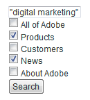

# Pesquisar formulários{#search-forms}

## Uso de coleções em formulários de pesquisa {#reference_5A079AEEEFB84457892EF0870D0605C3}

As coleções permitem que seus clientes pesquisem áreas específicas de seu site. Dependendo de você implementar uma lista suspensa ou uma lista de caixas de seleção, é possível permitir que seus clientes pesquisem uma única coleção ou várias coleções.

Consulte também [Sobre coleções](../c-about-settings-menu/c-about-searching-menu.md#concept_62E42ACE53D54EEE9273433B86259127).

O exemplo a seguir mostra quatro nomes de coleção diferentes e as áreas associadas do site que eles cobrem:

<table> 
 <thead> 
  <tr> 
   <th colname="col1" class="entry"> <p>Nome da coleção </p> </th> 
   <th colname="col2" class="entry"> <p> </p> </th> 
  </tr> 
 </thead>
 <tbody> 
  <tr> 
   <td colname="col1"> <p>Produtos </p> </td> 
   <td colname="col2"> <p> 
     <ul id="ul_7AE70789C0914EBFBCCC7695C6F53B9E"> 
      <li id="li_72525BAA34E2442D86152F2FD8CA83D5"> https://www.mycompany.com/products.htm </li> 
      <li id="li_5CA4152239124BDBB251E6C94B15D45B"> https://www.mycompany.com/publish/ </li> 
      <li id="li_6E266736B3494696A3AFD841C4AFEC57"> https://www.mycompany.com/search/ </li> 
     </ul> </p> </td> 
  </tr> 
  <tr> 
   <td colname="col1"> <p>Clientes </p> </td> 
   <td colname="col2"> <p>https://www.mycompany.com/customers/ </p> </td> 
  </tr> 
  <tr> 
   <td colname="col1"> <p>Notícias </p> </td> 
   <td colname="col2"> <p>https://www.mycompany.com/news/ </p> </td> 
  </tr> 
  <tr> 
   <td colname="col1"> <p>Sobre o Adobe </p> </td> 
   <td colname="col2"> <p>https://www.mycompany.com/company/ </p> </td> 
  </tr> 
 </tbody> 
</table>

A interface suspensa do formulário de pesquisa permite que os usuários selecionem uma coleção e se pareçam com a seguinte:


O formulário de pesquisa suspenso é gerado com o seguinte código HTML:

```
<select name="sp_k"> 
<option value="">All of Adobe</option> 
<option value="Products">Products</option> 
<option value="Customers">Customers</option> 
<option value="News">News</option> 
<option value="About Adobe">About Adobe</option> 
</select>
```

Como alternativa, você pode usar um grupo de caixas de seleção em seu formulário de pesquisa para que os visitantes possam selecionar várias coleções:



O formulário de pesquisa da caixa de seleção é gerado com o seguinte código HTML:

```
<input type="checkbox" name="sp_k" value="">All of Adobe<br> 
<input type="checkbox" name="sp_k" value="Products">Products<br> 
<input type="checkbox" name="sp_k" value="Customers">Customers<br> 
<input type="checkbox" name="sp_k" value="News">News<br> 
<input type="checkbox" name="sp_k" value="About Adobe">About Adobe<br>
```

## Resultados da pesquisa {#section_BBDD5B44E2B349BC88D937F44583D350}

A tag do modelo de pesquisa `<search-input-collections>` gera o HTML da caixa de listagem da coleção nos resultados da pesquisa e seleciona automaticamente a coleção especificada na pesquisa. Se você deseja gerar caixas de seleção, use a tag `<search-input>` em vez da tag `<input>` da seguinte maneira:

```
<search-input type="checkbox" name="sp_k" value="">All of Adobe<br> 
<search-input type="checkbox" name="sp_k" value="Products">Products<br> 
<search-input type="checkbox" name="sp_k" value="Customers">Customers<br> 
<search-input type="checkbox" name="sp_k" value="News">News<br> 
<search-input type="checkbox" name="sp_k" value="About Adobe">About Adobe<br>
```

A tag `<search-input>` gera uma tag `<input>` e inclui o atributo `checked` se a coleção foi especificada na pesquisa.

## Uso de quadros com formulários {#reference_82CDDDA1E37042E4849EBF7EA05407C5}

Você pode configurar seus conjuntos de quadros para funcionar com pesquisa/merchandising de site.

Para saber mais sobre quadros HTML e o elemento do conjunto de quadros HTML, consulte o seguinte URL:

[https://www.w3schools.com/html/html_frames.asp](https://www.w3schools.com/html/html_frames.asp)

Se o site usa quadros, você pode especificar um quadro de destino para links de resultados de pesquisa. O destino padrão é _self, que abre links no quadro ou na janela do navegador atual. Em vez disso, você pode especificar metas específicas de site ou reservadas para navegador:

* _top (reservado para navegador) resulta aberto na janela atual do navegador e substitui todos os quadros atuais.
* _blank (reservado para navegador) resulta aberto em uma nova janela do navegador.
* _parent (reservado para navegador) resulta aberto no quadro pai do quadro atual.
* o quadro2 (específico do site) resulta aberto em um quadro chamado &quot;quadro2&quot;. Você pode especificar o nome de qualquer quadro como um valor (por exemplo, principal ou conteúdo).

Se o site não usa quadros, você provavelmente não desejará alterar o nome de destino padrão.

Se você criar um modelo de resultados de pesquisa personalizado para seu site, poderá substituir a configuração especificada usando o atributo `target` da tag `<search-link>`.

O processo para configurar conjuntos de quadros é o seguinte:

<table> 
 <thead> 
  <tr> 
   <th colname="col1" class="entry"> <p>Etapa do processo </p> </th> 
   <th colname="col02" class="entry"> <p>Descrição do processo </p> </th> 
   <th colname="col2" class="entry"> <p>Link </p> </th> 
  </tr> 
 </thead>
 <tbody> 
  <tr> 
   <td colname="col1"> <p>1 </p> </td> 
   <td colname="col02"> <p>Adicione o formulário ao quadro desejado na página da Web. </p> </td> 
   <td colname="col2"> <p> <a href="#section_BAA8A502BB2243F8B5FF9783CDF2BFFD" type="section" format="dita" scope="local"> Adicionando o código do formulário de pesquisa a um quadro em seu...  </a> </p> </td> 
  </tr> 
  <tr> 
   <td colname="col1"> <p>2 </p> </td> 
   <td colname="col02"> <p>Defina o quadro de destino para a página de resultados da pesquisa. </p> </td> 
   <td colname="col2"> <p> <a scope="local" href="#section_532CACB90888467093D95EACB64FDFA1" type="section" format="dita"> Definição do quadro de destino para a página de resultados da pesquisa  </a> </p> </td> 
  </tr> 
  <tr> 
   <td colname="col1"> <p>3 </p> </td> 
   <td colname="col02"> <p>Defina o público-alvo para links feitos na página de resultados da pesquisa. </p> </td> 
   <td colname="col2"> <p> <a scope="local" href="#section_523248C5AC424D878321C21A23A5CD66" type="section" format="dita"> Definindo o público-alvo para links feitos a partir dos resultados da pesquisa...  </a> </p> </td> 
  </tr> 
  <tr> 
   <td colname="col1"> <p>4 </p> </td> 
   <td colname="col02"> <p>Edite as páginas do quadro de navegação para evitar que elas sejam indexadas. </p> </td> 
   <td colname="col2"> <p> <a scope="local" href="#section_C62E5F0EE1294D5EBD97E123E54433FC" type="section" format="dita"> Editar as páginas do quadro de navegação para evitar que elas sejam..  </a> </p> </td> 
  </tr> 
  <tr> 
   <td colname="col1"> <p>5 </p> </td> 
   <td colname="col02"> <p>Teste o formulário de pesquisa. </p> </td> 
   <td colname="col2"> <p> <a scope="local" href="#section_43D8D4A7BF524DC480DFE5442F6A2E3C" type="section" format="dita"> Teste do formulário de pesquisa  </a> </p> </td> 
  </tr> 
 </tbody> 
</table>

## Adicionar o código do formulário de pesquisa a um quadro na sua página da Web {#section_BAA8A502BB2243F8B5FF9783CDF2BFFD}

1. No menu do produto, clique em **[!UICONTROL Design]** > **[!UICONTROL Auto-Complete]** > **[!UICONTROL Form Source]**.

   O código do formulário de pesquisa HTML é semelhante ao seguinte:

   ```
   <!-- Adobe Target HTML for [your customer name] --> 
   <form method="get" action="https://search.atomz.com/search/"> 
   <input size=15 name="sp_q"><br> 
   <input type=submit value="Search"> 
   <input type=hidden name="sp_a" value="[your account number]"> 
   </form>
   ```

1. Na página [!DNL Standard Form Source] , selecione e copie o código do formulário de pesquisa HTML que aparece no campo de texto.
1. Cole o código do formulário de pesquisa no quadro desejado no conjunto de quadros.

   No exemplo abaixo, o código do formulário de pesquisa é colado no quadro de navegação, o quadro vertical estreito no lado esquerdo da tela.

   

## Definir o quadro de destino para a página de resultados da pesquisa {#section_532CACB90888467093D95EACB64FDFA1}

Se você colocou o código do formulário de pesquisa no quadro de navegação vertical, como acima, é possível exibir os resultados da pesquisa no quadro principal maior. Neste exemplo, você chama o quadro principal de &quot;corpo&quot; e o define como o quadro de destino.


1. Para especificar o quadro de destino para a página de resultados, adicione um destino e valor ao formulário, alterando a seguinte linha no código do formulário de pesquisa do seguinte:

   `<form method="get" action="https://search.atomz.com/search/">`

   para:

   `<form target="body" method="get" action="https://search.atomz.com/search/">`

   Assegure-se de colocar aspas no valor de destino do formulário.

Quando um cliente faz uma pesquisa em seu site, os resultados da pesquisa aparecem no quadro &quot;body&quot; da página da Web.

## Definir o destino para links feitos a partir da página de resultados da pesquisa {#section_523248C5AC424D878321C21A23A5CD66}

Você pode definir o quadro de destino editando diretamente seu modelo.

Se os resultados da pesquisa forem exibidos no quadro &quot;corpo&quot;, você provavelmente também desejará que os links sejam abertos no quadro &quot;corpo&quot;. Como esse é o mesmo quadro, o valor de destino `"_self"` que é a configuração padrão, não é necessário fazer alterações.

Você também pode definir o quadro de destino para links de resultados. A seguir estão vários exemplos do que você pode fazer:

* Especifique quadros diferentes para os resultados da pesquisa e seus links, de modo que os resultados da pesquisa permaneçam ativos em seu próprio quadro enquanto cada resultado clicado abre em um quadro separado.
* Especifique que os resultados da pesquisa sejam abertos em uma nova janela em branco, de modo que sua janela antiga permaneça ativa com seu conteúdo original, o que também preserva os resultados da pesquisa.

O nome do público-alvo pode ser o nome de um quadro especificado no seu HTML ou pode ser um dos vários dos seguintes padrões HTML:

* `target="_blank"` Abra os links em uma nova janela, em branco, sem nome.

* `target="_self"` Padrão. Abra os links na mesma janela em que os resultados da pesquisa residem. Nesse caso, a janela original de resultados da pesquisa. Use essa opção para substituir um destino básico atribuído globalmente.

* `target="_parent"` Abra os links no conjunto de quadros principal da página do link . Se o documento não tiver um pai, isso funcionará como `"_self"` por padrão.

* `target="_top"` Abra os links na janela completa. Se o documento já estiver na parte superior, isso funcionará como `"_self"` por padrão. Use essa opção para sair de um aninhamento de quadro arbitrariamente profundo.

Por exemplo, para definir o quadro de destino `_blank`, edite o modelo da seguinte maneira:

1. No menu do produto, clique em **[!UICONTROL Design]** > **[!UICONTROL Templates]**.

1. Na página [!DNL Staged Templates] , na tabela, clique no nome do modelo com o quadro de destino direcionado.
1. Localize a tag `<search-link>` . Sua tag padrão `<search-link>` deve ser semelhante ao seguinte:

   `<search-link><search-title length=100></search-link>`

1. Adicione o destino do quadro à tag `<search-link>` . No exemplo acima, digite `target="_blank"`. Certifique-se de incluir o sublinhado e as aspas em torno do valor do target.

   A tag `<search-link>` agora aparece da seguinte maneira:

   `<search-link target="_blank"><search-title length=100></search-link>`

Quando um visitante do site escolhe um link de resultados de pesquisa, a página vinculada agora abre em uma nova janela em branco.

## Editar as páginas de quadro de navegação para evitar que elas sejam indexadas {#section_C62E5F0EE1294D5EBD97E123E54433FC}

Normalmente, você quer excluir seus quadros de navegação de serem indexados com seus resultados de pesquisa. Para realizar essa funcionalidade, você pode adicionar `noindex` meta tag a essas páginas.

1. Abra a fonte da página HTML do quadro de navegação.
1. Adicione a meta tag a seguir na seção `<head>` do seu HTML:

   `<meta name="robots" content="noindex">`

   Por exemplo:

   ```
   <html> 
   <head> 
   <title>This page is a frameset that I do not want indexed</title> 
   <meta http-equiv="Content-Type" content="text/html; charset=iso-8859-1"> 
   <meta name="robots" content="noindex"> 
   </head>
   ```

## Teste do formulário de pesquisa {#section_43D8D4A7BF524DC480DFE5442F6A2E3C}

1. Acesse seu site e navegue até um formulário.
1. No campo de pesquisa, insira alguns termos de pesquisa e clique em **[!UICONTROL Search]**.

   O seguinte é verdadeiro:

   * A página de resultados da pesquisa é exibida no quadro de destino especificado.
   * Os links dos resultados da pesquisa estão no quadro de destino especificado.
   * Os resultados do quadro de navegação não são exibidos.

   Em caso de problemas com quadros após testar o formulário de pesquisa, entre em contato com o Suporte ao cliente.

## Exemplo de formulário de pesquisa avançado {#reference_82E1051918744EBA88A01E9E6AE42C4A}

É possível editar o código de formulário avançado para atender às necessidades de design e conteúdo, ou adicionar ou remover parâmetros de pesquisa adicionais.

Sua página inicial é um bom local para inserir um formulário de pesquisa avançada, pois muitos clientes esperam encontrar o recurso de pesquisa. Você também pode criar uma página HTML que inclua o formulário de pesquisa e outras informações úteis e, em seguida, criar um link para essa página em todo o seu site.

Se estiver indexando conteúdo seguro, você pode ter os resultados da pesquisa fornecidos por servidores Web de pesquisa seguros. Altere o URL no atributo de ação do formulário de pesquisa para: action=&quot;https://search.atomz.com/search/&quot; para fazer isso.

>[!NOTE]
>
>Alguns editores de HTML têm problemas para colar o código HTML de outros aplicativos. Se o código HTML aparecer em sua página da Web como texto, copie e cole o código de pesquisa em um editor de texto simples, como o Bloco de notas no Windows ou Texto simples no Mac, e depois copie e cole novamente do editor de texto simples no editor de HTML.

Parâmetros de pesquisa são usados no código de formulário de pesquisa avançada para criar botões de opção, caixas de seleção e caixas de listagem que os clientes podem usar para personalizar pesquisas individuais. Os clientes podem especificar o número de resultados de pesquisa exibidos, por exemplo, ou um intervalo de datas, ou se os resumos são exibidos com resultados de pesquisa - tudo isso através de opções exibidas nos formulários de pesquisa avançados.

Usando o formulário de pesquisa avançada de amostra a seguir, o restante deste tópico mostra como cada opção no formulário é criada usando parâmetros de pesquisa.


Você pode exibir todo o código HTML do formulário de pesquisa avançada da amostra acima.

Consulte [Código HTML do formulário de pesquisa avançada](#reference_9AAD4A46B68D4D48865508982CB86DB9).

Consulte [Configuração do CSS de Conclusão Automática](../c-about-auto-complete.md#task_EECE35DEB6C94F4A8A5B42B4DED76D96).

Consulte [Copiando o código HTML do formulário de pesquisa para o...](../c-about-auto-complete.md#task_A3A01EA800F24C0AA33902387E0362C7).

<table> 
 <thead> 
  <tr> 
   <th colname="col2" class="entry"> <p>Localização no formulário </p> </th> 
   <th colname="col1" class="entry"> <p>Parâmetro </p> </th> 
   <th colname="col3" class="entry"> <p>Código HTML </p> </th> 
   <th colname="col4" class="entry"> <p>Descrição </p> </th> 
  </tr> 
 </thead>
 <tbody> 
  <tr> 
   <td colname="col2"> <p>Ativar as opções avançadas de formulário de pesquisa (campo oculto) </p> </td> 
   <td colname="col1"> <p> <span class="codeph"> sp_advanced  </span> </p> </td> 
   <td colname="col3"> <p> <span class="syntax html codeph"> &lt;input type="hidden" name="sp_advanced" value="1"&gt; </span> </p> </td> 
   <td colname="col4"> <p>Ative ou desative as opções de pesquisa avançada. Por exemplo, você pode colocar um formulário de pesquisa padrão em sua página inicial com um link para uma segunda página que contenha um formulário avançado. Nesse caso, você colocaria uma cópia do formulário padrão dentro de <span class="codeph"> &lt;search-if-not-advanced&gt;...&lt;/search-if-not-advanced&gt; </span> tags de modelo. </p> <p>Um cliente que realiza uma pesquisa a partir do formulário padrão vê um formulário de pesquisa padrão quando os resultados da pesquisa são exibidos. Na tela do formulário de pesquisa avançada, inclua a tag <span class="codeph"> &lt;input type=hidden name="sp_advanced" value=1&gt; </span> com as outras opções avançadas do formulário. </p> <p>Você também inclui uma cópia do formulário de pesquisa avançada nas tags de modelo &lt;search-if-advanced&gt;.. &lt;/search-if-advanced&gt;. Um cliente que faz uma pesquisa a partir de um formulário de pesquisa avançado vê um formulário de pesquisa avançado quando os resultados da pesquisa são exibidos. </p> </td> 
  </tr> 
  <tr> 
   <td colname="col2"> <p> Corresponder qualquer, tudo ou frase </p> </td> 
   <td colname="col1"> <p> <span class="codeph"> sp_p  </span> </p> <p> </p> </td> 
   <td colname="col3"> <p> <code class="syntax html"> &lt;!--&nbsp;Allow&nbsp;"any,"&nbsp;"all,"&nbsp;or&nbsp;"phrase"&nbsp;--&gt; 
      &lt;input&nbsp;type=radio&nbsp;name="sp_p"&nbsp;value="any"&gt;Any&nbsp;word 
      &lt;input&nbsp;type=radio&nbsp;name="sp_p"&nbsp;value="all"&nbsp;checked&gt;All&nbsp;words 
      &lt;input&nbsp;type=radio&nbsp;name="sp_p"&nbsp;value="phrase"&gt;Exact&nbsp;phrase </code> </p> </td> 
   <td colname="col4"> <p>Permitir que o cliente especifique que "qualquer palavra", "todas as palavras" ou "a frase exata" devem estar presentes para que um documento corresponda. Quando o parâmetro <span class="codeph"> sp_p </span> é especificado, os clientes não precisam usar "+", ou "-", ou ambos na consulta de pesquisa. </p> <p> Se o parâmetro <span class="codeph"> sp_p </span> for omitido, ou se estiver definido como "" ou "any", os clientes ainda poderão usar os especificadores "+" e "-". Se o parâmetro <span class="codeph"> sp_p </span> estiver definido como "all" ou "phrase", então os "+" e "-" especificados serão ignorados. </p> <p>Saiba mais sobre como usar "+" e "-" em uma pesquisa. </p> <p>Consulte <a href="../c-about-settings-menu/c-about-searching-menu.md#concept_207105CF26B1448F8A3D223787C56AB8" type="concept" format="dita" scope="local">Sobre pesquisadores </a>. </p> </td> 
  </tr> 
  <tr> 
   <td colname="col2"> <p> Correspondência de som </p> </td> 
   <td colname="col1"> <p> <span class="codeph"> sp_w  </span> </p> <p>e </p> <p> <span class="codeph"> sp_w_control  </span> </p> <p> </p> </td> 
   <td colname="col3"> <p> <code class="syntax html"> &lt;!--&nbsp;Checkbox&nbsp;enables&nbsp;sound-alike&nbsp;matching&nbsp;--&gt; 
      &lt;input&nbsp;type=hidden&nbsp;name="sp_w_control"&nbsp;value=1&gt; 
      &lt;input&nbsp;type=checkbox&nbsp;name="sp_w"&nbsp;value="alike"&gt;&nbsp;Sound-alike&nbsp;matching </code> </p> </td> 
   <td colname="col4"> <p>Permite que os clientes habilitem ou desabilitem a correspondência de som. A correspondência de som permite que consultas de pesquisa com erros ortográficos correspondam a palavras que "soam iguais" em seus documentos. </p> <p>Quando o parâmetro <span class="codeph"> sp_w_control </span> é definido como 1 e o parâmetro <span class="codeph"> sp_w </span> é definido como "similar", a caixa de seleção gerada é selecionada, permitindo a correspondência de som por padrão. </p> <p>Se o parâmetro <span class="codeph"> sp_w </span> estiver definido como "", a caixa de seleção não será selecionada. </p> <p>Se você não ativou a correspondência de som durante a operação de indexação mais recente, a correspondência de som não é possível e o parâmetro <span class="codeph"> sp_w </span> é ignorado. Para ativar a correspondência de som, no menu do produto, clique em <span class="uicontrol"> Linguística </span> &gt; <span class="uicontrol"> Palavras e idioma </span> &gt; <span class="uicontrol"> Correspondência de som </span>. </p> <p>Você também pode atribuir os parâmetros <span class="codeph"> sp_w </span> e <span class="codeph"> sp_w_control </span> da seguinte maneira: </p> <p> <code class="syntax html"> &lt;!--&nbsp;Checkbox&nbsp;disables&nbsp;sound-alike&nbsp;matching&nbsp;--&gt; 
      &lt;input&nbsp;type=hidden&nbsp;name="sp_w_control"&nbsp;value=0&gt; 
      &lt;input&nbsp;type=checkbox&nbsp;name="sp_w"&nbsp;value="exact"&gt; 
      No&nbsp;sound-alike&nbsp;matching </code> </p> <p>Nesse caso, quando o parâmetro <span class="codeph"> sp_w_control </span> é definido como 0 e o parâmetro <span class="codeph"> sp_w </span> é definido como "exato", a correspondência de semelhança de som é desativada por padrão. Se o parâmetro <span class="codeph"> sp_w </span> estiver definido como "", a correspondência de som semelhante será ativada. </p> </td> 
  </tr> 
  <tr> 
   <td colname="col2"> <p>Correspondência de intervalo de datas </p> </td> 
   <td colname="col1"> <p> <span class="codeph"> sp_d  </span> </p> <p> </p> </td> 
   <td colname="col3"> <p> <code class="syntax html"> &lt;!--Specifies&nbsp;type&nbsp;of&nbsp;date&nbsp;range&nbsp;searching&nbsp;to&nbsp;perform.--&gt; 
      &lt;input&nbsp;type=radio&nbsp;name="sp_d"&nbsp;value="custom"&nbsp;checked&gt; 
      &lt;input&nbsp;type=radio&nbsp;name="sp_d"&nbsp;value="specific"&gt; </code> </p> </td> 
   <td colname="col4"> <p>O parâmetro <span class="codeph"> sp_d </span> especifica um intervalo de dados personalizado que deve ser executado ou um intervalo de datas específico que deve ser executado. </p> <p>No formulário de pesquisa avançada padrão, essa opção é apresentada como um grupo de botões de opção com uma lista suspensa de intervalos de datas "personalizados", conforme gerado com um parâmetro <span class="codeph"> sp_date_range </span>. Também inclui e um grupo de datas "específicas" de início e término geradas com <span class="codeph"> sp_start_day </span>, <span class="codeph"> sp_start_month </span>, <span class="codeph"> sp_start_year </span>, <span class="codeph"> sp_end_day </span>, <span class="codeph"> sp_end_month </span>, e a10/&gt; parâmetros sp_end_year </span>.<span class="codeph"> </span></p> <p>Um intervalo de datas "personalizado" é um intervalo nomeado de datas para pesquisa. Por exemplo, "Em qualquer momento", "Hoje", "No último ano" e assim por diante. </p> <p>Um intervalo de datas "específico" consiste em uma data inicial e uma data final. Por exemplo, de "8 de setembro de 2009 a 18 de outubro de 2011". </p> </td> 
  </tr> 
  <tr> 
   <td colname="col2"> <p>Correspondência de intervalo de datas: intervalo de datas personalizado </p> </td> 
   <td colname="col1"> <p> <span class="codeph"> sp_date_range  </span> </p> <p> </p> </td> 
   <td colname="col3"> <p> <code class="syntax html"> &lt;!--Selection&nbsp;list&nbsp;for&nbsp;custom&nbsp;date&nbsp;range.--&gt; 
      &lt;select&nbsp;name="sp_date_range"&nbsp;size=1&gt; 
      &lt;option&nbsp;value=-1&nbsp;selected&gt;Anytime&lt;/option&gt; 
      &lt;option&nbsp;value=7&gt;Within&nbsp;the&nbsp;last&nbsp;week&lt;/option&gt; 
      &lt;option&nbsp;value=14&gt;Within&nbsp;the&nbsp;last&nbsp;2&nbsp;weeks&lt;/option&gt; 
      &lt;option&nbsp;value=30&gt;Within&nbsp;the&nbsp;last&nbsp;30&nbsp;days&lt;/option&gt; 
      &lt;option&nbsp;value=60&gt;Within&nbsp;the&nbsp;last&nbsp;60&nbsp;days&lt;/option&gt; 
      &lt;option&nbsp;value=90&gt;Within&nbsp;the&nbsp;last&nbsp;90&nbsp;days&lt;/option&gt; 
      &lt;option&nbsp;value=180&gt;Within&nbsp;the&nbsp;last&nbsp;180&nbsp;days&lt;/option&gt; 
      &lt;option&nbsp;value=365&gt;Within&nbsp;the&nbsp;last&nbsp;year&lt;/option&gt; 
      &lt;option&nbsp;value=730&gt;Within&nbsp;the&nbsp;last&nbsp;two&nbsp;years&lt;/option&gt; 
      &lt;/select&gt; </code> </p> </td> 
   <td colname="col4"> <p>O parâmetro <span class="codeph"> sp_date_range </span> é usado para criar um intervalo de datas "personalizado". Por exemplo, "Em qualquer momento", "Hoje", "No último ano" e assim por diante. </p> <p>Valores maiores ou iguais a zero especificam o número de dias para pesquisa antes de hoje. Por exemplo, um valor de 0 especifica "Hoje", um valor de "1" especifica "Hoje e Ontem", um valor de "30" especifica "Nos últimos 30 dias" e assim por diante. Valores inferiores a zero especificam um intervalo personalizado da seguinte maneira: </p> <p> 
     <ul id="ul_E65DDE33883F441F9730F315E485AD98"> 
      <li id="li_83E9466AB9D7438A8544001F6B007186"> <p>-1 = "Em qualquer momento", o mesmo que não especificar um intervalo de datas. </p> </li> 
      <li id="li_38AB8D97179A47F9B860A96EA09119BB"> <p>-2 = "Esta semana", que pesquisa de domingo a sábado da semana atual. </p> </li> 
      <li id="li_F4C3A8658428418A8A06FBAAB4733C68"> <p>-3 = "Última semana", que pesquisa de domingo a sábado da semana antes da semana atual. </p> </li> 
      <li id="li_DF2D0B043A4E4DE9BE8D82E69A76E793"> <p>-4 = "Este mês", que pesquisa datas dentro do mês atual. </p> </li> 
      <li id="li_76BC4C2CED574E2A81448158828BFF1B"> <p>-5 = "Último mês", que pesquisa datas dentro do mês anterior ao mês atual. </p> </li> 
      <li id="li_17FF849384FB46D58AF6FF1D3BC408C8"> <p>-6 = "Este ano", que pesquisa datas dentro do ano atual. </p> </li> 
      <li id="li_E2B8B4DFF3914BBDB86D0EB77F52B305"> <p>-7 = "Ano passado", que pesquisa datas no ano anterior ao ano atual. </p> </li> 
     </ul> </p> </td> 
  </tr> 
  <tr> 
   <td colname="col2"> <p>Correspondência de intervalo de datas: datas de início </p> </td> 
   <td colname="col1"> <p> <span class="codeph"> sp_start_day, sp_start_month, sp_start_year  </span> </p> <p> </p> </td> 
   <td colname="col3"> </td> 
   <td colname="col4"> <p>Esse triplet de valores numéricos especifica a data inicial de um intervalo de datas específico a ser pesquisado. Certifique-se de especificar todos os três valores, pois uma data parcialmente especificada é ignorada. </p> <p>É legal especificar apenas a data de início, apenas a data de término, ou a data de início e a data de término. Se apenas a data de início for especificada, a pesquisa incluirá documentos correspondentes datados da data de início ou após essa data. Se apenas a data final for especificada, a pesquisa incluirá documentos correspondentes na data final ou antes dela. Se a data de início e a data de término forem especificadas, a pesquisa incluirá documentos correspondentes da data de início à data de término. </p> <p>Todas as datas são pesquisadas em relação ao Tempo Médio de Greenwich. </p> </td> 
  </tr> 
  <tr> 
   <td colname="col2"> <p> Correspondência de intervalo de datas: datas de término </p> </td> 
   <td colname="col1"> <p> <span class="codeph"> sp_end_day, sp_end_month, sp_end_year  </span> </p> <p> </p> </td> 
   <td colname="col3"> </td> 
   <td colname="col4"> <p>Esse triplet de valores numéricos especifica a data final do intervalo de datas específico a ser pesquisado. Certifique-se de especificar todos os três valores, pois uma data parcialmente especificada é ignorada. </p> <p>É legal especificar apenas a data de início, somente a data de término, ou ambas as datas de início e término. Se apenas a data de início for especificada, a pesquisa incluirá documentos correspondentes datados da data de início ou após essa data. Se apenas a data final for especificada, a pesquisa incluirá documentos correspondentes na data final ou antes dela. Se a data de início e de término forem especificadas, a pesquisa incluirá documentos correspondentes da data de início à data de término. </p> <p>Todas as datas são pesquisadas em relação ao Tempo Médio de Greenwich. </p> </td> 
  </tr> 
  <tr> 
   <td colname="col2"> <p>No campo de pesquisa </p> </td> 
   <td colname="col1"> <p> <span class="codeph"> sp_x  </span> </p> </td> 
   <td colname="col3"> <p> <code class="syntax html"> &lt;!--&nbsp;List&nbsp;box&nbsp;selects&nbsp;the&nbsp;search&nbsp;field&nbsp;--&gt; 
      Within&nbsp;&lt;select&nbsp;name="sp_x"&nbsp;size=1&gt; 
      &lt;option&nbsp;value="any"&nbsp;selected&gt;Anywhere&lt;/option&gt; 
      &lt;option&nbsp;value="title"&gt;Title&lt;/option&gt; 
      &lt;option&nbsp;value="desc"&gt;Description&lt;/option&gt; 
      &lt;option&nbsp;value="keys"&gt;Keywords&lt;/option&gt; 
      &lt;option&nbsp;value="body"&gt;Body&lt;/option&gt; 
      &lt;option&nbsp;value="alt"&gt;Alternate&nbsp;text&lt;/option&gt; 
      &lt;option&nbsp;value="url"&gt;URL&lt;/option&gt; 
      &lt;option&nbsp;value="target"&gt;Target&lt;/option&gt; 
      &lt;option&nbsp;value="date"&gt;Date&lt;/option&gt;* 
      &lt;/select&gt; </code> </p> </td> 
   <td colname="col4"> <p>A caixa de listagem <span class="codeph"> sp_x </span> permite que os clientes especifiquem o campo no qual pesquisarão as cadeias de caracteres de consulta. </p> <p>Os clientes podem escolher todos os campos, o título, a descrição do documento, as palavras-chave do documento, o corpo, o texto alternativo, o URL do documento, a data ou palavras-chave de destino. </p> <p>Quando o parâmetro <span class="codeph"> sp_x </span> é usado, os clientes não precisam especificar "title:", "desc:", "keys:", "body:", "alt:", "url:" e "target:" nas sequências de consulta de pesquisa. </p> <p>Se o parâmetro <span class="codeph"> sp_x </span> for omitido ou se estiver definido como "" ou "any", os clientes ainda poderão usar as strings especificadoras de campo. Se o parâmetro <span class="codeph"> sp_x </span> for definido como um campo específico, todas as outras strings especificadoras de campo serão ignoradas. </p> <p>Consulte <a href="../c-about-settings-menu/c-about-searching-menu.md#concept_207105CF26B1448F8A3D223787C56AB8" type="concept" format="dita" scope="local">Sobre pesquisadores </a>. </p> </td> 
  </tr> 
  <tr> 
   <td colname="col2"> <p>Mostrar contagem de resultados </p> </td> 
   <td colname="col1"> <p> <span class="codeph"> sp_c  </span> </p> </td> 
   <td colname="col3"> <p> <code class="syntax html"> &lt;!--&nbsp;List&nbsp;box&nbsp;selects&nbsp;number&nbsp;of&nbsp;results&nbsp;to&nbsp;show&nbsp;per&nbsp;page&nbsp;--&gt; 
      Show&nbsp;&lt;select&nbsp;name="sp_c"&nbsp;size=1&gt; 
      &lt;option&nbsp;value=5&gt;5&lt;/option&gt; 
      &lt;option&nbsp;value=10&nbsp;selected&gt;10&lt;/option&gt; 
      &lt;option&nbsp;value=25&gt;25&lt;/option&gt; 
      &lt;option&nbsp;value=50&gt;50&lt;/option&gt; 
      &lt;option&nbsp;value=100&gt;100&lt;/option&gt; 
      &lt;/select&gt;&nbsp;results </code> </p> </td> 
   <td colname="col4"> <p>Permite que os clientes escolham o número de resultados de pesquisa exibidos em cada página de resultados de pesquisa. </p> <p>É possível ter quantas opções desejar no formulário ou quantas desejar. Verifique se o valor "value=" corresponde ao valor exibido. </p> </td> 
  </tr> 
  <tr> 
   <td colname="col2"> <p>Mostrar ou ocultar resumos </p> </td> 
   <td colname="col1"> <p> <span class="codeph"> sp_m  </span> </p> </td> 
   <td colname="col3"> <p> <code class="syntax html"> &lt;!--&nbsp;Show&nbsp;or&nbsp;hide&nbsp;summaries&nbsp;in&nbsp;search&nbsp;results&nbsp;--&gt; 
      &lt;select&nbsp;name="sp_m"&nbsp;size=1&gt; 
      &lt;option&nbsp;value=1&nbsp;selected&gt;with&lt;/option&gt; 
      &lt;option&nbsp;value=0&gt;without&lt;/option&gt; 
      &lt;/select&gt;&nbsp;summaries&nbsp; </code> </p> </td> 
   <td colname="col4"> <p>Permite que os clientes escolham se o texto resumido é mostrado para cada correspondência. </p> <p>Defina o valor como 1 se desejar mostrar resumos. Defina o valor como 0 se desejar ocultar resumos. Você também pode usar o parâmetro com um conjunto de botões de opção, como no exemplo a seguir: </p> <p> <code class="syntax html"> &lt;!--&nbsp;Show&nbsp;or&nbsp;hide&nbsp;summaries&nbsp;in&nbsp;search&nbsp;results&nbsp;--&gt; 
      &lt;input&nbsp;type=radio&nbsp;name="sp_m"&nbsp;value=1&nbsp;selected&gt;Show&nbsp;summaries 
      &lt;input&nbsp;type=radio&nbsp;name="sp_m"&nbsp;value=0&gt;Hide&nbsp;summaries </code> </p> </td> 
  </tr> 
  <tr> 
   <td colname="col2"> <p>Classificar por resultados </p> </td> 
   <td colname="col1"> <p> <span class="codeph"> sp_s  </span> </p> </td> 
   <td colname="col3"> <p> <code class="syntax html"> &lt;!--&nbsp;Sort&nbsp;results&nbsp;by&nbsp;relevance&nbsp;or&nbsp;by&nbsp;date&nbsp;--&gt; 
      Sort&nbsp;by&nbsp;&lt;select&nbsp;name="sp_s"&nbsp;size=1&gt; 
      &lt;option&nbsp;value=0&nbsp;selected&gt;relevance&lt;/option&gt; 
      &lt;option&nbsp;value=1&gt;date&lt;/option&gt; 
      &lt;/select&gt; </code> </p> </td> 
   <td colname="col4"> <p>Permite que os clientes escolham se os resultados são listados em ordem de relevância ou data. </p> <p>Quando o valor é definido como 1, os resultados são listados do documento alterado mais recentemente para o documento alterado menos recentemente. Quando o valor é definido como 0, os resultados são listados do mais relevante para o menos relevante. Você também pode usar esse parâmetro com botões de opção como no exemplo a seguir: </p> <p> <code class="syntax html"> &lt;!--&nbsp;Sort&nbsp;results&nbsp;by&nbsp;relevance&nbsp;or&nbsp;by&nbsp;date&nbsp;--&gt; 
      &lt;input&nbsp;type=radio&nbsp;name="sp_s"&nbsp;value=0&nbsp;selected&gt;Sort&nbsp;by&nbsp;relevance 
      &lt;input&nbsp;type=radio&nbsp;name="sp_s"&nbsp;value=1&gt;Sort&nbsp;by&nbsp;date </code> </p> </td> 
  </tr> 
 </tbody> 
</table>

## Código HTML do formulário de pesquisa avançada {#reference_9AAD4A46B68D4D48865508982CB86DB9}

O código de formulário HTML usado para produzir o formulário de pesquisa avançado exibido na parte superior do tópico de formulário de pesquisa avançada de amostra.

Consulte [Amostra de formulário de pesquisa avançada](#reference_82E1051918744EBA88A01E9E6AE42C4A).

Se você usar esse código, lembre-se de substituir o valor `sp_a` de `sp99999999` pelo seu número de conta real.

Para encontrar o número da sua conta, no menu do produto, clique em **[!UICONTROL Settings]** > **[!UICONTROL Account Options]** > **[!UICONTROL Account Settings]**.

```
<form method="get" action="https://search.atomz.com/search/"> 
<table cellspacing=0 cellpadding=0 border=0> 
<tr><td colspan=4> 
<b>Search For:</b><br> 
<input size=35 name="sp_q"> 
<!-- The "Search" button --> 
<input type=submit value="Search"> 
<input type=hidden name="sp_a" value="sp99999999"> 
<input type=hidden name="sp_f" value="ISO-8859-1"> 
</td></tr> 
<input type=hidden name="sp_advanced" value=1> 
<!-- Allow "any," "all," or "phrase" --> 
<tr><td valign=top> 
<b>Match: </b> 
</td><td colspan=4> 
<input type=radio name="sp_p" value="any">Any word 
<input type=radio name="sp_p" value="all" checked>All words 
<input type=radio name="sp_p" value="phrase">Exact phrase<br> 
<!-- Checkbox enables sound-alike matching --> 
<input type=hidden name="sp_w_control" value=1> 
<input type=checkbox name="sp_w" value="alike" checked> 
Sound-alike matching 
</td></tr> 
<!-- Date range criteria --> 
<tr><td><b>Dated:</b></td><td colspan=4> 
<input type=radio name="sp_d" value="custom" checked> 
<select name="sp_date_range" size=1> 
<option value=-1 selected>Anytime</option> 
<option value=7>Within the last week</option> 
<option value=14>Within the last 2 weeks</option> 
<option value=30>Within the last 30 days</option> 
<option value=60>Within the last 60 days</option> 
<option value=90>Within the last 90 days</option> 
<option value=180>Within the last 180 days</option> 
<option value=365>Within the last year</option> 
<option value=730>Within the last two years</option> 
</select> 
</td></tr> 
<tr><td></td><td rowspan=2> 
<input type=radio name="sp_d" value=specific> 
</td><td align=right>From:</td><td> 
<select name="sp_start_month" size=1> 
<option value=0 selected></option> 
<option value=1>January</option> 
<option value=2>February</option> 
<option value=3>March</option> 
<option value=4>April</option> 
<option value=5>May</option> 
<option value=6>June</option> 
<option value=7>July</option> 
<option value=8>August</option> 
<option value=9>September</option> 
<option value=10>October</option> 
<option value=11>November</option> 
<option value=12>December</option> 
</select> 
<select name="sp_start_day" size=1> 
<option value=0 selected></option> 
<option value=1>1</option> 
<option value=2>2</option> 
<option value=3>3</option> 
<option value=4>4</option> 
<option value=5>5</option> 
<option value=6>6</option> 
<option value=7>7</option> 
<option value=8>8</option> 
<option value=9>9</option> 
<option value=10>10</option> 
<option value=11>11</option> 
<option value=12>12</option> 
<option value=13>13</option> 
<option value=14>14</option> 
<option value=15>15</option> 
<option value=16>16</option> 
<option value=17>17</option> 
<option value=18>18</option> 
<option value=19>19</option> 
<option value=20>20</option> 
<option value=21>21</option> 
<option value=22>22</option> 
<option value=23>23</option> 
<option value=24>24</option> 
<option value=25>25</option> 
<option value=26>26</option> 
<option value=27>27</option> 
<option value=28>28</option> 
<option value=29>29</option> 
<option value=30>30</option> 
<option value=31>31</option> 
</select> 
<!--comma-->, 
<input size=4 name="sp_start_year"> 
</td></tr> 
<tr><td></td> 
<td align=right>To:</td><td> 
<select name="sp_end_month" size=1> 
<option value=0 selected></option> 
<option value=1>January</option> 
<option value=2>February</option> 
<option value=3>March</option> 
<option value=4>April</option> 
<option value=5>May</option> 
<option value=6>June</option> 
<option value=7>July</option> 
<option value=8>August</option> 
<option value=9>September</option> 
<option value=10>October</option> 
<option value=11>November</option> 
<option value=12>December</option> 
</select> 
<select name="sp_end_day" size=1> 
<option value=0 selected></option> 
<option value=1>1</option> 
<option value=2>2</option> 
<option value=3>3</option> 
<option value=4>4</option> 
<option value=5>5</option> 
<option value=6>6</option> 
<option value=7>7</option> 
<option value=8>8</option> 
<option value=9>9</option> 
<option value=10>10</option> 
<option value=11>11</option> 
<option value=12>12</option> 
<option value=13>13</option> 
<option value=14>14</option> 
<option value=15>15</option> 
<option value=16>16</option> 
<option value=17>17</option> 
<option value=18>18</option> 
<option value=19>19</option> 
<option value=20>20</option> 
<option value=21>21</option> 
<option value=22>22</option> 
<option value=23>23</option> 
<option value=24>24</option> 
<option value=25>25</option> 
<option value=26>26</option> 
<option value=27>27</option> 
<option value=28>28</option> 
<option value=29>29</option> 
<option value=30>30</option> 
<option value=31>31</option> 
</select> 
<!--comma-->, 
<input size=4 name="sp_end_year"> 
</td></tr> 
<!-- List box selects the search field --> 
<tr><td valign=top> 
<b>Within: </b> 
</td><td colspan=4><select name="sp_x" size=1> 
<option value="any" selected>Anywhere</option> 
<option value="title">Title</option> 
<option value="desc">Description</option> 
<option value="keys">Keywords</option> 
<option value="body">Body</option> 
<option value="alt">Alternate text</option> 
<option value="url">URL</option> 
<option value="target">Target</option> 
</select> 
</td></tr> 
<!-- List box selects number of results to show per page --> 
<tr><td valign=top> 
<b>Show: </b> 
</td><td colspan=4><select name="sp_c" size=1> 
<option value=5>5</option> 
<option value=10 selected>10</option> 
<option value=25>25</option> 
<option value=50>50</option> 
<option value=100>100</option> 
</select> results  
<!-- Show or hide summaries in search results --> 
<select name="sp_m" size=1> 
<option value=1 selected>with</option> 
<option value=0>without</option> 
</select> summaries<br> 
</td></tr> 
<!-- Sort results by relevance or by date --> 
<tr><td valign=top> 
<b>Sort by: </b> 
</td><td colspan=4><select name="sp_s" size=1> 
<option value=0 selected>relevance</option> 
<option value=1>date</option> 
</select> 
</td></tr> 
</table> 
</form>
```

## Código do modelo de formulário de pesquisa avançada {#reference_D762C22E754E462DBEECD88D2C3FA579}

Você pode adicionar o código HTML do formulário de pesquisa avançada ao modelo de forma que a opção padrão para qualquer parâmetro seja a mesma da pesquisa anterior.

Em outras palavras, se um cliente clicar no botão de opção **[!UICONTROL Exact phrase]**, você poderá garantir que o botão de opção seja selecionado por padrão quando os resultados da pesquisa forem exibidos.

Essa funcionalidade é realizada removendo todos os especificadores &quot;marcados&quot; ou &quot;selecionados&quot; das tags HTML padrão e, em seguida, substituindo as seguintes tags HTML:

* `<input>`
* `<select>`
* `<option>`
* `</option>`
* `</select>`

com as seguintes tags de modelo correspondentes:

* `<search-input>`
* `<search-select>`
* `<search-option>`
* `</search-option>`
* `</search-select>`

Para fazer isso, use o seguinte código como a tag `<form>` no modelo de pesquisa.

```
<!-- Adobe Target results section.--> 
 
<!-- Show heading and logo graphic. --> 
<SEARCH-IF-RESULTS> 
<b>SEARCH RESULTS <SEARCH-LOWER> - <SEARCH-UPPER></b> 
of <SEARCH-TOTAL> total results for <b><SEARCH-QUERY></b><br> 
</SEARCH-IF-RESULTS> 
<SEARCH-IF-NOT-RESULTS> 
<b>SEARCH RESULTS</b> for <b><SEARCH-QUERY></b><br> 
</SEARCH-IF-NOT-RESULTS> 
<SEARCH-LOGO><br> 
 
<!-- Display Results. --> 
<SEARCH-RESULTS LENGTH=160> 
<p><b><SEARCH-LINK><SEARCH-TITLE LENGTH=160></SEARCH-LINK></b><br> 
<SEARCH-IF-SHOW-SUMMARIES> 
<SEARCH-IF-CONTEXT LENGTH=240><SEARCH-CONTEXT><br></SEARCH-IF-CONTEXT> 
<font size="-1"><SEARCH-URL LENGTH=60></font><br> 
</SEARCH-IF-SHOW-SUMMARIES> 
</SEARCH-RESULTS> 
 
<!-- If no results, show a message. --> 
<SEARCH-IF-NOT-RESULTS><p> 
Sorry, no matches were found containing <b><SEARCH-QUERY>.</b> 
</SEARCH-IF-NOT-RESULTS> 
<!-- Show By Relevance, By Date links, Show/Hide Summaries links. --> 
<SEARCH-IF-RESULTS><p> 
<SEARCH-IF-SORT-BY-DATE> 
<b><SEARCH-SORT-BY-SCORE COUNT=10>Sort By Relevance</SEARCH-SORT-BY-SCORE></b> 
</SEARCH-IF-SORT-BY-DATE> 
<SEARCH-IF-SORT-BY-SCORE> 
<b><SEARCH-SORT-BY-DATE COUNT=10>Sort By Date</SEARCH-SORT-BY-DATE></b> 
</SEARCH-IF-SORT-BY-SCORE> 
| <b> 
<SEARCH-IF-SHOW-SUMMARIES> 
<SEARCH-HIDE-SUMMARIES COUNT=20>Hide Summaries</SEARCH-HIDE-SUMMARIES> 
</SEARCH-IF-SHOW-SUMMARIES> 
<SEARCH-IF-HIDE-SUMMARIES> 
<SEARCH-SHOW-SUMMARIES COUNT=10>Show Summaries</SEARCH-SHOW-SUMMARIES> 
</SEARCH-IF-HIDE-SUMMARIES> 
</b><br> 
</SEARCH-IF-RESULTS> 
 
<!-- Display Prev & Next links. --> 
<SEARCH-IF-RESULTS> 
<SEARCH-IF-PREV-COUNT> 
<b><SEARCH-PREV>Prev <SEARCH-PREV-COUNT></SEARCH-PREV></b> 
<SEARCH-IF-NEXT-COUNT> | </SEARCH-IF-NEXT-COUNT> 
</SEARCH-IF-PREV-COUNT> 
<SEARCH-IF-NEXT-COUNT> 
<b><SEARCH-NEXT>Next <SEARCH-NEXT-COUNT></SEARCH-NEXT></b><br> 
</SEARCH-IF-NEXT-COUNT><p> 
</SEARCH-IF-RESULTS> 
 
<!-- Put up the next form. --> 
<form method="get" action="https://search.atomz.com/search/"> 
<SEARCH-IF-NOT-ADVANCED> 
<SEARCH-INPUT-ACCOUNT> 
<SEARCH-INPUT-GALLERY> 
<SEARCH-INPUT-QUERY SIZE=25> 
<SEARCH-INPUT type=hidden name=sp_p> 
<input type=submit value="New Search"> 
<SEARCH-IF-INPUT-COLLECTIONS> 
<br><SEARCH-INPUT-COLLECTIONS> 
</SEARCH-IF-INPUT-COLLECTIONS> 
</SEARCH-IF-NOT-ADVANCED> 
<SEARCH-IF-ADVANCED> 
<table cellspacing=0 cellpadding=0 border=0> 
<tr><td colspan=4> 
<b>Search For:</b><br> 
<SEARCH-INPUT-QUERY SIZE=35> 
 
<!-- The "Search" button --> 
<input type=submit value="New Search"> 
<SEARCH-INPUT-ACCOUNT> 
<SEARCH-INPUT-GALLERY> 
</td></tr> 
<SEARCH-IF-INPUT-COLLECTIONS> 
<!-- Collections --> 
<tr><td> 
<b>In: </b> 
</td><td colspan=4> 
<SEARCH-INPUT-COLLECTIONS> 
</td></tr> 
</SEARCH-IF-INPUT-COLLECTIONS> 
<input type=hidden name="sp_advanced" value=1> 
 
<!-- Allow "any," "all," or "phrase" --> 
<tr><td valign=top> 
<b>Match: </b> 
</td><td colspan=4> 
<SEARCH-INPUT type=radio name="sp_p" value="any">Any word 
<SEARCH-INPUT type=radio name="sp_p" value="all">All words 
<SEARCH-INPUT type=radio name="sp_p" value="phrase">Exact phrase<br> 
<!-- Checkbox enables sound-alike matching --> 
<input type=hidden name="sp_w_control" value=1> 
<SEARCH-INPUT type=checkbox name="sp_w" value="alike">Sound-alike matching 
</td></tr> 
 
<!-- Date range section --> 
<tr> 
<td><b>Dated:</b></td> 
<td colspan=3> 
<SEARCH-INPUT type=radio name="sp_d" value="custom"> 
<SEARCH-SELECT name="sp_date_range" size=1> 
<SEARCH-OPTION value=-1>Anytime</SEARCH-OPTION> 
<SEARCH-OPTION value=7>Within the last week</SEARCH-OPTION> 
<SEARCH-OPTION value=14>Within the last 2 weeks</SEARCH-OPTION> 
<SEARCH-OPTION value=30>Within the last 30 days</SEARCH-OPTION> 
<SEARCH-OPTION value=60>Within the last 60 days</SEARCH-OPTION> 
<SEARCH-OPTION value=90>Within the last 90 days</SEARCH-OPTION> 
<SEARCH-OPTION value=180>Within the last 180 days</SEARCH-OPTION> 
<SEARCH-OPTION value=365>Within the last year</SEARCH-OPTION> 
<SEARCH-OPTION value=730>Within the last two years</SEARCH-OPTION> 
</SEARCH-SELECT> 
</td></tr> 
<tr><td></td><td rowspan=2> 
<SEARCH-INPUT type=radio name="sp_d" value=specific></td> 
<td align=right>From:</td><td> 
<SEARCH-SELECT name="sp_start_month" size=1> 
<SEARCH-OPTION value=0></SEARCH-OPTION> 
<SEARCH-OPTION value=1>January</SEARCH-OPTION> 
<SEARCH-OPTION value=2>February</SEARCH-OPTION> 
<SEARCH-OPTION value=3>March</SEARCH-OPTION> 
<SEARCH-OPTION value=4>April</SEARCH-OPTION> 
<SEARCH-OPTION value=5>May</SEARCH-OPTION> 
<SEARCH-OPTION value=6>June</SEARCH-OPTION> 
<SEARCH-OPTION value=7>July</SEARCH-OPTION> 
<SEARCH-OPTION value=8>August</SEARCH-OPTION> 
<SEARCH-OPTION value=9>September</SEARCH-OPTION> 
<SEARCH-OPTION value=10>October</SEARCH-OPTION> 
<SEARCH-OPTION value=11>November</SEARCH-OPTION> 
<SEARCH-OPTION value=12>December</SEARCH-OPTION> 
</SEARCH-SELECT> 
<SEARCH-SELECT name="sp_start_day" size=1> 
<SEARCH-OPTION value=0></SEARCH-OPTION> 
<SEARCH-OPTION value=1>1</SEARCH-OPTION> 
<SEARCH-OPTION value=2>2</SEARCH-OPTION> 
<SEARCH-OPTION value=3>3</SEARCH-OPTION> 
<SEARCH-OPTION value=4>4</SEARCH-OPTION> 
<SEARCH-OPTION value=5>5</SEARCH-OPTION> 
<SEARCH-OPTION value=6>6</SEARCH-OPTION> 
<SEARCH-OPTION value=7>7</SEARCH-OPTION> 
<SEARCH-OPTION value=8>8</SEARCH-OPTION> 
<SEARCH-OPTION value=9>9</SEARCH-OPTION> 
<SEARCH-OPTION value=10>10</SEARCH-OPTION> 
<SEARCH-OPTION value=11>11</SEARCH-OPTION> 
<SEARCH-OPTION value=12>12</SEARCH-OPTION> 
<SEARCH-OPTION value=13>13</SEARCH-OPTION> 
<SEARCH-OPTION value=14>14</SEARCH-OPTION> 
<SEARCH-OPTION value=15>15</SEARCH-OPTION> 
<SEARCH-OPTION value=16>16</SEARCH-OPTION> 
<SEARCH-OPTION value=17>17</SEARCH-OPTION> 
<SEARCH-OPTION value=18>18</SEARCH-OPTION> 
<SEARCH-OPTION value=19>19</SEARCH-OPTION> 
<SEARCH-OPTION value=20>20</SEARCH-OPTION> 
<SEARCH-OPTION value=21>21</SEARCH-OPTION> 
<SEARCH-OPTION value=22>22</SEARCH-OPTION> 
<SEARCH-OPTION value=23>23</SEARCH-OPTION> 
<SEARCH-OPTION value=24>24</SEARCH-OPTION> 
<SEARCH-OPTION value=25>25</SEARCH-OPTION> 
<SEARCH-OPTION value=26>26</SEARCH-OPTION> 
<SEARCH-OPTION value=27>27</SEARCH-OPTION> 
<SEARCH-OPTION value=28>28</SEARCH-OPTION> 
<SEARCH-OPTION value=29>29</SEARCH-OPTION> 
<SEARCH-OPTION value=30>30</SEARCH-OPTION> 
<SEARCH-OPTION value=31>31</SEARCH-OPTION> 
</SEARCH-SELECT><!--comma-->, 
<SEARCH-INPUT size=4 name="sp_start_year"> 
</td></tr> 
<tr><td></td> 
<td align=right>To:</td><td> 
<SEARCH-SELECT name="sp_end_month" size=1> 
<SEARCH-OPTION value=0></SEARCH-OPTION> 
<SEARCH-OPTION value=1>January</SEARCH-OPTION> 
<SEARCH-OPTION value=2>February</SEARCH-OPTION> 
<SEARCH-OPTION value=3>March</SEARCH-OPTION> 
<SEARCH-OPTION value=4>April</SEARCH-OPTION> 
<SEARCH-OPTION value=5>May</SEARCH-OPTION> 
<SEARCH-OPTION value=6>June</SEARCH-OPTION> 
<SEARCH-OPTION value=7>July</SEARCH-OPTION> 
<SEARCH-OPTION value=8>August</SEARCH-OPTION> 
<SEARCH-OPTION value=9>September</SEARCH-OPTION> 
<SEARCH-OPTION value=10>October</SEARCH-OPTION> 
<SEARCH-OPTION value=11>November</SEARCH-OPTION> 
<SEARCH-OPTION value=12>December</SEARCH-OPTION> 
</SEARCH-SELECT> 
<SEARCH-SELECT name="sp_end_day" size=1> 
<SEARCH-OPTION value=0></SEARCH-OPTION> 
<SEARCH-OPTION value=1>1</SEARCH-OPTION> 
<SEARCH-OPTION value=2>2</SEARCH-OPTION> 
<SEARCH-OPTION value=3>3</SEARCH-OPTION> 
<SEARCH-OPTION value=4>4</SEARCH-OPTION> 
<SEARCH-OPTION value=5>5</SEARCH-OPTION> 
<SEARCH-OPTION value=6>6</SEARCH-OPTION> 
<SEARCH-OPTION value=7>7</SEARCH-OPTION> 
<SEARCH-OPTION value=8>8</SEARCH-OPTION> 
<SEARCH-OPTION value=9>9</SEARCH-OPTION> 
<SEARCH-OPTION value=10>10</SEARCH-OPTION> 
<SEARCH-OPTION value=11>11</SEARCH-OPTION> 
<SEARCH-OPTION value=12>12</SEARCH-OPTION> 
<SEARCH-OPTION value=13>13</SEARCH-OPTION> 
<SEARCH-OPTION value=14>14</SEARCH-OPTION> 
<SEARCH-OPTION value=15>15</SEARCH-OPTION> 
<SEARCH-OPTION value=16>16</SEARCH-OPTION> 
<SEARCH-OPTION value=17>17</SEARCH-OPTION> 
<SEARCH-OPTION value=18>18</SEARCH-OPTION> 
<SEARCH-OPTION value=19>19</SEARCH-OPTION> 
<SEARCH-OPTION value=20>20</SEARCH-OPTION> 
<SEARCH-OPTION value=21>21</SEARCH-OPTION> 
<SEARCH-OPTION value=22>22</SEARCH-OPTION> 
<SEARCH-OPTION value=23>23</SEARCH-OPTION> 
<SEARCH-OPTION value=24>24</SEARCH-OPTION> 
<SEARCH-OPTION value=25>25</SEARCH-OPTION> 
<SEARCH-OPTION value=26>26</SEARCH-OPTION> 
<SEARCH-OPTION value=27>27</SEARCH-OPTION> 
<SEARCH-OPTION value=28>28</SEARCH-OPTION> 
<SEARCH-OPTION value=29>29</SEARCH-OPTION> 
<SEARCH-OPTION value=30>30</SEARCH-OPTION> 
<SEARCH-OPTION value=31>31</SEARCH-OPTION> 
</SEARCH-SELECT><!--comma-->, 
<SEARCH-INPUT size=4 name="sp_end_year"> 
</td></tr> 
<!-- List box selects the search field --> 
<tr><td valign=top> 
<b>Within: </b> 
</td><td colspan=4><SEARCH-SELECT name="sp_x" size=1> 
<SEARCH-OPTION value="any">Anywhere</SEARCH-OPTION> 
<SEARCH-OPTION value="title">Title</SEARCH-OPTION> 
<SEARCH-OPTION value="desc">Description</SEARCH-OPTION> 
<SEARCH-OPTION value="keys">Keywords</SEARCH-OPTION> 
<SEARCH-OPTION value="body">Body</SEARCH-OPTION> 
<SEARCH-OPTION value="alt">Alternate text</SEARCH-OPTION> 
<SEARCH-OPTION value="url">URL</SEARCH-OPTION> 
<SEARCH-OPTION value="target">Target</SEARCH-OPTION> 
</SEARCH-SELECT></td></tr> 
<!-- List box selects number of results to show per page --> 
<tr><td valign=top> 
<b>Show:</b> 
</td><td colspan=4><SEARCH-SELECT name="sp_c" size=1> 
<SEARCH-OPTION value=5>5</SEARCH-OPTION> 
<SEARCH-OPTION value=10>10</SEARCH-OPTION> 
<SEARCH-OPTION value=25>25</SEARCH-OPTION> 
<SEARCH-OPTION value=50>50</SEARCH-OPTION> 
<SEARCH-OPTION value=100>100</SEARCH-OPTION> 
</SEARCH-SELECT> results  
<!-- Show or hide summaries in search results --> 
<SEARCH-SELECT name="sp_m" size=1> 
<SEARCH-OPTION value=1>with</SEARCH-OPTION> 
<SEARCH-OPTION value=0>without</SEARCH-OPTION> 
</SEARCH-SELECT> summaries<br></td></tr> 
<!-- Sort results by relevance or by date --> 
<tr><td valign=top> 
<b>Sort by: </b> 
</td><td colspan=4><SEARCH-SELECT name="sp_s" size=1> 
<SEARCH-OPTION value=0>relevance</SEARCH-OPTION> 
<SEARCH-OPTION value=1>date</SEARCH-OPTION> 
</SEARCH-SELECT></td></tr> 
</table> 
</SEARCH-IF-ADVANCED> 
</form>
```

